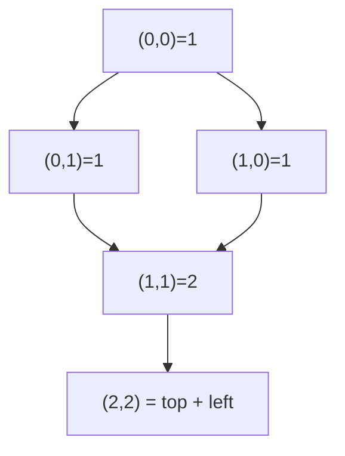
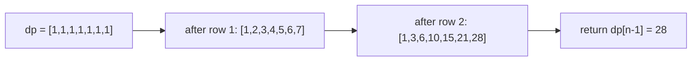

# Unique Paths

| Meta | Value |
|------|-------|
| Source | LeetCode #62 |
| Difficulty | Medium |
| Topics | Math, Dynamic Programming, Combinatorics |
| Link | https://leetcode.com/problems/unique-paths/ |

---

## Problem Statement
A robot sits in the **top-left** corner of an `m x n` grid. It can move only **right** or
**down** one cell at a time, and must reach the **bottom-right** corner. Return how many
distinct paths exist.

```text
Input:  m = 3, n = 7
Output: 28

Input:  m = 3, n = 2
Output: 3
        // down -> down -> right
        // down -> right -> down
        // right -> down -> down
```

---

## Approach (WHY)

Every cell can be reached only from the cell **above** it or the cell **to its left** —
those are the only two moves that land on it. So the number of ways to reach a cell is the
**sum** of the ways to reach those two predecessors:

$$
dp[r][c] = dp[r-1][c] + dp[r][c-1]
$$

The entire **top row** and **left column** have exactly one path (a straight line), giving
the base cases $dp[0][c] = dp[r][0] = 1$.



Equivalently, any path uses exactly $m-1$ down-moves and $n-1$ right-moves in some order, so
the closed form is a single binomial coefficient:

$$
\text{paths} = \binom{m+n-2}{m-1}
$$

Since each row only reads the previous row, we compress the table to a **single 1D array**.

```python
def unique_paths(m, n):
    dp = [1] * n                  # top row: one way to reach each cell
    for _ in range(1, m):
        for c in range(1, n):
            dp[c] += dp[c - 1]    # old dp[c] = above, new dp[c-1] = left
    return dp[n - 1]
```

```cpp
#include <bits/stdc++.h>
using namespace std;

long long unique_paths(int m, int n) {
    vector<long long> dp(n, 1);       // top row: one way to reach each cell
    for (int r = 1; r < m; ++r) {
        for (int c = 1; c < n; ++c) {
            dp[c] += dp[c - 1];       // old dp[c] = above, new dp[c-1] = left
        }
    }
    return dp[n - 1];
}
```

---

## Filled Grid Trace

For `m = 3, n = 7`, the full DP table (each cell = top + left) ends at **28**:

```text
 1   1   1   1   1   1   1
 1   2   3   4   5   6   7
 1   3   6  10  15  21  28   <- answer 28
```



A pointer never moves backward: each `dp[c] += dp[c-1]` adds the already-updated left value
to the still-old above value, exactly realizing the recurrence in place.

---

## Complexity
- **Time:** $O(mn)$ — one pass over every cell. (The binomial formula is $O(\min(m,n))$.)
- **Space:** $O(n)$ — a single rolling row instead of the full $m \times n$ table.

---

## Takeaway
Path counting on a right/down grid is the canonical additive grid DP: **a cell's ways equal
the sum of its top and left neighbours**, with the border row/column seeded to $1$. Collapse
to one row for $O(n)$ space, or skip the DP entirely with the binomial coefficient
$\binom{m+n-2}{m-1}$.
