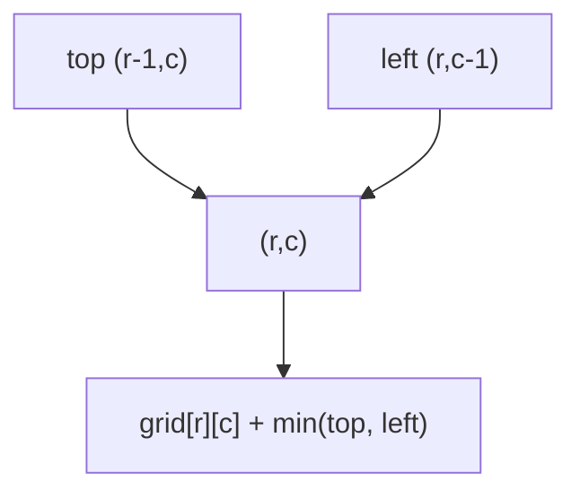
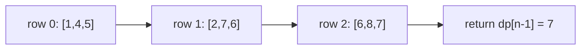

# Minimum Path Sum

| Meta | Value |
|------|-------|
| Source | LeetCode #64 |
| Difficulty | Medium |
| Topics | Array, Dynamic Programming, Matrix |
| Link | https://leetcode.com/problems/minimum-path-sum/ |

---

## Problem Statement
Given an `m x n` grid of **non-negative** numbers, find a path from the **top-left** to the
**bottom-right** that minimizes the **sum** of all numbers along it. You may move only
**right** or **down**.

```text
Input:  grid = [[1,3,1],
                [1,5,1],
                [4,2,1]]
Output: 7
        // path 1 -> 3 -> 1 -> 1 -> 1
```

---

## Approach (WHY)

To reach cell `(r,c)` you arrived from either **above** or the **left** — pick whichever
predecessor is cheaper, then pay this cell's own cost. That gives:

$$
dp[r][c] = grid[r][c] + \min\big(dp[r-1][c],\; dp[r][c-1]\big)
$$

The base cases follow paths with no choice: the top row accumulates left-to-right, the left
column accumulates top-to-bottom.



Greedy fails here — a locally cheap step can force expensive cells later — but the DP is
correct because it keeps the optimal cost to **every** cell, so the final cell sees the true
best of all upstream choices. We again reuse a single rolling row.

```python
def min_path_sum(grid):
    n = len(grid[0])
    dp = [float('inf')] * n
    dp[0] = 0                              # virtual entry before (0,0)
    for r in range(len(grid)):
        dp[0] += grid[r][0]                # left column: only from above
        for c in range(1, n):
            dp[c] = grid[r][c] + min(dp[c], dp[c - 1])
    return dp[n - 1]
```

```cpp
#include <bits/stdc++.h>
using namespace std;

long long min_path_sum(vector<vector<int>>& grid) {
    int n = grid[0].size();
    const long long INF = LLONG_MAX / 4;
    vector<long long> dp(n, INF);
    dp[0] = 0;                                 // virtual entry before (0,0)
    for (int r = 0; r < (int)grid.size(); ++r) {
        dp[0] += grid[r][0];                   // left column: only from above
        for (int c = 1; c < n; ++c) {
            dp[c] = grid[r][c] + min(dp[c], dp[c - 1]);
        }
    }
    return dp[n - 1];
}
```

---

## Filled Grid Trace

Starting from `[[1,3,1],[1,5,1],[4,2,1]]`, accumulate the minimum cost into each cell:

```text
grid            dp (min cost to reach)
1 3 1           1  4  5
1 5 1     -->   2  7  6
4 2 1           6  8  7   <- answer 7
```



The optimal route $1 \to 3 \to 1 \to 1 \to 1$ is exactly the chain of `min` choices that
produced the bottom-right $7$.

---

## Complexity
- **Time:** $O(mn)$ — every cell is finalized once.
- **Space:** $O(n)$ — a single rolling row.

---

## Takeaway
Optimizing a grid path is the same single-sweep DP as counting, but the **combine step
changes**: replace "sum the ways" with "`cost + min(parents)`". Seed unreachable predecessors
with $+\infty$ and keep the optimal cost to every cell so the destination inherits the global
best.
