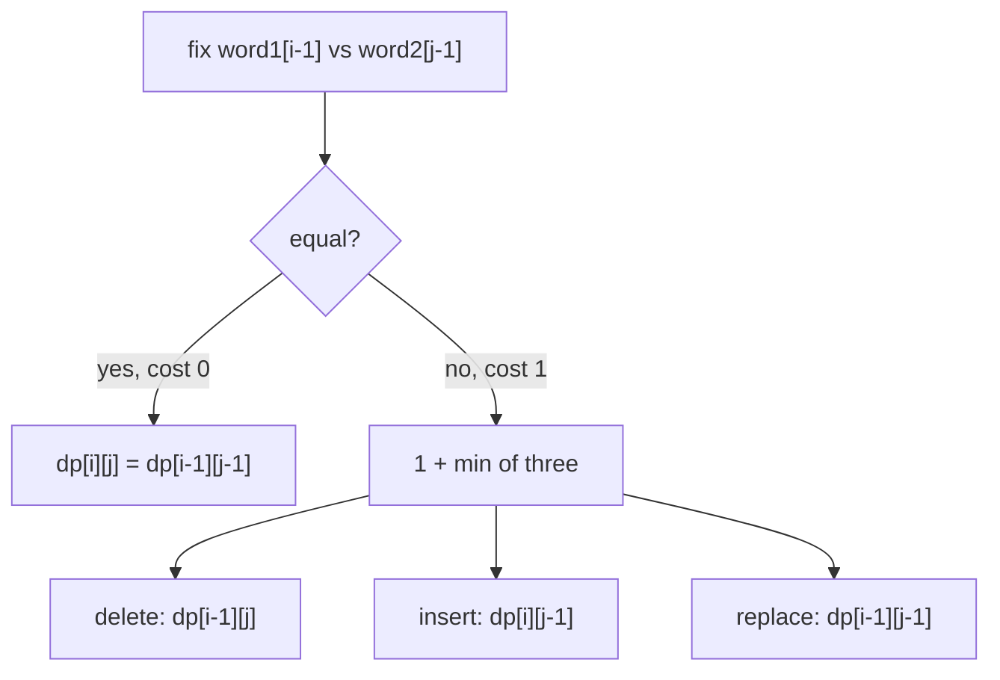
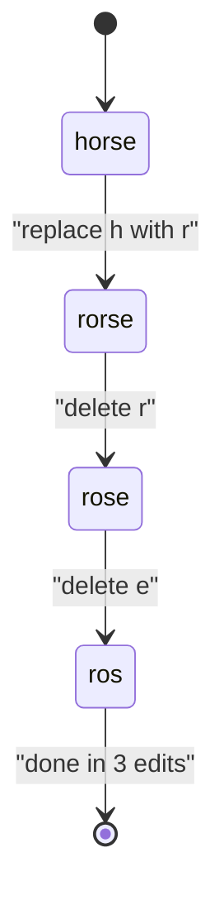

# Edit Distance

| Meta | Value |
|------|-------|
| Source | LeetCode #72 |
| Difficulty | Hard |
| Topics | String, Dynamic Programming |
| Link | https://leetcode.com/problems/edit-distance/ |

---

## Problem Statement

Given two strings `word1` and `word2`, return the **minimum number of operations** required
to convert `word1` into `word2`. The allowed operations are: **insert** a character,
**delete** a character, or **replace** a character.

```text
Input:  word1 = "horse", word2 = "ros"
Output: 3
Explanation: horse -> rorse (replace h with r)
             rorse -> rose  (delete r)
             rose  -> ros   (delete e)

Input:  word1 = "intention", word2 = "execution"
Output: 5
```

---

## Approach (WHY)

Let

$$
\text{dp}[i][j] = \text{min edits to turn } word1[0..i-1] \text{ into } word2[0..j-1].
$$

If the last characters match, they need no work — inherit the diagonal. Otherwise we must
spend one operation and take the cheapest of three sub-results:

$$
\text{dp}[i][j] =
\begin{cases}
\text{dp}[i-1][j-1] & word1[i-1] = word2[j-1] \\[6pt]
1 + \min\!\big(
\underbrace{\text{dp}[i-1][j]}_{\text{delete}},\;
\underbrace{\text{dp}[i][j-1]}_{\text{insert}},\;
\underbrace{\text{dp}[i-1][j-1]}_{\text{replace}}
\big) & \text{otherwise}
\end{cases}
$$

The base cases encode pure insert/delete runs: `dp[i][0] = i` (delete everything) and
`dp[0][j] = j` (insert everything).



### Code

```python
def minDistance(word1: str, word2: str) -> int:
    n, m = len(word1), len(word2)
    dp = [[0] * (m + 1) for _ in range(n + 1)]
    for i in range(n + 1):
        dp[i][0] = i
    for j in range(m + 1):
        dp[0][j] = j
    for i in range(1, n + 1):
        for j in range(1, m + 1):
            if word1[i - 1] == word2[j - 1]:
                dp[i][j] = dp[i - 1][j - 1]
            else:
                dp[i][j] = 1 + min(dp[i - 1][j],      # delete
                                   dp[i][j - 1],      # insert
                                   dp[i - 1][j - 1])  # replace
    return dp[n][m]
```

```cpp
#include <bits/stdc++.h>
using namespace std;

class Solution {
public:
    int minDistance(string word1, string word2) {
        int n = word1.size(), m = word2.size();
        vector<vector<long long>> dp(n + 1, vector<long long>(m + 1, 0));
        for (int i = 0; i <= n; i++) dp[i][0] = i;
        for (int j = 0; j <= m; j++) dp[0][j] = j;
        for (int i = 1; i <= n; i++) {
            for (int j = 1; j <= m; j++) {
                if (word1[i - 1] == word2[j - 1])
                    dp[i][j] = dp[i - 1][j - 1];
                else
                    dp[i][j] = 1 + min({dp[i - 1][j],       // delete
                                        dp[i][j - 1],        // insert
                                        dp[i - 1][j - 1]});  // replace
            }
        }
        return (int)dp[n][m];
    }
};
```

### Space-optimized (two rows)

```python
def minDistance_1d(word1: str, word2: str) -> int:
    n, m = len(word1), len(word2)
    prev = list(range(m + 1))
    for i in range(1, n + 1):
        curr = [i] + [0] * m
        for j in range(1, m + 1):
            if word1[i - 1] == word2[j - 1]:
                curr[j] = prev[j - 1]
            else:
                curr[j] = 1 + min(prev[j], curr[j - 1], prev[j - 1])
        prev = curr
    return prev[m]
```

```cpp
#include <bits/stdc++.h>
using namespace std;

long long minDistance_1d(string word1, string word2) {
    int n = word1.size(), m = word2.size();
    vector<long long> prev(m + 1), curr(m + 1);
    for (int j = 0; j <= m; j++) prev[j] = j;
    for (int i = 1; i <= n; i++) {
        curr[0] = i;
        for (int j = 1; j <= m; j++) {
            if (word1[i - 1] == word2[j - 1])
                curr[j] = prev[j - 1];
            else
                curr[j] = 1 + min({prev[j], curr[j - 1], prev[j - 1]});
        }
        prev = curr;
    }
    return prev[m];
}
```

---

## DP Grid Trace

For `word1 = "horse"` (rows) and `word2 = "ros"` (columns). The first row and column are
the insert/delete base cases; interior cells take the 3-way minimum.

|        | "" | r | o | s |
|--------|----|---|---|---|
| **""** | 0  | 1 | 2 | 3 |
| **h**  | 1  | 1 | 2 | 3 |
| **o**  | 2  | 2 | **1** | 2 |
| **r**  | 3  | **2** | 2 | 2 |
| **s**  | 4  | 3 | 3 | **2** |
| **e**  | 5  | 4 | 4 | 3 |

The answer `dp[5][3] = 3` matches the three edits in the example.



---

## Complexity

| Version | Time | Space |
|---|---|---|
| 2D table | $O(nm)$ | $O(nm)$ |
| Two rows | $O(nm)$ | $O(\min(n,m))$ |

---

## Takeaway

Edit distance is LCS with a three-way minimum instead of a two-way maximum, plus nonzero
base cases (`i` and `j`). Remember that a **replace** is a single operation pulling from the
diagonal — never two — and the insert/delete moves come from the left/up neighbors.
