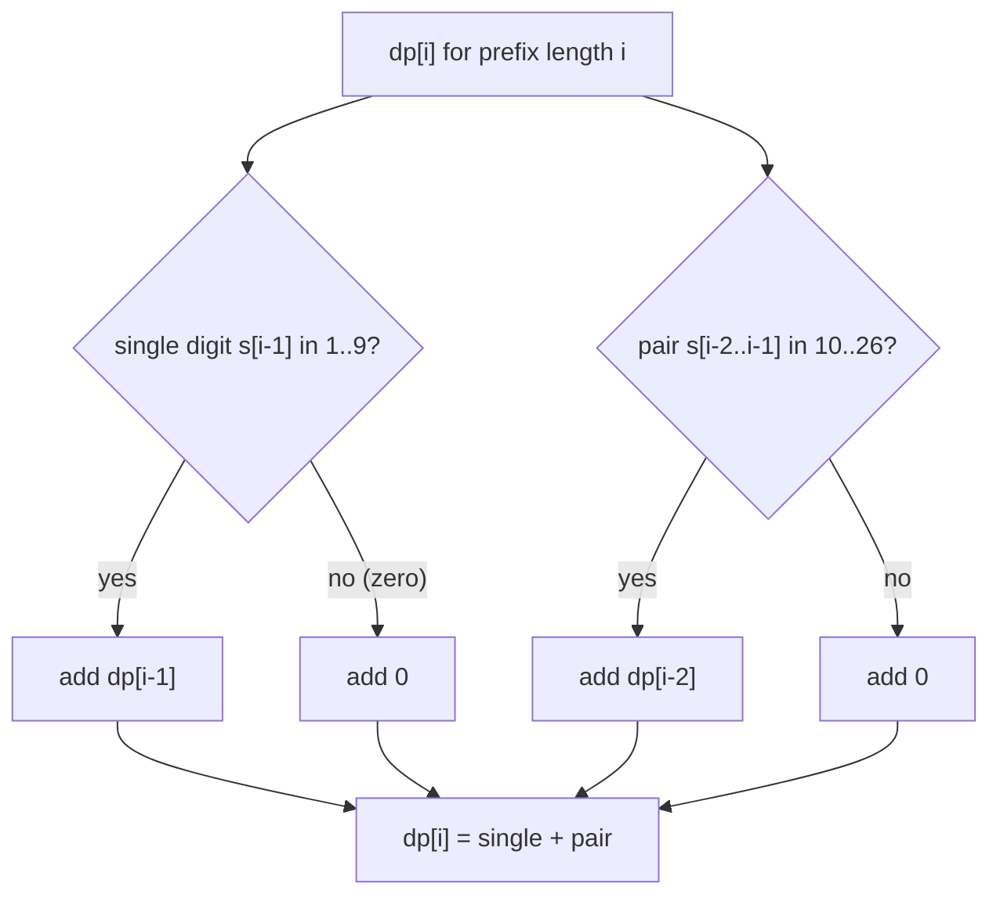

# Decode Ways

| Meta | Value |
|------|-------|
| Source | LeetCode #91 |
| Difficulty | Medium |
| Topics | String, Dynamic Programming |
| Link | https://leetcode.com/problems/decode-ways/ |

---

## Problem Statement

A message of digits is encoded with the mapping `A -> 1`, `B -> 2`, …, `Z -> 26`. Given a digit
string `s`, count how many ways it can be decoded back into letters. A leading `0` or any
invalid grouping contributes zero ways.

```text
Input:  s = "226"
Output: 3                 // "BZ" (2 26), "VF" (22 6), "BBF" (2 2 6)

Input:  s = "06"
Output: 0                 // cannot start a group with 0

Input:  s = "12"
Output: 2                 // "AB" (1 2) or "L" (12)
```

---

## Approach (WHY)

This is a **counting DP**. Let `dp[i]` = number of ways to decode the prefix of length `i`.
The empty prefix has one decoding, so `dp[0] = 1`. At each new character you add the ways from
two independent moves:

1. **Take one digit** `s[i-1]` if it is `1..9` — contributes `dp[i-1]`.
2. **Take two digits** `s[i-2..i-1]` if the pair is `10..26` — contributes `dp[i-2]`.

$$
dp[i] = \underbrace{dp[i-1]\cdot[\,s_{i-1}\neq 0\,]}_{\text{single}}
      + \underbrace{dp[i-2]\cdot[\,10 \le \overline{s_{i-2}s_{i-1}} \le 26\,]}_{\text{pair}}
$$

If neither move is valid at some position, `dp[i] = 0` and the whole string is undecodable.
Only the last two values matter, so we roll to $O(1)$ space.



```python
def num_decodings(s):
    if not s or s[0] == '0':
        return 0
    prev2 = 1          # dp[i-2], empty prefix
    prev1 = 1          # dp[i-1], first char already valid
    for i in range(1, len(s)):
        cur = 0
        if s[i] != '0':                       # take one digit
            cur += prev1
        if 10 <= int(s[i - 1:i + 1]) <= 26:   # take two digits
            cur += prev2
        prev2, prev1 = prev1, cur
    return prev1
```

```cpp
#include <bits/stdc++.h>
using namespace std;

long long num_decodings(string s) {
    if (s.empty() || s[0] == '0') return 0;
    long long prev2 = 1;   // dp[i-2], empty prefix
    long long prev1 = 1;   // dp[i-1], first char valid
    for (int i = 1; i < (int)s.size(); ++i) {
        long long cur = 0;
        if (s[i] != '0') cur += prev1;                 // single digit
        int two = (s[i - 1] - '0') * 10 + (s[i] - '0');
        if (two >= 10 && two <= 26) cur += prev2;      // pair
        prev2 = prev1;
        prev1 = cur;
    }
    return prev1;
}
```

---

## Trace

Run on `s = "226"` with `prev2 = prev1 = 1`.

```text
i=1 (s[1]='2'): single 2 -> +prev1(1); pair "22" in 10..26 -> +prev2(1); cur=2
                shift: prev2=1, prev1=2
i=2 (s[2]='6'): single 6 -> +prev1(2); pair "26" in 10..26 -> +prev2(1); cur=3
                shift: prev2=2, prev1=3
answer = 3
```

```mermaid
graph LR
    e["dp[0]=1 (empty)"] --> a["dp[1]=1 (\"2\")"]
    a --> b["dp[2]=2 (\"22\",\"2 2\")"]
    b --> c["dp[3]=3 (add \"6\" and \"26\")"]
```

---

## Complexity

| Measure | Value |
|---------|-------|
| Time | $O(n)$ — one pass over the string |
| Space | $O(1)$ — two rolling counts |

---

## Takeaway

Decode Ways is counting sequence DP: sum the ways from a valid **single** digit (`dp[i-1]`)
and a valid **two-digit** pair (`dp[i-2]`). Guard the zeros — a lone `0` and pairs outside
`10..26` contribute nothing, and a leading `0` makes the answer `0`.
