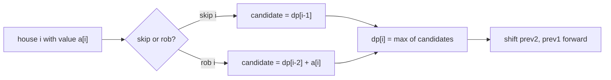
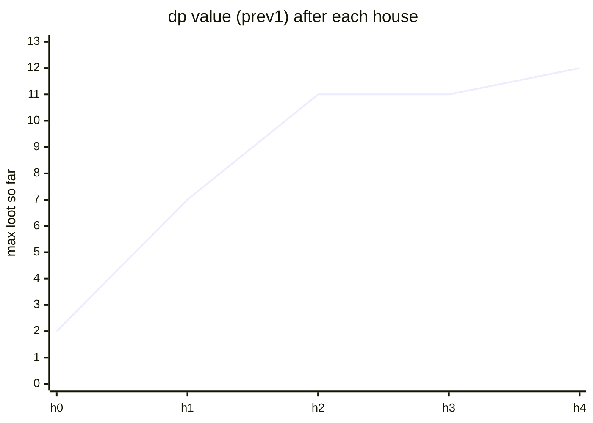

# House Robber

| Meta | Value |
|------|-------|
| Source | LeetCode #198 |
| Difficulty | Medium |
| Topics | Array, Dynamic Programming |
| Link | https://leetcode.com/problems/house-robber/ |

---

## Problem Statement

You are a robber planning to loot houses along a street. Each house holds a non-negative
amount of money, but **adjacent houses have connected alarms** — robbing two neighbours on the
same night triggers the police. Return the maximum amount you can rob without alerting them.

```text
Input:  nums = [2, 7, 9, 3, 1]
Output: 12                // rob houses 0, 2, 4 -> 2 + 9 + 1 = 12

Input:  nums = [1, 2, 3, 1]
Output: 4                 // rob houses 0, 2 -> 1 + 3 = 4
```

---

## Approach (WHY)

Let `dp[i]` be the maximum loot achievable considering houses `0..i`. Standing at house `i`,
you have exactly two non-conflicting choices:

1. **Skip house `i`** — then your best is whatever you had through `i-1`, i.e. `dp[i-1]`.
2. **Rob house `i`** — then you must have skipped `i-1`, so add `a[i]` to `dp[i-2]`.

Take the better of the two:

$$
dp[i] = \max\big(dp[i-1],\; dp[i-2] + a[i]\big)
$$

with base cases $dp[0] = a[0]$ and $dp[1] = \max(a[0], a[1])$. Since `dp[i]` only looks back two
steps, we keep two rolling variables and use $O(1)$ space.



```python
def rob(nums):
    prev2 = 0          # dp[i-2]
    prev1 = 0          # dp[i-1]
    for x in nums:
        cur = max(prev1, prev2 + x)   # skip vs rob
        prev2, prev1 = prev1, cur
    return prev1
```

```cpp
#include <bits/stdc++.h>
using namespace std;

long long rob(vector<int>& nums) {
    long long prev2 = 0;   // dp[i-2]
    long long prev1 = 0;   // dp[i-1]
    for (int x : nums) {
        long long cur = max(prev1, prev2 + (long long)x);
        prev2 = prev1;
        prev1 = cur;
    }
    return prev1;
}
```

---

## Trace

Run on `nums = [2, 7, 9, 3, 1]`. Each row applies `cur = max(prev1, prev2 + x)` then shifts.

```text
x=2:  cur = max(0, 0+2) = 2    -> prev2=0,  prev1=2
x=7:  cur = max(2, 0+7) = 7    -> prev2=2,  prev1=7
x=9:  cur = max(7, 2+9) = 11   -> prev2=7,  prev1=11
x=3:  cur = max(11, 7+3) = 11  -> prev2=11, prev1=11
x=1:  cur = max(11, 11+1) = 12 -> prev2=11, prev1=12
answer = 12
```



---

## Complexity

| Measure | Value |
|---------|-------|
| Time | $O(n)$ — one pass |
| Space | $O(1)$ — two rolling variables |

---

## Takeaway

House Robber is the archetypal **non-adjacent** sequence DP: at each index choose
`max(skip = dp[i-1], take = dp[i-2] + a[i])`. Because the window is two deep, collapse the
array into `prev1`/`prev2` for constant space.
