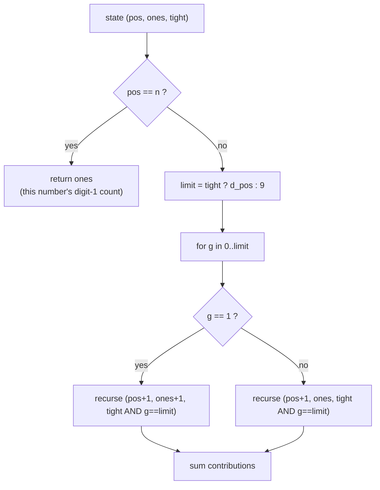
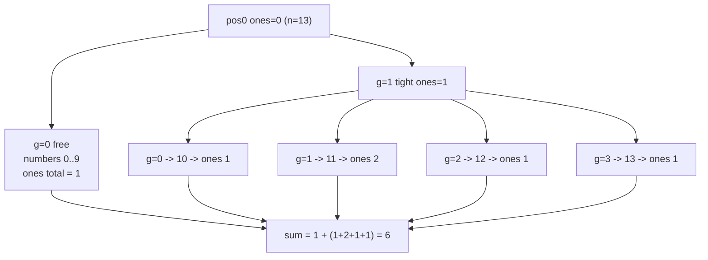

# Number of Digit One

| Meta | Value |
|------|-------|
| Source | LeetCode #233 |
| Difficulty | Hard |
| Topics | Math, Dynamic Programming, Digit DP |
| Link | https://leetcode.com/problems/number-of-digit-one/ |

---

## Problem Statement

Given an integer $n$, count the **total number of digit `1`** appearing in all non-negative
integers less than or equal to $n$. We sum occurrences across numbers and across positions — a
number like `11` contributes **two** to the count.

```text
Input:  n = 13
Output: 6
Explanation: the digit 1 appears in 1, 10, 11 (twice), 12, 13 -> 1+1+2+1+1 = 6.

Input:  n = 0
Output: 0
```

This is a *counting-of-a-digit* problem: we are not counting numbers, we are counting how many
times the digit `1` shows up overall. Digit DP handles it by accumulating the count of ones placed
so far and returning that count at each leaf.

---

## Approach (WHY)

Define $f(n)$ = total number of `1` digits among all integers in $[0, n]$. Build each number digit
by digit. The accumulator is `ones` = how many `1`s we have placed in the current prefix. When all
positions are filled, this prefix **is** one complete number, and its contribution to the global
total is exactly `ones`. So at a leaf we return `ones` (not $1$):

$$
f(n) = \sum_{x=0}^{n} (\text{number of digit-1 in } x)
$$

State: $(pos, ones, tight)$. We do not need `leading_zero` here, because a leading zero is a `0`,
not a `1`, so it never increments `ones` — padding with zeros is harmless for this particular
property. The transition adds $1$ to `ones` exactly when the chosen digit $g$ equals $1$:

$$
\text{ones}' = \text{ones} + [\,g = 1\,]
$$



Because every leaf returns the *count* rather than a $0/1$ flag, the recursion sums one `1` for
each placed `1` across every number in range — exactly the total we want. Memoize on
$(pos, ones)$ for non-tight states.

```python
from functools import lru_cache

def count_digit_one(n):
    if n < 0:
        return 0
    digits = list(map(int, str(n)))
    L = len(digits)

    @lru_cache(maxsize=None)
    def go(pos, ones, tight):
        if pos == L:
            return ones
        limit = digits[pos] if tight else 9
        total = 0
        for g in range(limit + 1):
            total += go(pos + 1, ones + (1 if g == 1 else 0), tight and g == limit)
        return total

    return go(0, 0, True)
```

```cpp
#include <bits/stdc++.h>
using namespace std;

int dg[20], L;
long long memo[20][20];     // ones at most 18
bool seen[20][20];

long long go(int pos, int ones, bool tight) {
    if (pos == L) return ones;
    if (!tight && seen[pos][ones]) return memo[pos][ones];
    int limit = tight ? dg[pos] : 9;
    long long total = 0;
    for (int g = 0; g <= limit; ++g)
        total += go(pos + 1, ones + (g == 1 ? 1 : 0), tight && g == limit);
    if (!tight) { seen[pos][ones] = true; memo[pos][ones] = total; }
    return total;
}

long long count_digit_one(long long n) {
    if (n < 0) return 0;
    string s = to_string(n);
    L = (int)s.size();
    for (int i = 0; i < L; ++i) dg[i] = s[i] - '0';
    memset(seen, 0, sizeof(seen));
    return go(0, 0, true);
}
```

The non-obvious move is returning `ones` at the leaf: each complete number reports how many `1`s
it contains, and the recursion adds those up over the entire range.

---

## Trace

Compute `count_digit_one(13)`. Bound digits are `[1, 3]`, length $L = 2$.

```text
pos0, tight, ones=0:  limit = 1 (first digit of 13)
  g=0 (free now):   pos1 free, ones=0
        second digit 0..9: only g=1 adds a one -> total ones across 00..09 = 1   (from "01" = 1)
        contributes 1
  g=1 (tight stays): pos1 tight, ones=1, limit = 3 (second digit of 13)
        second digit 0..3, each leaf returns ones:
          g=0 -> "10" ones=1
          g=1 -> "11" ones=2
          g=2 -> "12" ones=1
          g=3 -> "13" ones=1
        sum = 1+2+1+1 = 5
        contributes 5

total = 1 + 5 = 6
```

The `g=0` branch captures the single `1` in `01`(=1); the `g=1` branch captures the ones in
`10, 11, 12, 13`. Together $1 + 5 = 6$, matching the expected output.



---

## Complexity

Let $m$ be the number of digits of $n$ (so $m \le 19$ for 64-bit).

| Measure | Value |
|---------|-------|
| Time | $O(m \cdot m \cdot 10)$ — states $(pos, ones)$ times 10 digit choices |
| Space | $O(m \cdot m)$ for the memo |

There is also a well-known $O(m)$ closed-form per-position formula, but the digit-DP version
generalizes immediately to "count digit $d$" or "count under extra constraints".

---

## Takeaway

To **count occurrences of a digit** (not numbers), make the accumulator the running count of that
digit and **return the count at the leaf** instead of a $0/1$ validity flag. The recursion then
sums contributions across every number in $[0, n]$. Memoize on $(pos, count)$ for non-tight states.
