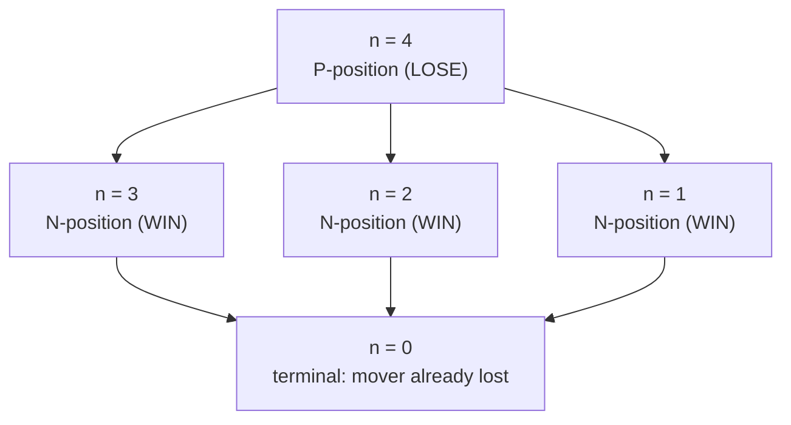
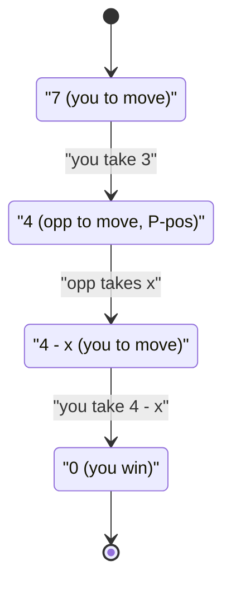

# Nim Game

| Meta | Value |
|---|---|
| Source | LeetCode 292 |
| Difficulty | Easy |
| Topic | Game DP, Combinatorial Game Theory |
| Key idea | P/N positions, period-4 closed form |

---

## Problem Statement

You and a friend take turns removing **1, 2, or 3** stones from a single heap. You move **first**. The player who removes the **last** stone **wins**. Given `n` stones and both players playing optimally, return whether **you** can win.

```text
Input:  n = 4
Output: false
Explain: whatever you take (1,2,3), the opponent takes the rest and wins.

Input:  n = 1
Output: true   (take the one stone)

Input:  n = 6
Output: true   (take 2, leaving 4 -> a losing position for the opponent)
```

---

## Approach (WHY)

Classify each `n` from the mover's view. With `win[n]` = "mover wins with `n` stones":

$$
win[n] = \bigvee_{m \in \{1,2,3\}} \neg\, win[n-m], \qquad win[0] = \text{False}
$$

`n = 0` means you cannot move, so you lose. Building the table reveals a period-4 pattern:

| n | 0 | 1 | 2 | 3 | 4 | 5 | 6 | 7 | 8 |
|---|---|---|---|---|---|---|---|---|---|
| win | F | T | T | T | F | T | T | T | F |

Every **multiple of 4** is a **P-position** (loss for the mover). Why: if `n` is a multiple of 4, whatever you remove (1–3), the opponent removes `4 - that` to restore a multiple of 4. The heap strictly shrinks, eventually reaching 0 on *your* turn. If `n` is **not** a multiple of 4, you can remove `n mod 4` stones and hand your opponent a multiple of 4.

$$
\text{You win} \iff n \bmod 4 \neq 0
$$



### O(1) closed form

```python
def can_win_nim(n):
    # losing only when n is a multiple of 4
    return n % 4 != 0

print(can_win_nim(4))  # False
print(can_win_nim(6))  # True
```

```cpp
#include <bits/stdc++.h>
using namespace std;

bool canWinNim(long long n) {
    // losing only when n is a multiple of 4
    return n % 4 != 0;
}

int main() {
    cout << boolalpha;
    cout << canWinNim(4) << "\n"; // false
    cout << canWinNim(6) << "\n"; // true
    return 0;
}
```

### DP reasoning (how the closed form is discovered)

The table is what *proves* the shortcut. For small `n` you would actually run the recurrence; it is `O(n)` and exposes the period-4 structure.

```python
def can_win_nim_dp(n):
    if n == 0:
        return False
    win = [False] * (n + 1)
    for s in range(1, n + 1):
        for m in (1, 2, 3):
            if s - m >= 0 and not win[s - m]:
                win[s] = True   # move to a losing state for opponent
                break
    return win[n]

print([can_win_nim_dp(k) for k in range(9)])
# [False, True, True, True, False, True, True, True, False]
```

```cpp
#include <bits/stdc++.h>
using namespace std;

bool canWinNimDP(int n) {
    if (n == 0) return false;
    vector<bool> win(n + 1, false);
    for (int s = 1; s <= n; ++s) {
        for (int m = 1; m <= 3; ++m) {
            if (s - m >= 0 && !win[s - m]) {
                win[s] = true;  // move to a losing state for opponent
                break;
            }
        }
    }
    return win[n];
}

int main() {
    for (int k = 0; k <= 8; ++k)
        cout << (canWinNimDP(k) ? "T" : "F") << ' ';
    cout << "\n"; // F T T T F T T T F
    return 0;
}
```

---

## Trace (n = 7)

`7 mod 4 = 3 ≠ 0` ⟹ **win**. Optimal first move: take `3`, leaving `4` (a P-position) for the opponent.

| Turn | Mover | Stones before | Takes | Stones after |
|---|---|---|---|---|
| 1 | You | 7 | 3 | 4 |
| 2 | Opp | 4 | x∈{1,2,3} | 4 − x |
| 3 | You | 4 − x | 4 − x | 0 (you took the last) |



---

## Complexity

| Method | Time | Space |
|---|---|---|
| Closed form `n % 4` | $O(1)$ | $O(1)$ |
| Bottom-up DP table | $O(n)$ | $O(n)$ |

---

## Takeaway

Build the win/lose table first; the **period-4** structure pops out, collapsing the whole game to `n % 4 != 0`. Multiples of 4 are the losing P-positions because the opponent can always "complete the four" you removed.
