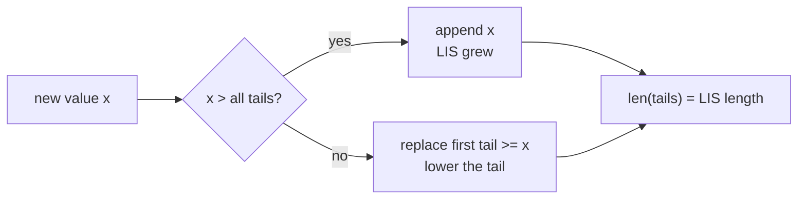
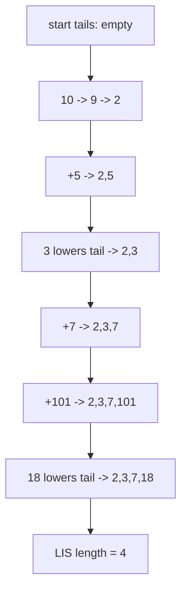

# Longest Increasing Subsequence

| Meta | Value |
|------|-------|
| Source | LeetCode #300 |
| Difficulty | Medium |
| Topics | Array, Binary Search, Dynamic Programming |
| Link | https://leetcode.com/problems/longest-increasing-subsequence/ |

---

## Problem Statement
Given an integer array `nums`, return the length of the **longest strictly increasing
subsequence**. A subsequence keeps relative order but need not be contiguous.

```text
Input:  nums = [10, 9, 2, 5, 3, 7, 101, 18]
Output: 4
Explanation: one LIS is [2, 3, 7, 101], length 4.
```

---

## Approach (WHY)

There are two standard solutions; you should know both.

**1. $O(n^2)$ DP.** Let `dp[i]` = length of the LIS ending exactly at index `i`. Any such
subsequence extends an earlier one ending at some `j < i` with `nums[j] < nums[i]`:

$$
dp[i] = 1 + \max\big(\{0\} \cup \{ dp[j] : j < i,\; nums[j] < nums[i] \}\big)
$$

**2. $O(n \log n)$ patience method.** Keep `tails`, where `tails[k]` is the smallest tail
value of any increasing subsequence of length `k + 1`. `tails` stays sorted, so each new
value is placed by binary search: replace the first tail $\ge x$, or append if `x` exceeds
all tails. The final length of `tails` is the answer.



```python
def lengthOfLIS_n2(nums):
    if not nums:
        return 0
    n = len(nums)
    dp = [1] * n
    for i in range(n):
        for j in range(i):
            if nums[j] < nums[i]:
                dp[i] = max(dp[i], dp[j] + 1)
    return max(dp)
```

```cpp
#include <bits/stdc++.h>
using namespace std;

int lengthOfLIS_n2(const vector<int>& nums) {
    int n = (int)nums.size();
    if (n == 0) return 0;
    vector<int> dp(n, 1);
    for (int i = 0; i < n; ++i)
        for (int j = 0; j < i; ++j)
            if (nums[j] < nums[i])
                dp[i] = max(dp[i], dp[j] + 1);
    return *max_element(dp.begin(), dp.end());
}
```

```python
from bisect import bisect_left

def lengthOfLIS(nums):
    tails = []
    for x in nums:
        pos = bisect_left(tails, x)   # first tail >= x (strict)
        if pos == len(tails):
            tails.append(x)
        else:
            tails[pos] = x
    return len(tails)
```

```cpp
#include <bits/stdc++.h>
using namespace std;

int lengthOfLIS(const vector<int>& nums) {
    vector<int> tails;
    for (int x : nums) {
        auto it = lower_bound(tails.begin(), tails.end(), x); // first >= x
        if (it == tails.end()) tails.push_back(x);
        else *it = x;
    }
    return (int)tails.size();
}
```

---

## Trace

`nums = [10, 9, 2, 5, 3, 7, 101, 18]` through the tails method:

| x | action | tails |
|---|--------|-------|
| 10 | append | `[10]` |
| 9 | replace 10 | `[9]` |
| 2 | replace 9 | `[2]` |
| 5 | append | `[2, 5]` |
| 3 | replace 5 | `[2, 3]` |
| 7 | append | `[2, 3, 7]` |
| 101 | append | `[2, 3, 7, 101]` |
| 18 | replace 101 | `[2, 3, 7, 18]` |

Final length $= 4$.



---

## Complexity

| Solution | Time | Space |
|----------|------|-------|
| $O(n^2)$ DP | $O(n^2)$ | $O(n)$ |
| Patience / tails | $O(n \log n)$ | $O(n)$ |

---

## Takeaway
The $O(n^2)$ DP is the most direct mental model: *LIS ending here*. When $n$ grows beyond a
few thousand, switch to the `tails` + binary-search method — the same `lower_bound` trick
underlies many harder LIS reductions like Russian Doll Envelopes.
