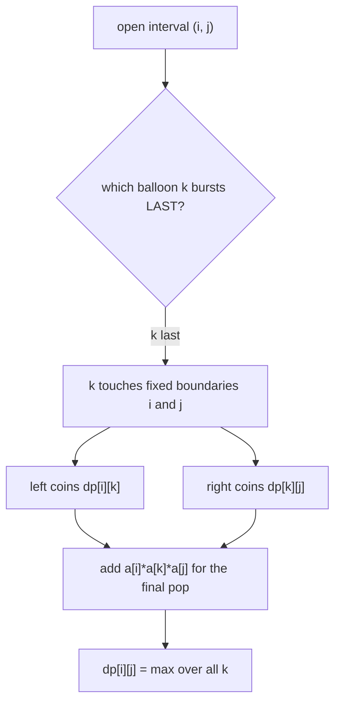
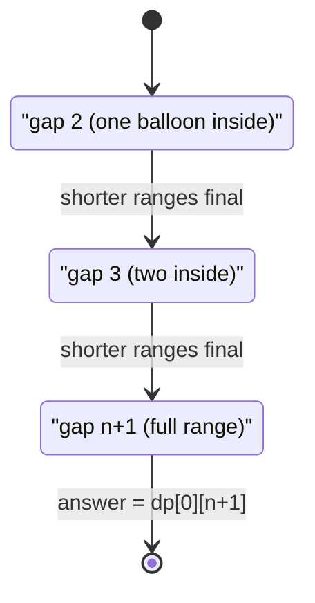
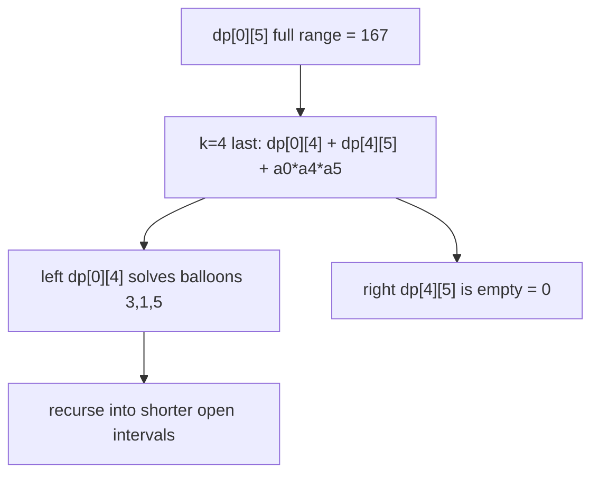

# Burst Balloons

| Meta | Value |
|------|-------|
| Problem | Burst Balloons |
| Source | LeetCode #312 |
| Reference | https://leetcode.com/problems/burst-balloons/ |
| Difficulty | Hard |
| Topics | Array, Dynamic Programming, Interval DP |
| Time | $O(n^3)$ |
| Space | $O(n^2)$ |

---

## Problem Statement

You are given `n` balloons indexed `0..n-1`, each painted with a number in `nums`. Bursting
balloon `i` earns `nums[left] * nums[i] * nums[right]` coins, where `left` and `right` are the
balloons **adjacent to `i` at the moment of bursting**. After a balloon bursts its neighbours
become adjacent. If a neighbour index falls off the array, treat the missing balloon as having
value `1`. Return the maximum coins you can collect by bursting all balloons.

```text
Input:  nums = [3, 1, 5, 8]
Output: 167
Explanation:
  burst 1 -> coins 3*1*5 = 15,  array [3,5,8]
  burst 5 -> coins 3*5*8 = 120, array [3,8]
  burst 3 -> coins 1*3*8 = 24,  array [8]
  burst 8 -> coins 1*8*1 = 8,   array []
  total = 15 + 120 + 24 + 8 = 167
```

---

## Approach (WHY)

If you try to reason about which balloon bursts **first**, its neighbours keep mutating as later
balloons pop, so the left and right sub-problems stay tangled. The fix is to ask the reverse
question for each open interval: **which balloon bursts last?**

Pad the array with virtual `1`s: `a = [1] + nums + [1]`. Define `dp[i][j]` as the maximum coins
obtainable by bursting **all balloons strictly between** indices `i` and `j` (the open interval
`(i, j)`). If balloon `k` is the last one to burst inside `(i, j)`, then everything else in the
range is already gone, so `k`'s neighbours are exactly the fixed boundaries `i` and `j`:

$$
dp[i][j] = \max_{i < k < j}\Big( dp[i][k] + dp[k][j] + a[i]\cdot a[k]\cdot a[j] \Big)
$$

Because `k` is last, the left part `(i, k)` and the right part `(k, j)` are fully independent —
that is what makes the recurrence valid.



Fill by **increasing interval length** so the shorter ranges `dp[i][k]` and `dp[k][j]` are ready:



```python
def maxCoins(nums):
    a = [1] + nums + [1]
    n = len(a)
    dp = [[0] * n for _ in range(n)]
    for length in range(2, n):                 # gap between boundaries i and j
        for i in range(0, n - length):
            j = i + length
            for k in range(i + 1, j):          # k bursts last in (i, j)
                gain = dp[i][k] + dp[k][j] + a[i] * a[k] * a[j]
                dp[i][j] = max(dp[i][j], gain)
    return dp[0][n - 1]
```

```cpp
#include <bits/stdc++.h>
using namespace std;

long long maxCoins(vector<int>& nums) {
    int m = (int)nums.size();
    vector<long long> a(m + 2, 1);
    for (int i = 0; i < m; ++i) a[i + 1] = nums[i];
    int n = m + 2;
    vector<vector<long long>> dp(n, vector<long long>(n, 0));
    for (int length = 2; length < n; ++length) {     // gap between boundaries i and j
        for (int i = 0; i + length < n; ++i) {
            int j = i + length;
            for (int k = i + 1; k < j; ++k) {        // k bursts last in (i, j)
                long long gain = dp[i][k] + dp[k][j] + a[i] * a[k] * a[j];
                dp[i][j] = max(dp[i][j], gain);
            }
        }
    }
    return dp[0][n - 1];
}
```

---

## Trace

Run on `nums = [3, 1, 5, 8]`, padded `a = [1, 3, 1, 5, 8, 1]` (`n = 6`). Build by length.

```text
length 2 (one balloon inside, k forced):
  dp[0][2] = a0*a1*a2 = 1*3*1 = 3      (burst balloon 3)
  dp[1][3] = a1*a2*a3 = 3*1*5 = 15     (burst balloon 1)
  dp[2][4] = a2*a3*a4 = 1*5*8 = 40     (burst balloon 5)
  dp[3][5] = a3*a4*a5 = 5*8*1 = 40     (burst balloon 8)

length 3 (two inside, choose last k):
  dp[0][3] = max(dp[0][1]+dp[1][3]+a0*a1*a3, dp[0][2]+dp[2][3]+a0*a2*a3)
           = max(0+15+1*3*5, 3+0+1*1*5) = max(30, 8) = 30
  dp[1][4] = max(15+40+3*1*8, ... ) -> 159 ... = 159
  dp[2][5] = max(40 + 1*1*1, 40 + 1*5*1) -> 48

length 4 and 5 continue the same way...
final dp[0][5] = 167
```



---

## Complexity

| Measure | Value |
|---------|-------|
| States | $O(n^2)$ intervals `(i, j)` |
| Transition | $O(n)$ choices of last balloon `k` |
| Time | $O(n^3)$ |
| Space | $O(n^2)$ for the `dp` table |

---

## Takeaway

Burst Balloons is the poster child for the **"think last, not first"** reframing in interval DP.
By padding with `1`s and letting `dp[i][j]` cover the **open** interval whose last burst is `k`,
the neighbours become the fixed boundaries `a[i]` and `a[j]`, decoupling the two halves into
`dp[i][k] + dp[k][j] + a[i]*a[k]*a[j]`. Fill by increasing length and use `long long` to avoid
overflow on the triple products.
