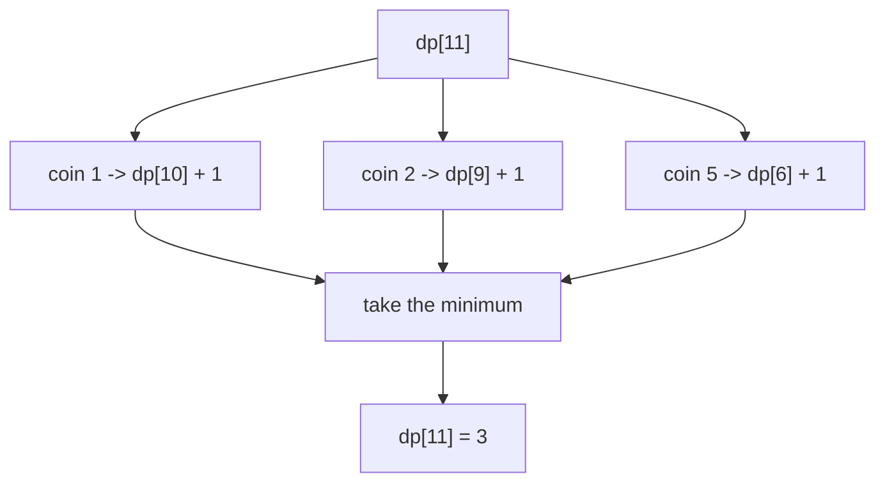
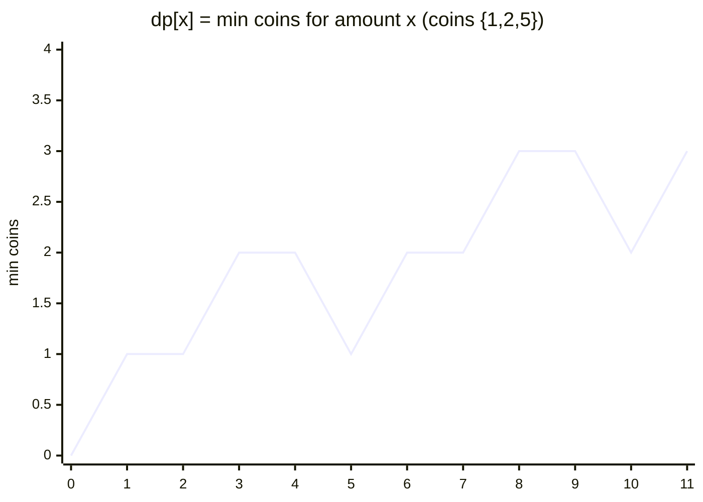

# Coin Change (Minimum Coins)

| Meta | Value |
|------|-------|
| Problem | Coin Change |
| Source | LeetCode #322 |
| Reference | https://leetcode.com/problems/coin-change/ |
| Difficulty | Medium |
| Topics | Dynamic Programming, Unbounded Knapsack, BFS |
| Time | $O(k \cdot A)$ |
| Space | $O(A)$ |

---

## Problem Statement

You are given coins of distinct denominations and a total `amount`. Each coin may be used an
**unlimited** number of times. Return the **fewest** number of coins needed to make up `amount`.
If it cannot be made, return `-1`.

```text
Input:  coins = [1, 2, 5], amount = 11
Output: 3
Explanation: 11 = 5 + 5 + 1  (three coins, no fewer is possible)

Input:  coins = [2], amount = 3
Output: -1   (3 is odd, unreachable with only 2s)
```

---

## Approach (WHY)

Let $dp[x]$ be the minimum number of coins to form amount $x$. The empty amount needs zero coins,
so $dp[0] = 0$; every other amount starts **unreachable** ($\infty$).

For each amount $x$, the last coin placed is some $c \le x$. Removing it leaves the sub-amount
$x - c$, already optimally solved:

$$
dp[x] = \min_{c \in C,\; c \le x} \big( dp[x - c] + 1 \big).
$$

If no coin yields a finite value, $dp[x]$ stays $\infty$, meaning "impossible". Because each coin
is reusable, this is the **unbounded knapsack** shape; the inner amount loop ascends so a coin can
be re-selected.



---

## Solution

```python
import math

def coin_change(coins, amount):
    INF = math.inf
    dp = [0] + [INF] * amount            # dp[0] = 0
    for x in range(1, amount + 1):
        for c in coins:
            if c <= x and dp[x - c] + 1 < dp[x]:
                dp[x] = dp[x - c] + 1
    return -1 if dp[amount] == INF else dp[amount]
```

```cpp
#include <bits/stdc++.h>
using namespace std;

int coin_change(vector<int>& coins, int amount) {
    const long long INF = LLONG_MAX / 4;     // overflow-safe sentinel
    vector<long long> dp(amount + 1, INF);
    dp[0] = 0;
    for (int x = 1; x <= amount; x++) {
        for (int c : coins) {
            if (c <= x && dp[x - c] + 1 < dp[x])
                dp[x] = dp[x - c] + 1;
        }
    }
    return dp[amount] == INF ? -1 : (int)dp[amount];
}
```

---

## DP-Table Trace

`coins = [1, 2, 5]`, `amount = 11`. Each cell is the fewest coins for that amount (`∞` =
unreachable so far).

| amount | 0 | 1 | 2 | 3 | 4 | 5 | 6 | 7 | 8 | 9 | 10 | 11 |
|--------|---|---|---|---|---|---|---|---|---|---|----|----|
| dp     | 0 | 1 | 1 | 2 | 2 | 1 | 2 | 2 | 3 | 3 | 2  | 3  |

- `dp[5] = 1` via the single coin `5`.
- `dp[6] = dp[5] + 1 = 2` (coin `1` on top of `5`).
- `dp[11] = min(dp[10], dp[9], dp[6]) + 1 = min(2,3,2)+1 = 3`.



The dips at $5$ and $10$ show large denominations slashing the coin count.

---

## Complexity

- **Time:** $O(k \cdot A)$ — every amount $1\ldots A$ tries each of $k$ coins.
- **Space:** $O(A)$ — a single 1D table.

---

## Takeaway

Min-coins is unbounded knapsack with `min` as the combine operator. Initialize `dp[0] = 0`, keep an
**overflow-safe** INF sentinel for unreachable amounts, and remember to translate that sentinel back
to `-1`. Loop order is irrelevant here because `min` is order-independent — unlike the counting
variants.
