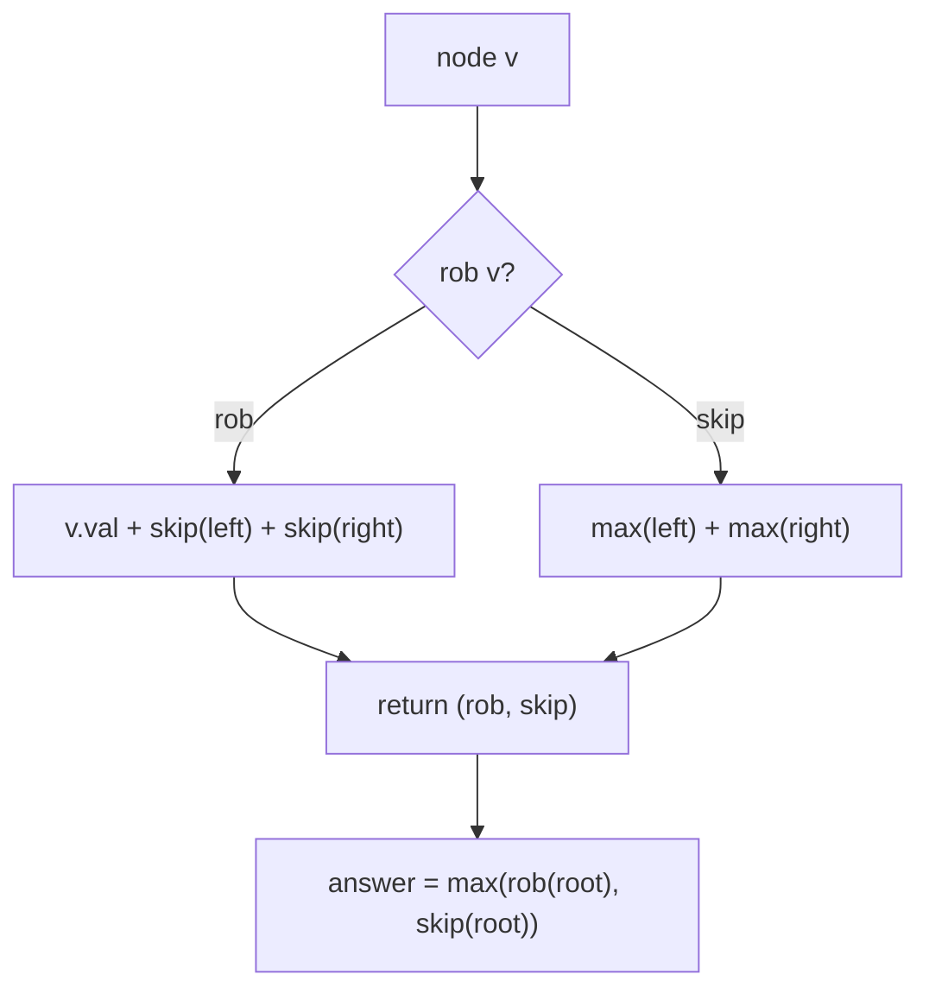
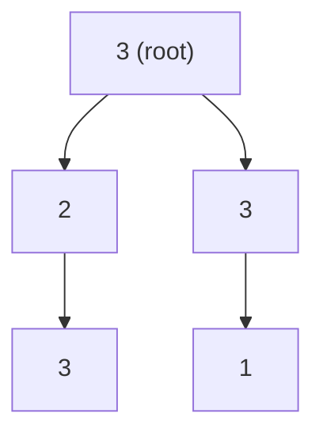
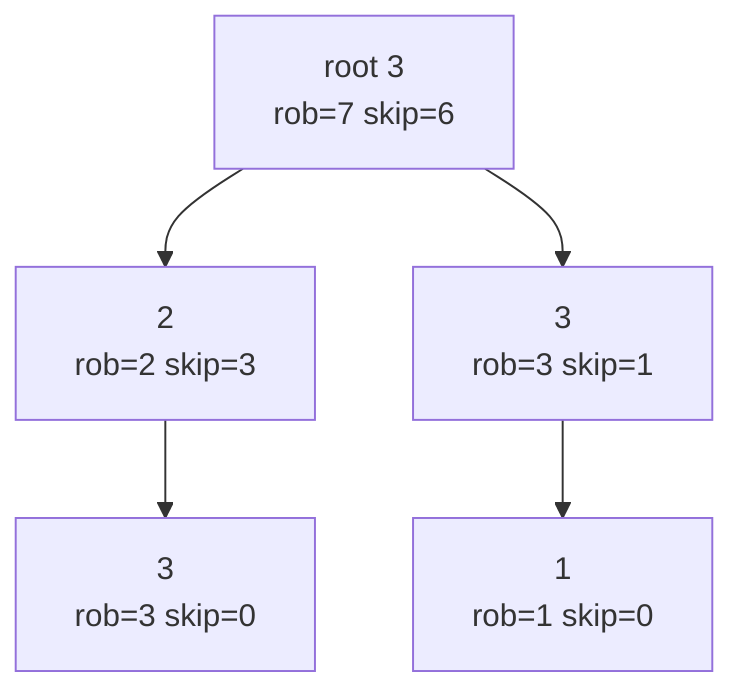

# House Robber III

| Meta | Value |
|------|-------|
| Source | LeetCode #337 |
| Difficulty | Medium |
| Topics | Tree, Depth-First Search, Dynamic Programming, Binary Tree |
| Link | https://leetcode.com/problems/house-robber-iii/ |

---

## Problem Statement

The houses form a **binary tree** rooted at `root`. A burglar realizes that if **two directly
linked houses** (a parent and its child) are both robbed on the same night, the alarm goes off.
Each node holds a non-negative amount of money. Return the **maximum amount** the burglar can rob
without ever robbing a parent and one of its children together.

```text
Input:        3
             / \
            2   3
             \   \
              3   1
Output: 7                 // rob 3 (root) + 3 (left-right) + 1 (right-right) = 7

Input:        3
             / \
            4   5
           / \   \
          1   3   1
Output: 9                 // rob 4 + 5 = 9
```

---

## Approach (WHY)

This is **maximum weight independent set on a tree**: no two adjacent (parent–child) nodes may
both be chosen. At each node we expose **two states** to its parent:

- `rob` — best total for this subtree **when this node IS robbed**.
- `skip` — best total for this subtree **when this node is NOT robbed**.

If we rob the current node, both children must be skipped. If we skip it, each child may
independently take its better option:

$$
\text{rob}(v) = v.\text{val} + \text{skip}(v.\text{left}) + \text{skip}(v.\text{right})
$$
$$
\text{skip}(v) = \max\big(\text{rob}, \text{skip}\big)_{\text{left}} + \max\big(\text{rob}, \text{skip}\big)_{\text{right}}
$$

The answer is $\max(\text{rob}(\text{root}), \text{skip}(\text{root}))$. A single post-order DFS
returns the pair `(rob, skip)`, so the whole tree is processed in $O(n)$.





```python
class TreeNode:
    def __init__(self, val=0, left=None, right=None):
        self.val = val
        self.left = left
        self.right = right

def rob(root):
    def dfs(node):
        if not node:
            return 0, 0                 # (rob, skip) for an empty subtree
        l_rob, l_skip = dfs(node.left)
        r_rob, r_skip = dfs(node.right)
        rob_here = node.val + l_skip + r_skip      # children must be skipped
        skip_here = max(l_rob, l_skip) + max(r_rob, r_skip)
        return rob_here, skip_here

    return max(dfs(root))
```

```cpp
#include <bits/stdc++.h>
using namespace std;

struct TreeNode {
    int val;
    TreeNode* left;
    TreeNode* right;
    TreeNode(int x) : val(x), left(nullptr), right(nullptr) {}
};

// returns {rob, skip} for the subtree at node
pair<long long,long long> dfs(TreeNode* node) {
    if (node == nullptr) return {0, 0};            // empty subtree
    auto [l_rob, l_skip] = dfs(node->left);
    auto [r_rob, r_skip] = dfs(node->right);
    long long rob_here = (long long)node->val + l_skip + r_skip;  // children skipped
    long long skip_here = max(l_rob, l_skip) + max(r_rob, r_skip);
    return {rob_here, skip_here};
}

long long rob(TreeNode* root) {
    auto [r, s] = dfs(root);
    return max(r, s);
}
```

---

## Trace

Run on the first example. The DFS returns `(rob, skip)` bottom-up.

```text
node 3 (left-right leaf):  rob=3, skip=0
node 1 (right-right leaf):  rob=1, skip=0
node 2 (left child):  rob = 2 + skip(3) = 2 + 0 = 2; skip = max(3,0) = 3 -> (2, 3)
node 3 (right child): rob = 3 + skip(1) = 3 + 0 = 3; skip = max(1,0) = 1 -> (3, 1)
root 3:  rob  = 3 + skip(left=2) + skip(right=3) = 3 + 3 + 1 = 7
         skip = max(2,3) + max(3,1) = 3 + 3 = 6
answer = max(7, 6) = 7
```



---

## Complexity

| Measure | Value |
|---------|-------|
| Time | $O(n)$ — each node visited once |
| Space | $O(h)$ — recursion stack, $h$ = tree height |

---

## Takeaway

House Robber III is **maximum independent set on a tree**. Return two states per node —
`(rob, skip)` — and combine: robbing forces both children into `skip`, skipping lets each child
pick its own max. One post-order DFS, $O(n)$, no global memo needed.
