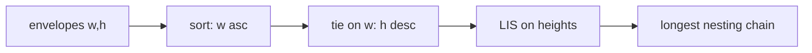
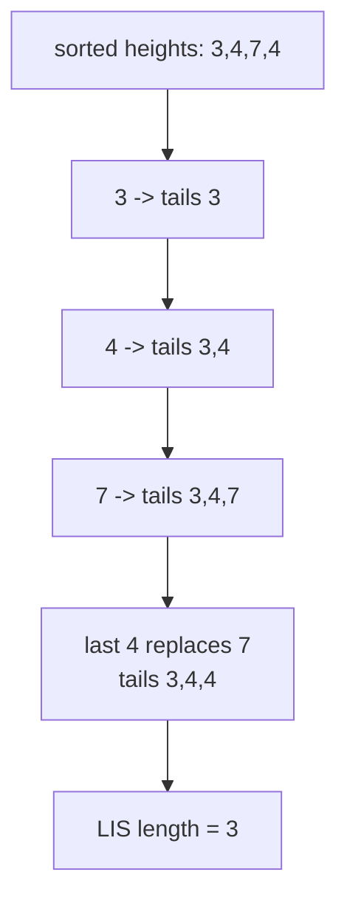

# Russian Doll Envelopes

| Meta | Value |
|------|-------|
| Source | LeetCode #354 |
| Difficulty | Hard |
| Topics | Array, Binary Search, Dynamic Programming, Sorting |
| Link | https://leetcode.com/problems/russian-doll-envelopes/ |

---

## Problem Statement
You are given `envelopes` where `envelopes[i] = [w, h]` is the width and height of an
envelope. One envelope fits into another only if **both** its width and height are
**strictly smaller**. Return the maximum number of envelopes you can nest (like Russian
dolls).

```text
Input:  envelopes = [[5,4],[6,4],[6,7],[2,3]]
Output: 3
Explanation: nesting chain [2,3] => [5,4] => [6,7].
```

---

## Approach (WHY)

A nesting chain is an ordering where both coordinates strictly increase — this is a
**2-D Longest Increasing Subsequence**. We reduce it to a 1-D LIS by sorting cleverly.

Sort envelopes by **width ascending**, and on equal widths by **height descending**. Then
run a standard LIS on the heights:

- Ascending width means any valid chain reads left-to-right in the sorted order.
- The **descending** height tie-break on equal widths is the crucial trick: it guarantees
  that two envelopes with the **same width** can never both appear in an increasing height
  subsequence (their heights go down, not up), correctly enforcing *strict* width growth.

$$
\text{answer} = \text{LIS}\big(\,[\,h \text{ values after sorting}\,]\,\big)
$$



Why the tie-break matters — consider widths `[6,4]` and `[6,7]`. If sorted height
*ascending* we would get heights `4, 7`, an increasing pair, wrongly counting both equal
widths. Sorting height *descending* gives `7, 4`, which cannot both be picked.

```python
from bisect import bisect_left

def maxEnvelopes(envelopes):
    envelopes.sort(key=lambda e: (e[0], -e[1]))
    tails = []
    for _, h in envelopes:
        pos = bisect_left(tails, h)   # strict LIS on heights
        if pos == len(tails):
            tails.append(h)
        else:
            tails[pos] = h
    return len(tails)
```

```cpp
#include <bits/stdc++.h>
using namespace std;

int maxEnvelopes(vector<vector<int>>& envelopes) {
    sort(envelopes.begin(), envelopes.end(), [](const vector<int>& a, const vector<int>& b){
        if (a[0] != b[0]) return a[0] < b[0];   // width ascending
        return a[1] > b[1];                      // height descending on ties
    });
    vector<int> tails;
    for (auto& e : envelopes) {
        int h = e[1];
        auto it = lower_bound(tails.begin(), tails.end(), h);
        if (it == tails.end()) tails.push_back(h);
        else *it = h;
    }
    return (int)tails.size();
}
```

---

## Trace

`envelopes = [[5,4],[6,4],[6,7],[2,3]]`

After sorting (`w` asc, `h` desc): `[[2,3],[5,4],[6,7],[6,4]]`.
Heights in that order: `[3, 4, 7, 4]`.

| h | action | tails |
|---|--------|-------|
| 3 | append | `[3]` |
| 4 | append | `[3, 4]` |
| 7 | append | `[3, 4, 7]` |
| 4 | replace 7 | `[3, 4, 4]` |

Final length $= 3$ — the chain `[2,3] => [5,4] => [6,7]`.



Note the two width-6 envelopes (`[6,7]`, `[6,4]`) never both contribute, exactly as the
descending tie-break intended.

---

## Complexity

| Step | Time | Space |
|------|------|-------|
| Sort | $O(n \log n)$ | $O(n)$ |
| LIS on heights | $O(n \log n)$ | $O(n)$ |
| **Total** | $O(n \log n)$ | $O(n)$ |

---

## Takeaway
Multi-key "chain / nest" problems collapse to a 1-D LIS: **sort by the first key, LIS on
the second**. The make-or-break detail is the **descending tie-break** on equal first keys,
which encodes the strict-inequality requirement directly into the sort order.
