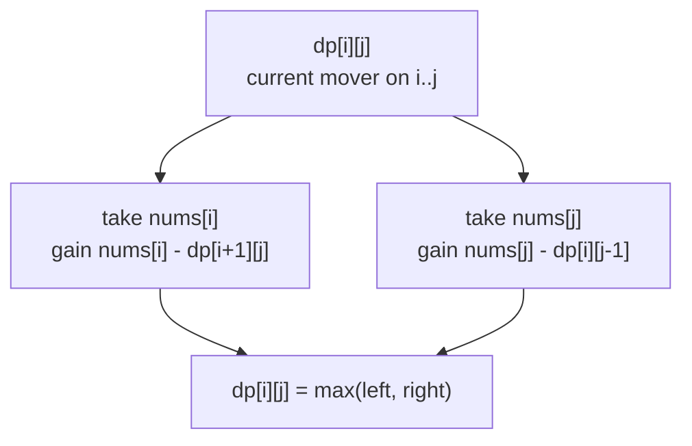
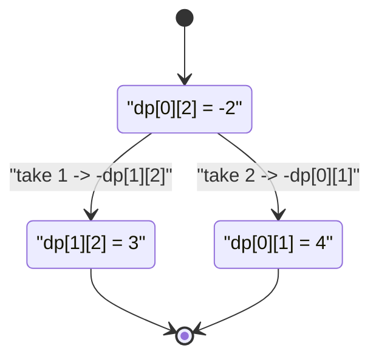

# Predict the Winner

| Meta | Value |
|---|---|
| Source | LeetCode 486 |
| Difficulty | Medium |
| Topic | Interval Game DP, Minimax |
| Key idea | `dp[i][j]` = best score difference on `nums[i..j]` |

---

## Problem Statement

Two players take turns picking a number from **either end** of an integer array `nums`. Each adds the chosen number to their score. Player 1 moves first. Both play optimally. Return `true` if **Player 1** can win (a **tie** counts as a win for Player 1).

```text
Input:  nums = [1, 5, 2]
Output: false
Explain: P1 takes 1 or 2. If 2 -> P2 takes 5 -> P1 takes 1.
         P1=3, P2=5. P1 cannot guarantee a non-loss.

Input:  nums = [1, 5, 233, 7]
Output: true
Explain: P1 takes 7; whatever P2 does, P1 grabs 233 and wins.
```

---

## Approach (WHY)

Track the **score difference** from the perspective of the player **about to move**. Let `dp[i][j]` be the maximum value of *(current player's total − opponent's total)* obtainable on subarray `nums[i..j]`.

Base case — one element, the mover simply takes it:

$$
dp[i][i] = nums[i]
$$

Transition — the mover takes an end, gains its value, and then **faces** the opponent who plays optimally on the rest. Because `dp` of the remaining interval is the opponent's advantage, we **subtract** it:

$$
dp[i][j] = \max\big(\,nums[i] - dp[i+1][j],\ \ nums[j] - dp[i][j-1]\,\big)
$$

Player 1 wins (or ties) iff the difference over the whole array is non-negative:

$$
\text{Player 1 wins} \iff dp[0][n-1] \ge 0
$$

The negation encodes minimax cleanly: a positive `dp` for the opponent is a positive *deduction* against the current player.



### Top-down memoization

```python
from functools import lru_cache

def predict_the_winner(nums):
    n = len(nums)

    @lru_cache(maxsize=None)
    def solve(i, j):
        # best (mover - opponent) difference on nums[i..j]
        if i == j:
            return nums[i]
        take_left = nums[i] - solve(i + 1, j)
        take_right = nums[j] - solve(i, j - 1)
        return max(take_left, take_right)

    return solve(0, n - 1) >= 0

print(predict_the_winner([1, 5, 2]))       # False
print(predict_the_winner([1, 5, 233, 7]))  # True
```

```cpp
#include <bits/stdc++.h>
using namespace std;

vector<long long> g_nums;
vector<vector<long long>> memo;
vector<vector<char>> seen;

long long solve(int i, int j) {
    // best (mover - opponent) difference on nums[i..j]
    if (i == j) return g_nums[i];
    if (seen[i][j]) return memo[i][j];
    long long takeLeft  = g_nums[i] - solve(i + 1, j);
    long long takeRight = g_nums[j] - solve(i, j - 1);
    seen[i][j] = 1;
    return memo[i][j] = max(takeLeft, takeRight);
}

bool predictTheWinner(const vector<long long>& nums) {
    g_nums = nums;
    int n = (int)nums.size();
    memo.assign(n, vector<long long>(n, 0));
    seen.assign(n, vector<char>(n, 0));
    return solve(0, n - 1) >= 0;
}

int main() {
    cout << boolalpha;
    cout << predictTheWinner({1, 5, 2}) << "\n";      // false
    cout << predictTheWinner({1, 5, 233, 7}) << "\n"; // true
    return 0;
}
```

### Bottom-up tabulation

```python
def predict_the_winner_bottom_up(nums):
    n = len(nums)
    dp = [[0] * n for _ in range(n)]
    for i in range(n):
        dp[i][i] = nums[i]
    for length in range(2, n + 1):
        for i in range(0, n - length + 1):
            j = i + length - 1
            take_left = nums[i] - dp[i + 1][j]
            take_right = nums[j] - dp[i][j - 1]
            dp[i][j] = max(take_left, take_right)
    return dp[0][n - 1] >= 0

print(predict_the_winner_bottom_up([1, 5, 2]))       # False
print(predict_the_winner_bottom_up([1, 5, 233, 7]))  # True
```

```cpp
#include <bits/stdc++.h>
using namespace std;

bool predictTheWinnerBottomUp(const vector<long long>& nums) {
    int n = (int)nums.size();
    vector<vector<long long>> dp(n, vector<long long>(n, 0));
    for (int i = 0; i < n; ++i) dp[i][i] = nums[i];
    for (int length = 2; length <= n; ++length) {
        for (int i = 0; i + length - 1 < n; ++i) {
            int j = i + length - 1;
            long long takeLeft  = nums[i] - dp[i + 1][j];
            long long takeRight = nums[j] - dp[i][j - 1];
            dp[i][j] = max(takeLeft, takeRight);
        }
    }
    return dp[0][n - 1] >= 0;
}

int main() {
    cout << boolalpha;
    cout << predictTheWinnerBottomUp({1, 5, 2}) << "\n";      // false
    cout << predictTheWinnerBottomUp({1, 5, 233, 7}) << "\n"; // true
    return 0;
}
```

---

## Trace (nums = [1, 5, 2])

Filling `dp` by increasing interval length:

| i..j | nums | take_left | take_right | dp |
|---|---|---|---|---|
| 0..0 | [1] | — | — | 1 |
| 1..1 | [5] | — | — | 5 |
| 2..2 | [2] | — | — | 2 |
| 0..1 | [1,5] | 1 − 5 = −4 | 5 − 1 = 4 | 4 |
| 1..2 | [5,2] | 5 − 2 = 3 | 2 − 5 = −3 | 3 |
| 0..2 | [1,5,2] | 1 − dp[1][2]=1−3=−2 | 2 − dp[0][1]=2−4=−2 | −2 |

`dp[0][2] = -2 < 0` ⟹ Player 1 **loses** ⟹ `False`.



---

## Complexity

| Method | Time | Space |
|---|---|---|
| Memoized recursion | $O(n^2)$ | $O(n^2)$ |
| Bottom-up table | $O(n^2)$ | $O(n^2)$ (reducible to $O(n)$) |

---

## Takeaway

Model symmetric take-from-ends games with a **single score-difference table**: `dp[i][j] = max(a[i] - dp[i+1][j], a[j] - dp[i][j-1])`. The minus sign is the entire minimax — no separate min/max branches needed. Player 1 wins iff the full-array difference is `>= 0`.
