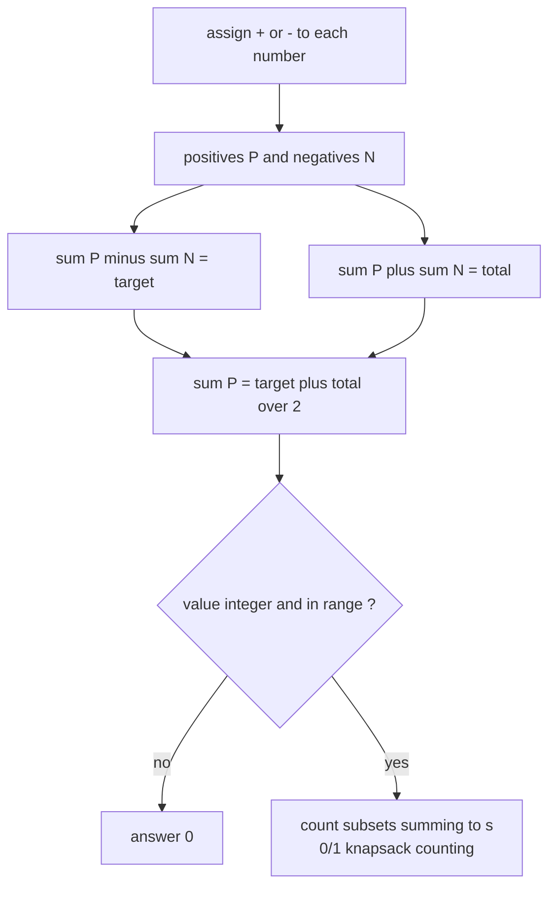
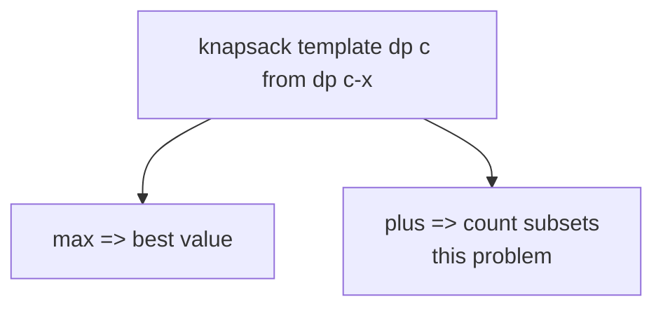
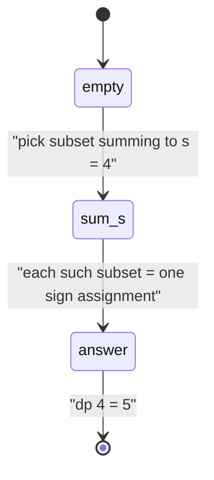

# 494. Target Sum

| Meta | Value |
| --- | --- |
| Problem | Target Sum |
| Source | LeetCode 494 |
| Reference | https://leetcode.com/problems/target-sum/ |
| Difficulty | Medium |
| Topics | Dynamic Programming, Subset Sum, 0/1 Knapsack, Counting |
| Time | $O(n \cdot S)$ |
| Space | $O(S)$ |

## Problem Statement

You are given an integer array `nums` and an integer `target`. Place a `+` or `-` in front of every number so that the resulting expression evaluates to `target`. Return the number of distinct ways (sign assignments) to do this.

```text
Input:
  nums = [1, 1, 1, 1, 1]
  target = 3

Output:
  5

Explanation:
  -1+1+1+1+1 = 3
  +1-1+1+1+1 = 3
  +1+1-1+1+1 = 3
  +1+1+1-1+1 = 3
  +1+1+1+1-1 = 3
  Five sign assignments hit the target.
```

## Approach (WHY)

Split the numbers into a set $P$ assigned `+` and a set $N$ assigned `-`. Then:

$$
\text{sum}(P) - \text{sum}(N) = target, \qquad \text{sum}(P) + \text{sum}(N) = total
$$

Adding the two equations:

$$
2 \cdot \text{sum}(P) = target + total \;\Longrightarrow\; \text{sum}(P) = \frac{target + total}{2}
$$

So the problem reduces to: **count the subsets of `nums` whose sum equals $s = \frac{target + total}{2}$.** This is a classic **0/1 knapsack counting** DP. It has solutions only when $target + total$ is non-negative and **even**, and when $|target| \le total$.



For the counting DP, let $dp[c]$ be the number of subsets summing to exactly $c$. Base case $dp[0] = 1$ (the empty subset). Processing each number $x$ updates, with capacity **descending** (each number used once):

$$
dp[c] \mathrel{+}= dp[c - x]
$$

We replace the knapsack `max` with `+` because we are **counting** ways, not maximizing value.



### Solution

```python
def find_target_sum_ways(nums, target):
    total = sum(nums)
    # s = (target + total) / 2 must be a non-negative integer
    if (target + total) % 2 != 0 or abs(target) > total:
        return 0
    s = (target + total) // 2
    dp = [0] * (s + 1)
    dp[0] = 1
    for x in nums:
        for c in range(s, x - 1, -1):      # DESCENDING => each number once
            dp[c] += dp[c - x]
    return dp[s]


if __name__ == "__main__":
    print(find_target_sum_ways([1, 1, 1, 1, 1], 3))  # 5
```

```cpp
#include <bits/stdc++.h>
using namespace std;

long long find_target_sum_ways(vector<long long> nums, long long target) {
    long long total = 0;
    for (long long x : nums) total += x;
    // s = (target + total) / 2 must be a non-negative integer
    if (((target + total) % 2 != 0) || llabs(target) > total)
        return 0;
    long long s = (target + total) / 2;
    vector<long long> dp(s + 1, 0);
    dp[0] = 1;
    for (long long x : nums)
        for (long long c = s; c >= x; c--)   // DESCENDING => each number once
            dp[c] += dp[c - x];
    return dp[s];
}

int main() {
    cout << find_target_sum_ways({1, 1, 1, 1, 1}, 3) << "\n";  // 5
    return 0;
}
```

## DP-Table Trace

`nums = [1, 1, 1, 1, 1]`, `target = 3`, `total = 5`, so $s = \frac{3 + 5}{2} = 4$. Each row is `dp` (counts) **after** processing one number, capacities $0 \dots 4$.

| After number | 0 | 1 | 2 | 3 | 4 |
| --- | --- | --- | --- | --- | --- |
| init | 1 | 0 | 0 | 0 | 0 |
| 1st `1` | 1 | 1 | 0 | 0 | 0 |
| 2nd `1` | 1 | 2 | 1 | 0 | 0 |
| 3rd `1` | 1 | 3 | 3 | 1 | 0 |
| 4th `1` | 1 | 4 | 6 | 4 | 1 |
| 5th `1` | 1 | 5 | 10 | 10 | 5 |

The final $dp[4] = 5$ — the number of subsets summing to $4$, which equals the number of valid sign assignments. (These are exactly the binomial coefficients $\binom{5}{k}$, a nice sanity check.)



## Complexity

- **Time:** $O(n \cdot S)$ where $S = s = \frac{target + total}{2}$.
- **Space:** $O(S)$ — single rolling counting array.

## Takeaway

Target Sum looks like a sign-assignment puzzle but algebra collapses it to "count subsets with a fixed sum," a textbook **0/1 knapsack counting** DP. The two giveaways: derive $s = \frac{target + total}{2}$, then swap knapsack's `max` for `+` while keeping the **descending** capacity loop.
