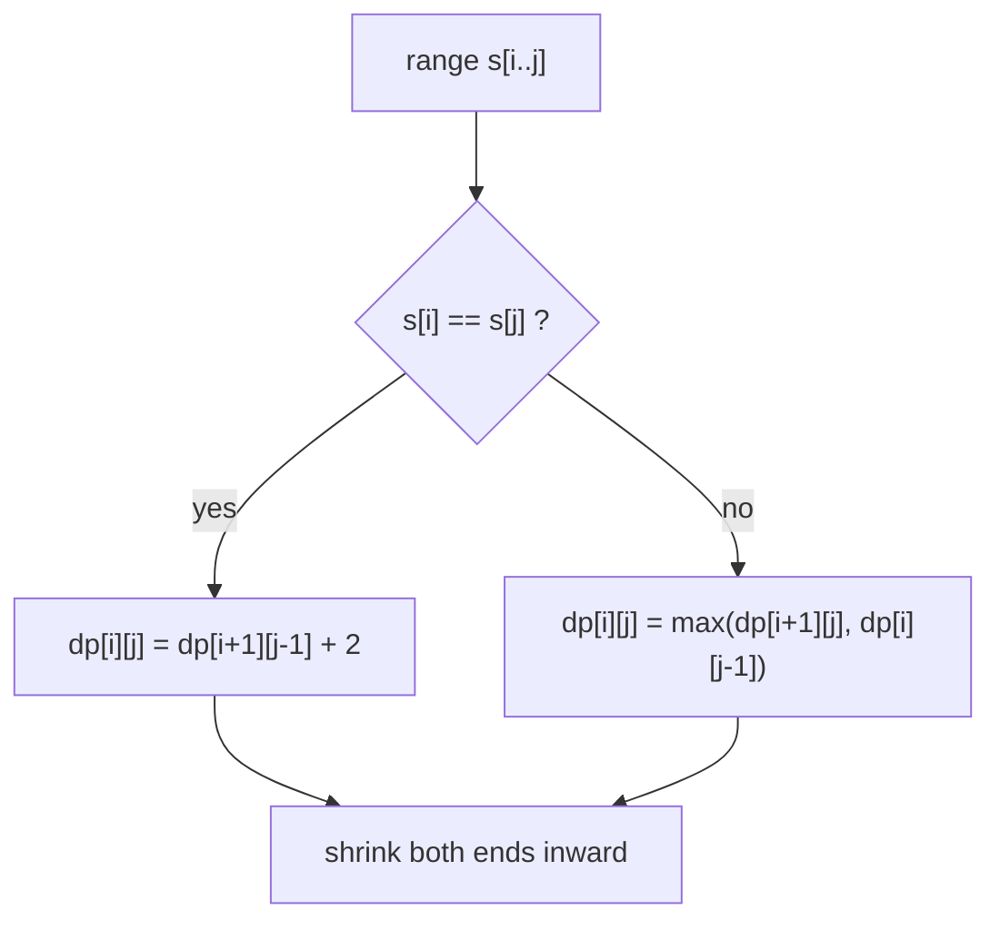
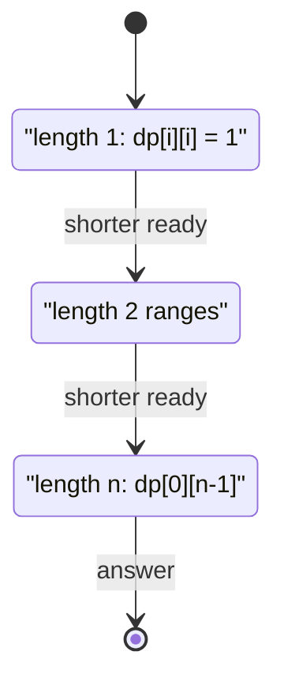
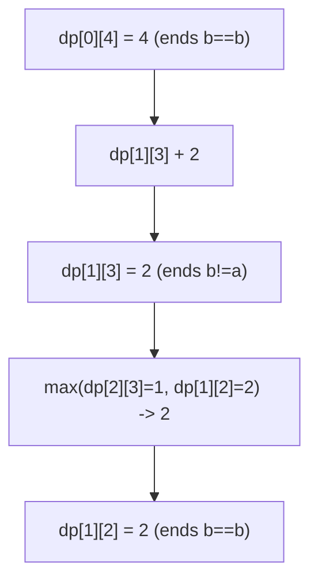

# Longest Palindromic Subsequence

| Meta | Value |
|------|-------|
| Problem | Longest Palindromic Subsequence |
| Source | LeetCode #516 |
| Reference | https://leetcode.com/problems/longest-palindromic-subsequence/ |
| Difficulty | Medium |
| Topics | String, Dynamic Programming, Interval DP |
| Time | $O(n^2)$ |
| Space | $O(n^2)$ |

---

## Problem Statement

Given a string `s`, return the length of the **longest palindromic subsequence** in `s`. A
subsequence is formed by deleting zero or more characters without changing the order of the
remaining characters; it is a palindrome if it reads the same forwards and backwards.

```text
Input:  s = "bbbab"
Output: 4
Explanation: one longest palindromic subsequence is "bbbb".

Input:  s = "cbbd"
Output: 2
Explanation: one longest palindromic subsequence is "bb".
```

---

## Approach (WHY)

Work on **ranges** of the string. Let `dp[i][j]` be the length of the longest palindromic
subsequence inside `s[i..j]`. The two endpoint characters decide everything:

- If `s[i] == s[j]`, they can wrap a palindrome found strictly inside, adding `2` to it:
  `dp[i][j] = dp[i+1][j-1] + 2`.
- If `s[i] != s[j]`, at least one endpoint is useless, so drop one and keep the better side:
  `dp[i][j] = max(dp[i+1][j], dp[i][j-1])`.

$$
dp[i][j] =
\begin{cases}
dp[i+1][j-1] + 2 & \text{if } s[i] = s[j] \\[4pt]
\max\big(dp[i+1][j],\; dp[i][j-1]\big) & \text{if } s[i] \ne s[j]
\end{cases}
$$

with base case $dp[i][i] = 1$ (a single character is a palindrome of length 1).



Unlike chain DPs there is no free split point `k`; the range simply **shrinks toward its centre**.
The dependencies still come from strictly shorter ranges, so we fill by **increasing length**:



```python
def longestPalindromeSubseq(s):
    n = len(s)
    dp = [[0] * n for _ in range(n)]
    for i in range(n):
        dp[i][i] = 1                          # single char palindrome
    for length in range(2, n + 1):            # range length
        for i in range(0, n - length + 1):
            j = i + length - 1
            if s[i] == s[j]:
                dp[i][j] = dp[i + 1][j - 1] + 2
            else:
                dp[i][j] = max(dp[i + 1][j], dp[i][j - 1])
    return dp[0][n - 1]
```

```cpp
#include <bits/stdc++.h>
using namespace std;

long long longestPalindromeSubseq(const string& s) {
    int n = (int)s.size();
    vector<vector<long long>> dp(n, vector<long long>(n, 0));
    for (int i = 0; i < n; ++i) dp[i][i] = 1;      // single char palindrome
    for (int length = 2; length <= n; ++length) {  // range length
        for (int i = 0; i + length - 1 < n; ++i) {
            int j = i + length - 1;
            if (s[i] == s[j])
                dp[i][j] = dp[i + 1][j - 1] + 2;
            else
                dp[i][j] = max(dp[i + 1][j], dp[i][j - 1]);
        }
    }
    return dp[0][n - 1];
}
```

---

## Trace

Run on `s = "bbbab"` (`n = 5`). Diagonal starts at all `1`s; grow by length.

```text
length 2:
  dp[0][1] s[0]=b,s[1]=b equal -> dp[1][0]+2 = 0+2 = 2
  dp[1][2] b,b equal -> 2
  dp[2][3] b,a differ -> max(dp[3][3], dp[2][2]) = 1
  dp[3][4] a,b differ -> max(1, 1) = 1

length 3:
  dp[0][2] b,b equal -> dp[1][1]+2 = 1+2 = 3
  dp[1][3] b,a differ -> max(dp[2][3], dp[1][2]) = max(1, 2) = 2
  dp[2][4] b,b equal -> dp[3][3]+2 = 1+2 = 3

length 4:
  dp[0][3] b,a differ -> max(dp[1][3], dp[0][2]) = max(2, 3) = 3
  dp[1][4] b,b equal -> dp[2][3]+2 = 1+2 = 3

length 5 (full string):
  dp[0][4] b,b equal -> dp[1][3]+2 = 2+2 = 4
answer = 4   ("bbbb")
```



---

## Complexity

| Measure | Value |
|---------|-------|
| States | $O(n^2)$ ranges `(i, j)` |
| Transition | $O(1)$ endpoint comparison |
| Time | $O(n^2)$ |
| Space | $O(n^2)$ (reducible to $O(n)$ with two rolling rows) |

---

## Takeaway

Longest Palindromic Subsequence is the **shrink-the-ends** flavour of interval DP. Instead of a
free split point, the recurrence compares the two endpoints of `s[i..j]`: matching ends add `2`
around the inner range, mismatched ends drop one side. Initialise the diagonal to `1` and fill by
**increasing length** so `dp[i+1][j-1]`, `dp[i+1][j]`, and `dp[i][j-1]` are always ready. The
$O(1)$ transition makes this the rare $O(n^2)$ interval DP.
