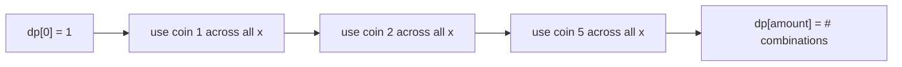
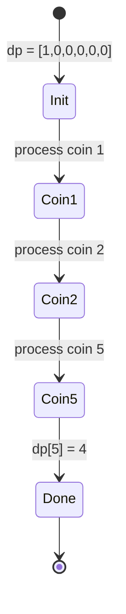

# Coin Change II (Count Combinations)

| Meta | Value |
|------|-------|
| Problem | Coin Change II |
| Source | LeetCode #518 |
| Reference | https://leetcode.com/problems/coin-change-ii/ |
| Difficulty | Medium |
| Topics | Dynamic Programming, Unbounded Knapsack, Counting |
| Time | $O(k \cdot A)$ |
| Space | $O(A)$ |

---

## Problem Statement

Given coins of distinct denominations and a total `amount`, return the **number of distinct
combinations** that sum to `amount`. Each coin may be used an **unlimited** number of times. Two
combinations are the same if they use the same multiset of coins — **order does not matter**.

```text
Input:  amount = 5, coins = [1, 2, 5]
Output: 4
Explanation:
  5 = 5
  5 = 2 + 2 + 1
  5 = 2 + 1 + 1 + 1
  5 = 1 + 1 + 1 + 1 + 1

Input:  amount = 3, coins = [2]
Output: 0   (cannot form 3 with only 2s)
```

---

## Approach (WHY)

Let $dp[x]$ be the number of **combinations** summing to $x$. There is exactly one way to make the
empty amount — pick nothing — so $dp[0] = 1$.

To avoid counting $\{1,2\}$ and $\{2,1\}$ separately, we impose a canonical build order: process one
coin **completely** before moving to the next. That means the coin loop is **OUTER** and the amount
loop is **INNER**:

$$
dp[x] \mathrel{+}= dp[x - c] \quad\text{for each coin } c,\; x = c \ldots A.
$$

Because coin $c$ is only ever appended after the coins already processed, every multiset has a
single canonical generation order and is counted exactly once.



---

## Solution

```python
def change(amount, coins):
    dp = [0] * (amount + 1)
    dp[0] = 1                            # one empty combination
    for c in coins:                      # COINS OUTER -> combinations
        for x in range(c, amount + 1):   # amount inner
            dp[x] += dp[x - c]
    return dp[amount]
```

```cpp
#include <bits/stdc++.h>
using namespace std;

int change(int amount, vector<int>& coins) {
    vector<long long> dp(amount + 1, 0);
    dp[0] = 1;                               // one empty combination
    for (int c : coins) {                    // COINS OUTER -> combinations
        for (int x = c; x <= amount; x++) {  // amount inner
            dp[x] += dp[x - c];
        }
    }
    return (int)dp[amount];
}
```

---

## DP-Table Trace

`coins = [1, 2, 5]`, `amount = 5`. We show the table after each coin is fully processed.

| stage | dp[0] | dp[1] | dp[2] | dp[3] | dp[4] | dp[5] |
|-------|-------|-------|-------|-------|-------|-------|
| init        | 1 | 0 | 0 | 0 | 0 | 0 |
| after coin 1| 1 | 1 | 1 | 1 | 1 | 1 |
| after coin 2| 1 | 1 | 2 | 2 | 3 | 3 |
| after coin 5| 1 | 1 | 2 | 2 | 3 | **4** |

- After coin `1`: only the all-ones combination exists for each amount.
- After coin `2`: e.g. `dp[4] = 3` → `{1,1,1,1}`, `{2,1,1}`, `{2,2}`.
- After coin `5`: `dp[5]` gains the single-coin `{5}`, giving **4**.



---

## Complexity

- **Time:** $O(k \cdot A)$ — each coin sweeps every amount once.
- **Space:** $O(A)$ — single 1D table.

---

## Takeaway

Counting **combinations** = unbounded knapsack with `+=` and **coins on the outer loop**. The outer
coin loop fixes a canonical order so each multiset is counted once. Flip the loops (amount outer)
and you would instead count ordered sequences — that is the subject of the companion problem.
