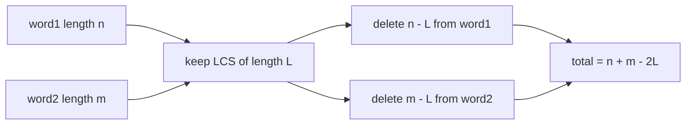
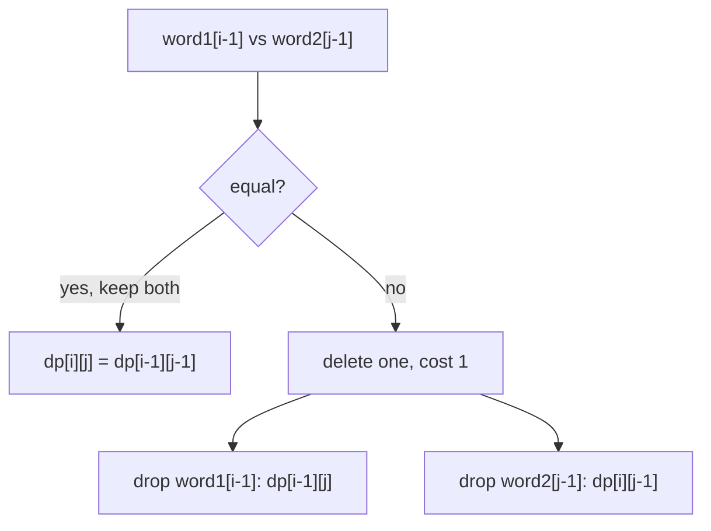
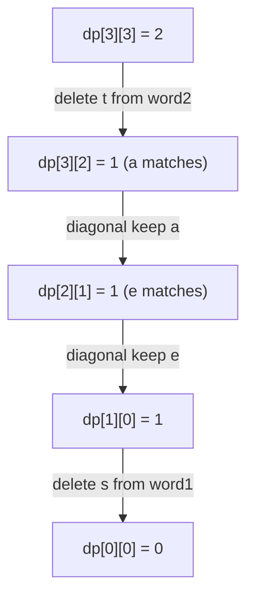

# Delete Operation for Two Strings

| Meta | Value |
|------|-------|
| Source | LeetCode #583 |
| Difficulty | Medium |
| Topics | String, Dynamic Programming |
| Link | https://leetcode.com/problems/delete-operation-for-two-strings/ |

---

## Problem Statement

Given two strings `word1` and `word2`, return the **minimum number of deletions** required
to make the two strings equal. In each step you may delete exactly one character from either
string.

```text
Input:  word1 = "sea", word2 = "eat"
Output: 2
Explanation: Delete "s" from "sea" -> "ea", delete "t" from "eat" -> "ea".

Input:  word1 = "leetcode", word2 = "etco"
Output: 4
```

---

## Approach (WHY)

You may only **delete**, never insert or replace. So every character you keep must appear in
both strings in the same order — i.e. it belongs to a **common subsequence**. To delete as
few characters as possible, keep the **longest** common subsequence and delete the rest.

If $L = \text{LCS}(word1, word2)$, then

$$
\text{answer} = (n - L) + (m - L) = n + m - 2L.
$$



We can compute it directly with an LCS table, or skip the subtraction and define a deletion
DP straight away:

$$
\text{dp}[i][j] =
\begin{cases}
\text{dp}[i-1][j-1] & word1[i-1] = word2[j-1] \\[4pt]
1 + \min\big(\text{dp}[i-1][j],\ \text{dp}[i][j-1]\big) & \text{otherwise}
\end{cases}
$$

with base cases `dp[i][0] = i` and `dp[0][j] = j` (delete the whole remaining prefix).



### Code (via LCS)

```python
def minDistance(word1: str, word2: str) -> int:
    n, m = len(word1), len(word2)
    dp = [[0] * (m + 1) for _ in range(n + 1)]
    for i in range(1, n + 1):
        for j in range(1, m + 1):
            if word1[i - 1] == word2[j - 1]:
                dp[i][j] = dp[i - 1][j - 1] + 1
            else:
                dp[i][j] = max(dp[i - 1][j], dp[i][j - 1])
    lcs = dp[n][m]
    return n + m - 2 * lcs
```

```cpp
#include <bits/stdc++.h>
using namespace std;

class Solution {
public:
    int minDistance(string word1, string word2) {
        int n = word1.size(), m = word2.size();
        vector<vector<long long>> dp(n + 1, vector<long long>(m + 1, 0));
        for (int i = 1; i <= n; i++) {
            for (int j = 1; j <= m; j++) {
                if (word1[i - 1] == word2[j - 1])
                    dp[i][j] = dp[i - 1][j - 1] + 1;
                else
                    dp[i][j] = max(dp[i - 1][j], dp[i][j - 1]);
            }
        }
        long long lcs = dp[n][m];
        return (int)((long long)n + m - 2 * lcs);
    }
};
```

### Code (direct deletion DP)

```python
def minDistance_direct(word1: str, word2: str) -> int:
    n, m = len(word1), len(word2)
    dp = [[0] * (m + 1) for _ in range(n + 1)]
    for i in range(n + 1):
        dp[i][0] = i
    for j in range(m + 1):
        dp[0][j] = j
    for i in range(1, n + 1):
        for j in range(1, m + 1):
            if word1[i - 1] == word2[j - 1]:
                dp[i][j] = dp[i - 1][j - 1]
            else:
                dp[i][j] = 1 + min(dp[i - 1][j], dp[i][j - 1])
    return dp[n][m]
```

```cpp
#include <bits/stdc++.h>
using namespace std;

long long minDistance_direct(string word1, string word2) {
    int n = word1.size(), m = word2.size();
    vector<vector<long long>> dp(n + 1, vector<long long>(m + 1, 0));
    for (int i = 0; i <= n; i++) dp[i][0] = i;
    for (int j = 0; j <= m; j++) dp[0][j] = j;
    for (int i = 1; i <= n; i++) {
        for (int j = 1; j <= m; j++) {
            if (word1[i - 1] == word2[j - 1])
                dp[i][j] = dp[i - 1][j - 1];
            else
                dp[i][j] = 1 + min(dp[i - 1][j], dp[i][j - 1]);
        }
    }
    return dp[n][m];
}
```

---

## DP Grid Trace

Direct deletion DP for `word1 = "sea"` (rows) and `word2 = "eat"` (columns). Row/column `0`
are the "delete the whole prefix" base cases.

|        | "" | e | a | t |
|--------|----|---|---|---|
| **""** | 0  | 1 | 2 | 3 |
| **s**  | 1  | 2 | 3 | 4 |
| **e**  | 2  | **1** | 2 | 3 |
| **a**  | 3  | 2 | **1** | 2 |

The answer `dp[3][3] = 2`. Cross-check with LCS: `LCS("sea","eat") = "ea"` so
$L = 2$ and $n + m - 2L = 3 + 3 - 4 = 2$. ✔



---

## Complexity

| Version | Time | Space |
|---|---|---|
| LCS table | $O(nm)$ | $O(nm)$, reducible to $O(\min(n,m))$ |
| Direct deletion DP | $O(nm)$ | $O(nm)$, reducible to $O(\min(n,m))$ |

---

## Takeaway

When only deletions are allowed, the characters you keep form a common subsequence, so the
minimum deletions equal $n + m - 2 \cdot \text{LCS}$. Recognizing this reduction turns a
fresh-looking problem into the LCS you already know — the direct DP is just LCS with the
subtraction folded into the recurrence.
