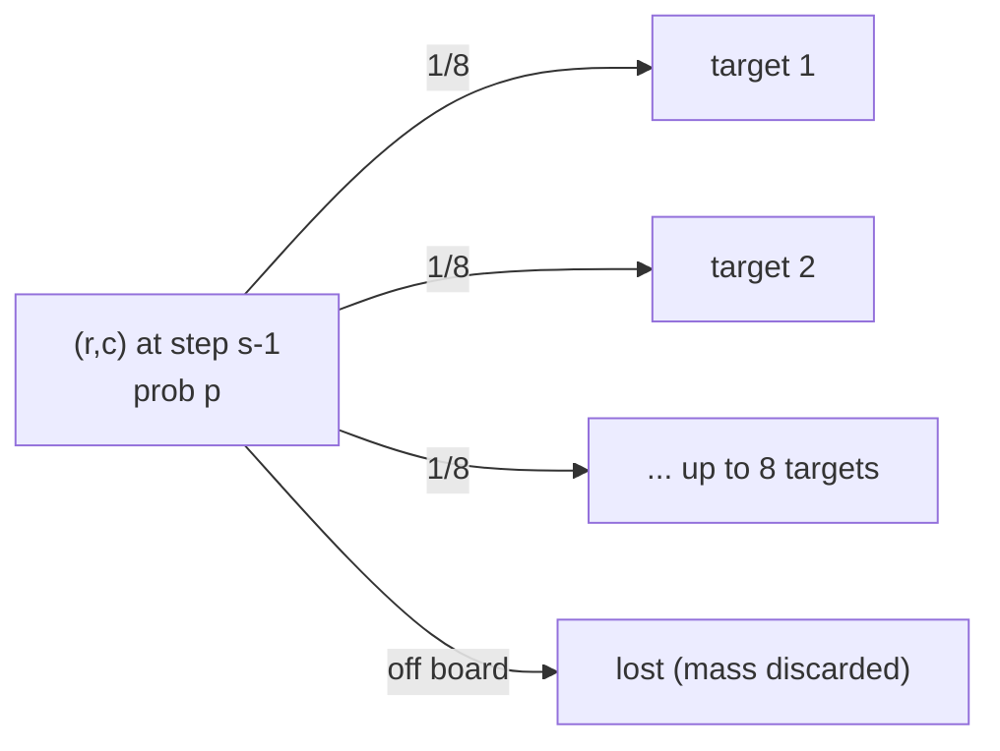
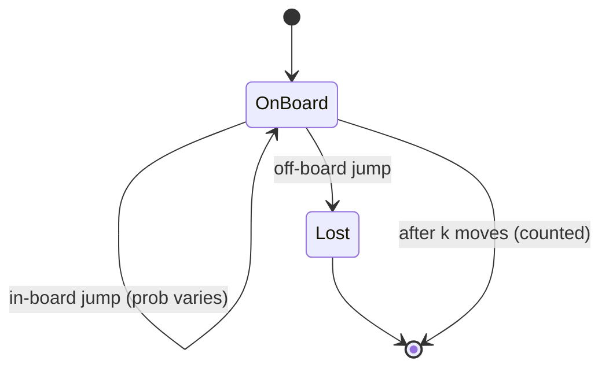

# Knight Probability in Chessboard

| Meta | Value |
|------|-------|
| Source | LeetCode #688 |
| Difficulty | Medium |
| Topics | Dynamic Programming, Probability, Matrix |
| Link | https://leetcode.com/problems/knight-probability-in-the-chessboard/ |

---

## Problem Statement

On an `n × n` chessboard, a knight starts at cell `(row, column)` and makes **exactly `k`
moves**. Each move is chosen **uniformly at random** among the knight's 8 L-shaped jumps,
*even if the destination is off the board* — and once it steps off, it stops moving and is
lost. Return the probability that the knight remains **on the board** after all `k` moves.

```text
Input:  n = 3, k = 2, row = 0, column = 0
Output: 0.0625
        // From (0,0): 2 of 8 first moves stay on board (prob 2/8 each).
        // From each survivor, 2 of 8 stay -> 0.25 * 0.25 = 0.0625.

Input:  n = 1, k = 0, row = 0, column = 0
Output: 1.0
        // No moves made; the knight is trivially still on the board.
```

---

## Approach (WHY)

Let `dp[s][r][c]` = **probability the knight is on cell `(r, c)` after `s` moves**, having
survived every step. With `s = 0` all mass sits on the start: `dp[0][row][column] = 1`.

Each of the 8 moves is equally likely, so a single move spreads a cell's probability evenly
to its (up to 8) targets, each receiving a factor $\tfrac{1}{8}$. Mass that lands off the
board simply vanishes — we never add it anywhere. Pulling toward `(r, c)` from its 8
predecessors:

$$
dp[s][r][c] = \sum_{(dr,dc)} \frac{1}{8}\, dp[s-1][\,r-dr\,][\,c-dc\,]
$$

where the sum ranges over in-board predecessors only. The answer is the total surviving
mass after `k` moves:

$$
\text{answer} = \sum_{r=0}^{n-1}\sum_{c=0}^{n-1} dp[k][r][c].
$$

Because layer `s` depends only on layer `s-1`, two 2D grids suffice (rolling array).



```python
def knightProbability(n, k, row, column):
    moves = [(-2, -1), (-2, 1), (-1, -2), (-1, 2),
             (1, -2), (1, 2), (2, -1), (2, 1)]
    dp = [[0.0] * n for _ in range(n)]
    dp[row][column] = 1.0
    for _ in range(k):
        nxt = [[0.0] * n for _ in range(n)]
        for r in range(n):
            for c in range(n):
                if dp[r][c] == 0.0:
                    continue
                share = dp[r][c] / 8.0
                for dr, dc in moves:
                    nr, nc = r + dr, c + dc
                    if 0 <= nr < n and 0 <= nc < n:
                        nxt[nr][nc] += share
        dp = nxt
    return sum(dp[r][c] for r in range(n) for c in range(n))
```

```cpp
#include <bits/stdc++.h>
using namespace std;

double knightProbability(int n, int k, int row, int column) {
    int moves[8][2] = {{-2,-1},{-2,1},{-1,-2},{-1,2},
                       {1,-2},{1,2},{2,-1},{2,1}};
    vector<vector<double>> dp(n, vector<double>(n, 0.0));
    dp[row][column] = 1.0;
    for (int step = 0; step < k; ++step) {
        vector<vector<double>> nxt(n, vector<double>(n, 0.0));
        for (int r = 0; r < n; ++r) {
            for (int c = 0; c < n; ++c) {
                if (dp[r][c] == 0.0) continue;
                double share = dp[r][c] / 8.0;
                for (auto& mv : moves) {
                    int nr = r + mv[0], nc = c + mv[1];
                    if (nr >= 0 && nr < n && nc >= 0 && nc < n)
                        nxt[nr][nc] += share;
                }
            }
        }
        dp = move(nxt);
    }
    double ans = 0.0;
    for (int r = 0; r < n; ++r)
        for (int c = 0; c < n; ++c)
            ans += dp[r][c];
    return ans;
}
```

---

## Trace (n = 3, k = 2, start (0, 0))

**Step 0.** All mass on the start cell.

```text
1 0 0
0 0 0
0 0 0
```

**Step 1.** From `(0,0)` only moves `(1,2)` and `(2,1)` stay on board; each gets `1/8`.

```text
0    0    0
0    0    0.125
0    0.125 0
```

**Step 2.** From `(1,2)`: 2 of 8 targets are in-board → contributes `0.125 * 2/8`. Same for
`(2,1)`. Total surviving mass `= 0.125*0.25 + 0.125*0.25 = 0.0625`.



The knight is either still **OnBoard** (its mass is summed into the answer) or has been
**absorbed** into the `Lost` sink, which contributes nothing.

---

## Complexity

| Aspect | Cost |
|--------|------|
| Time | $O(k \cdot n^2 \cdot 8) = O(k n^2)$ |
| Space | $O(n^2)$ with two rolling grids |

---

## Takeaway

This is **probability DP** in its purest form: store `dp[cell] = probability of being
here`, push each cell's mass evenly across its `1/8` transitions, and let off-board moves
silently leak into an absorbing sink. Summing the surviving grid after `k` layers gives the
answer — no expectation algebra needed, just additive disjoint events.
