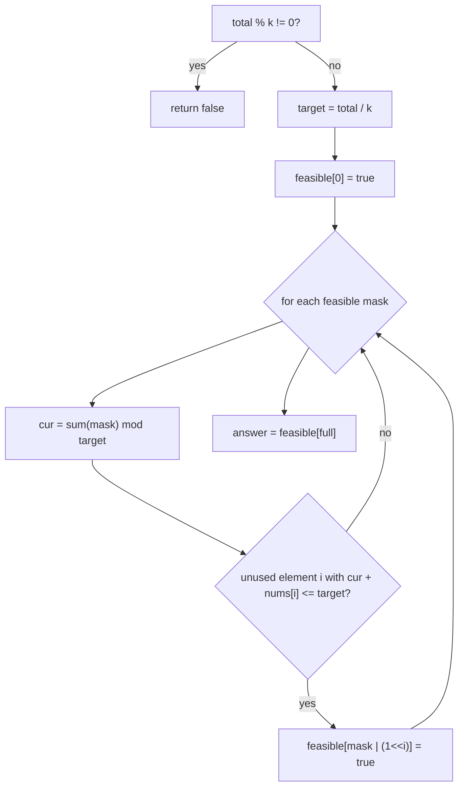
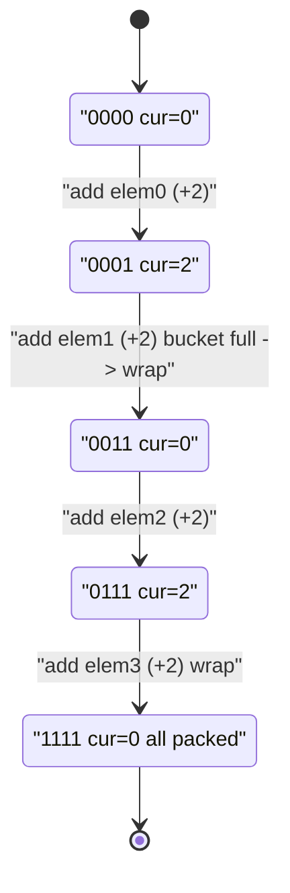

# Partition to K Equal Sum Subsets

| Meta | Value |
|------|-------|
| Source | LeetCode #698 |
| Difficulty | Medium |
| Topics | Bitmask, Dynamic Programming, Backtracking |
| Link | https://leetcode.com/problems/partition-to-k-equal-sum-subsets/ |

---

## Problem Statement

Given an integer array `nums` and an integer `k`, decide whether it is possible to split the
array into **exactly `k` non-empty subsets whose sums are all equal**. Each element belongs to
exactly one subset.

```text
Input:  nums = [4, 3, 2, 3, 5, 2, 1], k = 4
Output: true
Explanation: (5), (1,4), (2,3), (2,3) each sum to 5.

Input:  nums = [1, 2, 3, 4], k = 3
Output: false
Explanation: total 10 is not divisible by 3.
```

Constraints: $1 \le k \le \text{len(nums)} \le 16$, $1 \le \text{nums}[i]$.

---

## Approach (WHY)

First, a quick reject: if `sum(nums)` is not divisible by `k`, it is impossible. Otherwise every
subset must sum to

$$
\text{target} = \frac{\sum \text{nums}}{k}.
$$

With $n \le 16$, the set of *already-used* elements fits in a bitmask. We fill buckets **one at a
time, greedily in sequence**: define

$$
dp[\text{mask}] = \text{the running sum of the current (in-progress) bucket, modulo target},
$$

reachable using exactly the elements in `mask`. A mask is *valid* if it can be reached; the
elegance is that **`dp[mask] = sum(mask) mod target`** is forced — the elements in `mask` have
been packed into some number of completed buckets plus one partial bucket, and that partial sum
is `sum(mask) % target`. So we only need a boolean `feasible[mask]`.

Transition: from a feasible `mask`, try adding an unused element `i`. It is allowed only if it
does **not overflow** the current bucket:

$$
(\text{sum(mask)} \bmod \text{target}) + \text{nums}[i] \le \text{target}.
$$

When the partial sum hits `target` it simply wraps to `0`, automatically starting the next
bucket. If `feasible[(1<<n) - 1]` is true, all elements packed perfectly into buckets of size
`target`, i.e. exactly `k` of them.



```python
def canPartitionKSubsets(nums, k):
    total = sum(nums)
    if total % k != 0:
        return False
    target = total // k
    if max(nums) > target:
        return False
    n = len(nums)
    full = 1 << n
    # subset_sum[mask] = sum of chosen elements
    subset_sum = [0] * full
    for mask in range(1, full):
        low = mask & (-mask)
        i = low.bit_length() - 1
        subset_sum[mask] = subset_sum[mask ^ low] + nums[i]
    feasible = [False] * full
    feasible[0] = True
    for mask in range(full):
        if not feasible[mask]:
            continue
        cur = subset_sum[mask] % target            # partial bucket sum
        for i in range(n):
            if mask & (1 << i):
                continue
            if cur + nums[i] <= target:            # fits without overflow
                feasible[mask | (1 << i)] = True
    return feasible[full - 1]
```

```cpp
#include <bits/stdc++.h>
using namespace std;

bool canPartitionKSubsets(vector<int>& nums, int k) {
    long long total = 0;
    for (int x : nums) total += x;
    if (total % k != 0) return false;
    long long target = total / k;
    if (*max_element(nums.begin(), nums.end()) > target) return false;
    int n = (int)nums.size();
    int full = 1 << n;
    vector<long long> subset_sum(full, 0);
    for (int mask = 1; mask < full; ++mask) {
        int i = __builtin_ctz(mask);               // lowest set bit index
        subset_sum[mask] = subset_sum[mask ^ (1 << i)] + nums[i];
    }
    vector<char> feasible(full, 0);
    feasible[0] = 1;
    for (int mask = 0; mask < full; ++mask) {
        if (!feasible[mask]) continue;
        long long cur = subset_sum[mask] % target; // partial bucket sum
        for (int i = 0; i < n; ++i) {
            if (mask & (1 << i)) continue;
            if (cur + nums[i] <= target)           // fits without overflow
                feasible[mask | (1 << i)] = 1;
        }
    }
    return feasible[full - 1] != 0;
}
```

---

## Trace Over Masks

Take `nums = [2, 2, 2, 2]`, `k = 2`, so `total = 8`, `target = 4`. Bits index elements
left-to-right. We grow feasible masks; `cur = sum(mask) % 4`:

| mask | elements in mask | `sum` | `cur = sum % 4` | can add (fits) | new feasible masks |
|------|------------------|-------|-----------------|----------------|--------------------|
| `0000` | {} | 0 | 0 | any (2 ≤ 4) | `0001`,`0010`,`0100`,`1000` |
| `0001` | {0} | 2 | 2 | 2 ≤ 4 | `0011`,`0101`,`1001` |
| `0011` | {0,1} | 4 | 0 | starts new bucket | `0111`,`1011` |
| `0111` | {0,1,2} | 6 | 2 | 2 ≤ 4 | `1111` |
| `1111` | all | 8 | 0 | — | **feasible[full] = true** |



When `cur` returns to `0` the current bucket closed exactly at `target`, transparently starting
the next one. Reaching `feasible[1111]` proves both buckets were filled to `4`.

---

## Complexity

- **States:** $2^n$ masks; `subset_sum` precomputed in $O(2^n)$.
- **Transition:** each feasible mask scans $n$ elements $\Rightarrow$ $O(2^n \cdot n)$ time.
- **Space:** $O(2^n)$ for `feasible` and `subset_sum`.

For $n = 16$: $2^{16} \cdot 16 \approx 10^6$ operations — far cheaper than the $O(k \cdot 2^n)$
naive backtracking with overlapping work.

---

## Takeaway

The trick is realizing that the partial-bucket sum for a set of used elements is *forced*:
`sum(mask) % target`. That collapses the state to a single boolean `feasible[mask]`, so we never
track "which bucket" or "how many buckets" explicitly — overflow checks plus automatic wrap-around
at `target` handle bucket boundaries. Always reject early when `total % k != 0` or
`max(nums) > target`.
