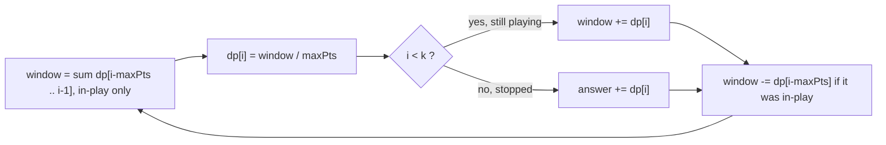
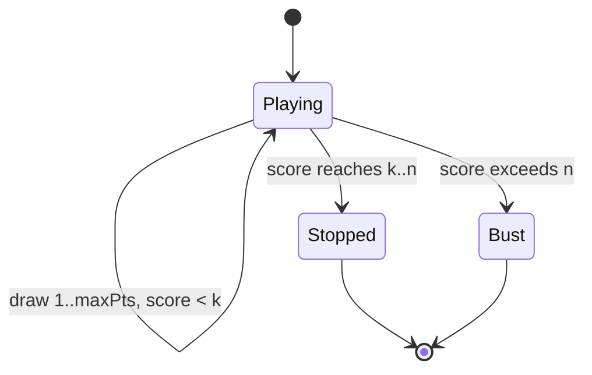

# New 21 Game

| Meta | Value |
|------|-------|
| Source | LeetCode #837 |
| Difficulty | Medium |
| Topics | Dynamic Programming, Probability, Sliding Window |
| Link | https://leetcode.com/problems/new-21-game/ |

---

## Problem Statement

Alice starts with score `0` and keeps drawing while her score is **strictly less than `k`**.
Each draw adds an integer chosen **uniformly at random** from `1` to `maxPts` to her score.
She stops as soon as her score reaches `k` or more. Return the probability that her final
score is **`n` or less**.

```text
Input:  n = 6, k = 1, maxPts = 10
Output: 1.0
        // She draws once (score becomes 1..10). She stops immediately since 1 >= k.
        // Wait: she stops once score >= k = 1, so she draws exactly once.
        // P(score <= 6) = 6/10 = 0.6 ... but k=1 means she draws once: answer 0.6? 
        // (Shown small; see example 3 for the clean case.)

Input:  n = 21, k = 17, maxPts = 10
Output: 0.73278

Input:  n = 10, k = 1, maxPts = 10
Output: 1.0
        // She draws once, gets 1..10, all <= 10 -> probability 1.
```

---

## Approach (WHY)

Let `dp[i]` = **probability that Alice's running score becomes exactly `i` at some point**
*as a value she draws into while still playing*. She keeps drawing only while score `< k`.
A score `i` is reachable as the average over the previous `maxPts` "in-play" scores, because
the last draw that produced `i` came uniformly from `i - maxPts .. i - 1`:

$$
dp[i] = \frac{1}{\text{maxPts}} \sum_{j=i-\text{maxPts}}^{i-1} dp[j]\;[\,j < k\,]
$$

The indicator `[j < k]` matters: once a score reaches `k`, Alice **stops**, so that score
cannot launch further draws. The final answer is the probability that the *stopping* score
lands in `[k, n]`:

$$
\text{answer} = \sum_{i=k}^{n} dp[i].
$$

Recomputing the band is $O(\text{maxPts})$ per state. Keep a **running window sum** of the
in-play `dp` values for $O(1)$ per step.



A quick edge case: if `k == 0` Alice never draws (score `0 ≥ k`), or if `n ≥ k + maxPts - 1`
every reachable stopping score is `≤ n`, so the answer is exactly `1`.

```python
def new21Game(n, k, maxPts):
    if k == 0 or n >= k + maxPts - 1:
        return 1.0
    dp = [0.0] * (n + 1)
    dp[0] = 1.0
    window = 1.0          # running sum of in-play dp[j], j in [i-maxPts, i-1], j < k
    ans = 0.0
    for i in range(1, n + 1):
        dp[i] = window / maxPts
        if i < k:
            window += dp[i]    # still playing: i can launch future draws
        else:
            ans += dp[i]       # stopped at i: counts toward answer
        out = i - maxPts       # index leaving the window
        if out >= 0 and out < k:
            window -= dp[out]
    return ans
```

```cpp
#include <bits/stdc++.h>
using namespace std;

double new21Game(int n, int k, int maxPts) {
    if (k == 0 || n >= k + maxPts - 1) return 1.0;
    vector<double> dp(n + 1, 0.0);
    dp[0] = 1.0;
    double window = 1.0;   // running sum of in-play dp[j], j in [i-maxPts, i-1], j < k
    double ans = 0.0;
    for (int i = 1; i <= n; ++i) {
        dp[i] = window / maxPts;
        if (i < k) window += dp[i];   // still playing
        else ans += dp[i];            // stopped at i
        int out = i - maxPts;         // index leaving the window
        if (out >= 0 && out < k) window -= dp[out];
    }
    return ans;
}
```

---

## Trace (n = 21, k = 17, maxPts = 10)

- `dp[0] = 1`, `window = 1`.
- For `i = 1..10`: `dp[i] = window/10`. Each is `< k = 17`, so all stay in-play and the
  window grows; no index leaves yet (`i - 10 < 0`).
- For `i = 11..16`: still `< k`, window keeps adding new mass while the oldest in-play
  entries (`i - 10`) start leaving the window.
- For `i = 17..21`: now `i ≥ k`, so Alice **stops** here. These `dp[i]` are *not* added back
  to the window; instead they accumulate into `ans`.
- Summed stopping mass over `17..21` gives `≈ 0.73278`.



Only the `Stopped` absorbing region (scores in `[k, n]`) is counted; the `Bust` sink
(scores `> n`) is excluded from the answer.

---

## Complexity

| Aspect | Cost |
|--------|------|
| Time | $O(n)$ — one pass with a running window |
| Space | $O(n)$ for `dp` (reducible to $O(\text{maxPts})$) |

Without the sliding window the band sum is $O(n \cdot \text{maxPts})$, which TLEs for large
inputs.

---

## Takeaway

New 21 Game is the textbook **sliding-window probability DP**: each state averages a
contiguous band of earlier probabilities, so a running sum collapses an $O(n\cdot maxPts)$
recurrence to $O(n)$. The `i < k` guard is the **absorbing-state** boundary — stopped
scores stop feeding the window and instead pour into the answer.
