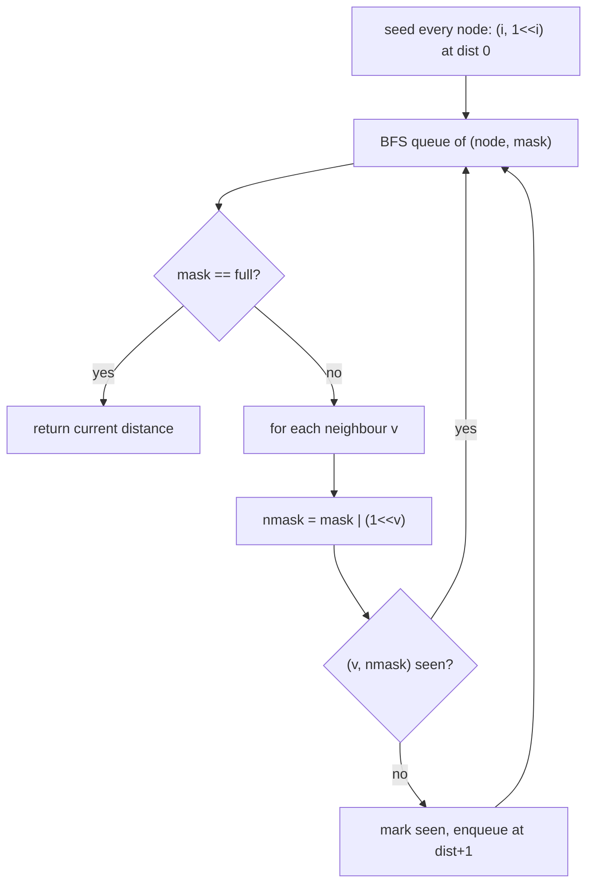
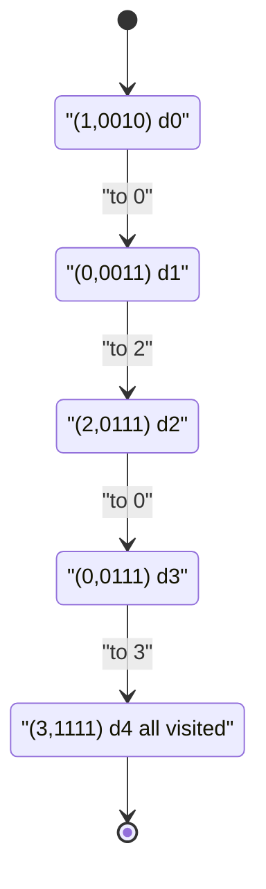

# Shortest Path Visiting All Nodes

| Meta | Value |
|------|-------|
| Source | LeetCode #847 |
| Difficulty | Hard |
| Topics | BFS, Bitmask, Dynamic Programming, Graphs |
| Link | https://leetcode.com/problems/shortest-path-visiting-all-nodes/ |

---

## Problem Statement

You have an undirected, connected graph of `n` nodes labelled `0 .. n-1`, given as an adjacency
list `graph`, where `graph[i]` lists the neighbours of node `i`. Find the length of the
**shortest path that visits every node**. You may start and stop at any node, may revisit nodes,
and may reuse edges.

```text
Input:  graph = [[1,2,3],[0],[0],[0]]
Output: 4
Explanation: one shortest walk is 1 -> 0 -> 2 -> 0 -> 3 (length 4).

Input:  graph = [[1],[0,2,4],[1,3],[2],[1]]
Output: 4
Explanation: e.g. 0 -> 1 -> 4 -> 1 -> 2 -> 3 has length 5; a length-4 walk exists.
```

Constraints: $1 \le n \le 12$, the graph is connected.

---

## Approach (WHY)

Because revisits are allowed, this is **not** a plain TSP — there is no "each node once"
restriction, and edges are unit length. With unit edges, the shortest number of steps is found
by **breadth-first search**, but the search state must remember *where we are* **and** *which
nodes we have already collected*. So a state is the pair

$$
\text{state} = (\text{node},\ \text{mask}),
$$

where bit `i` of `mask` is `1` iff node `i` has been visited at least once along the walk. There
are $n \cdot 2^n$ such states. BFS over this state graph gives the minimum steps because every
move costs exactly one.

Start BFS from **all** nodes simultaneously: each start `i` seeds the state `(i, 1 << i)` at
distance `0`. A move to neighbour `v` produces `(v, mask | (1 << v))`. The answer is the first
time any state with `mask == (1 << n) - 1` (all bits set) is dequeued.



```python
from collections import deque

def shortestPathLength(graph):
    n = len(graph)
    full = (1 << n) - 1
    if n == 1:
        return 0
    seen = [[False] * (1 << n) for _ in range(n)]
    q = deque()
    for i in range(n):
        seen[i][1 << i] = True
        q.append((i, 1 << i, 0))           # node, mask, distance
    while q:
        node, mask, dist = q.popleft()
        if mask == full:
            return dist
        for v in graph[node]:
            nmask = mask | (1 << v)
            if not seen[v][nmask]:
                seen[v][nmask] = True
                q.append((v, nmask, dist + 1))
    return 0
```

```cpp
#include <bits/stdc++.h>
using namespace std;

int shortestPathLength(vector<vector<int>>& graph) {
    int n = (int)graph.size();
    int full = (1 << n) - 1;
    if (n == 1) return 0;
    vector<vector<char>> seen(n, vector<char>(1 << n, 0));
    queue<array<int, 3>> q;                 // node, mask, distance
    for (int i = 0; i < n; ++i) {
        seen[i][1 << i] = 1;
        q.push({i, 1 << i, 0});
    }
    while (!q.empty()) {
        auto cur = q.front(); q.pop();
        int node = cur[0], mask = cur[1], dist = cur[2];
        if (mask == full) return dist;
        for (int v : graph[node]) {
            int nmask = mask | (1 << v);
            if (!seen[v][nmask]) {
                seen[v][nmask] = 1;
                q.push({v, nmask, dist + 1});
            }
        }
    }
    return 0;
}
```

---

## Trace Over Masks

Take `graph = [[1,2,3],[0],[0],[0]]` (a star centred at `0`), so `full = 1111`. BFS seeds four
states at distance 0. Watch how masks grow as the frontier expands:

| distance | sample dequeued state `(node, mask)` | meaning | new states pushed |
|----------|--------------------------------------|---------|-------------------|
| 0 | `(1, 0010)` | started at 1 | `(0, 0011)` |
| 0 | `(2, 0100)` | started at 2 | `(0, 0101)` |
| 1 | `(0, 0011)` | at 0, have {0,1} | `(2, 0111)`, `(3, 1011)` |
| 2 | `(2, 0111)` | at 2, have {0,1,2} | `(0, 0111)`, `(3, 1111)`? via 0 |
| 3 | `(0, 0111)` | at 0, have {0,1,2} | `(3, 1111)` |
| 4 | `(3, 1111)` | all visited | **return 4** |



The first dequeued state with `mask == 1111` carries distance `4`, which is the answer. Marking
`seen[node][mask]` prevents the walk from looping forever despite allowed revisits.

---

## Complexity

- **States:** $n \cdot 2^n$ pairs `(node, mask)`.
- **Edges explored:** each state expands to $\deg(node)$ neighbours; summed this is
  $O(2^n \cdot n^2)$ in the worst (dense) case.
- **Time:** $O(2^n \cdot n^2)$. **Space:** $O(2^n \cdot n)$ for the `seen` table and queue.

For $n = 12$: $2^{12} \cdot 12^2 \approx 5.9 \times 10^5$ — trivially fast.

---

## Takeaway

Unit-length edges + "visit everything" + small $n$ $\Rightarrow$ **BFS over `(node, mask)`
states**, not TSP DP. The mask records the visited set so revisits are allowed yet cycles are
pruned by `seen`. Multi-source seeding (start from every node at distance 0) lets us pick the
best starting point for free.
