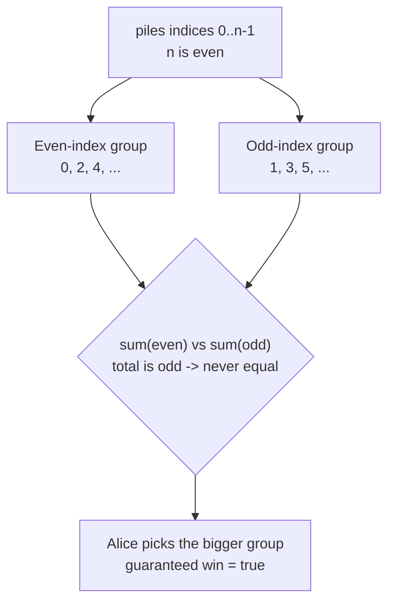
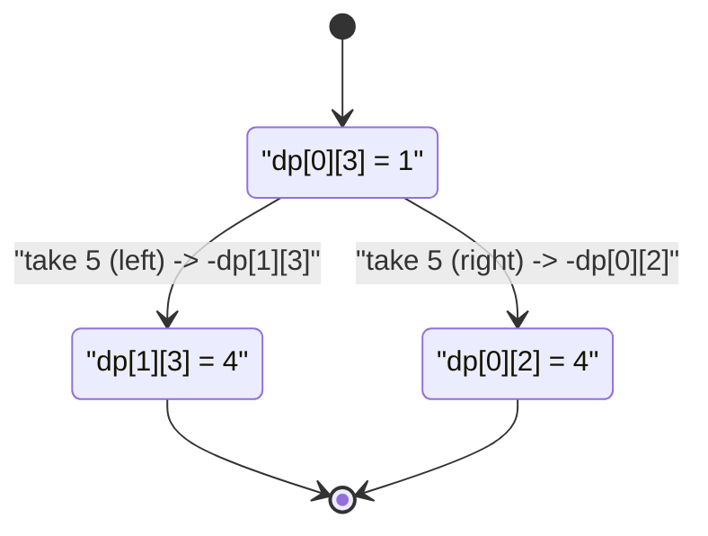

# Stone Game

| Meta | Value |
|---|---|
| Source | LeetCode 877 |
| Difficulty | Medium |
| Topic | Interval Game DP, Parity Argument |
| Key idea | `dp[i][j]` difference DP; `even n` + `odd sum` ⟹ always true |

---

## Problem Statement

There are `piles` of stones in a row, `piles[i]` stones in pile `i`. The **total number of stones is odd** and the number of piles `n` is **even**. Alice and Bob alternate; on each turn the player removes the **entire** pile from either the **start** or the **end** of the row. The player with the most stones wins. Alice goes first; both play optimally. Return `true` if **Alice** wins.

```text
Input:  piles = [5, 3, 4, 5]
Output: true
Explain: Alice takes the first 5. Whatever Bob does, Alice can secure 4 or 5
         next and finish with at least 10 of the 17 stones.
```

---

## Approach (WHY)

This is the interval game again. Let `dp[i][j]` be the best **score difference** *(current mover − opponent)* on `piles[i..j]`:

$$
dp[i][i] = piles[i], \qquad
dp[i][j] = \max\big(piles[i] - dp[i+1][j],\ \ piles[j] - dp[i][j-1]\big)
$$

Alice wins iff `dp[0][n-1] > 0`. Because the total is odd there are no ties, so `> 0` and `>= 0` coincide here.

### The O(1) parity insight

With `n` **even** and the total **odd**, Alice can *guarantee* a win without any DP. Color positions: indices `0, 2, 4, …` are "even piles", indices `1, 3, …` are "odd piles". With an even count of piles, the two ends always have **opposite parity** (one even index, one odd index). So Alice can decide upfront to take **only even-indexed** piles or **only odd-indexed** piles — whichever group has more stones. Since the total is odd, one group strictly exceeds the other. Therefore Alice always wins:

$$
n \text{ even} \ \wedge\ \sum piles \text{ odd} \ \Rightarrow\ \text{Alice wins} = \text{true}
$$



```python
def stone_game(piles):
    # n even and total odd: Alice can always win
    return True

print(stone_game([5, 3, 4, 5]))  # True
```

```cpp
#include <bits/stdc++.h>
using namespace std;

bool stoneGame(const vector<long long>& piles) {
    // n even and total odd: Alice can always win
    (void)piles;
    return true;
}

int main() {
    cout << boolalpha;
    cout << stoneGame({5, 3, 4, 5}) << "\n"; // true
    return 0;
}
```

### The honest DP (works without the parity guarantee)

The O(1) trick relies on the problem's constraints. The general solution is the score-difference interval DP, which also returns the actual margin.

```python
def stone_game_dp(piles):
    n = len(piles)
    dp = [[0] * n for _ in range(n)]
    for i in range(n):
        dp[i][i] = piles[i]
    for length in range(2, n + 1):
        for i in range(0, n - length + 1):
            j = i + length - 1
            take_left = piles[i] - dp[i + 1][j]
            take_right = piles[j] - dp[i][j - 1]
            dp[i][j] = max(take_left, take_right)
    return dp[0][n - 1] > 0

print(stone_game_dp([5, 3, 4, 5]))  # True
print(stone_game_dp([3, 7, 2, 3]))  # True
```

```cpp
#include <bits/stdc++.h>
using namespace std;

bool stoneGameDP(const vector<long long>& piles) {
    int n = (int)piles.size();
    vector<vector<long long>> dp(n, vector<long long>(n, 0));
    for (int i = 0; i < n; ++i) dp[i][i] = piles[i];
    for (int length = 2; length <= n; ++length) {
        for (int i = 0; i + length - 1 < n; ++i) {
            int j = i + length - 1;
            long long takeLeft  = piles[i] - dp[i + 1][j];
            long long takeRight = piles[j] - dp[i][j - 1];
            dp[i][j] = max(takeLeft, takeRight);
        }
    }
    return dp[0][n - 1] > 0;
}

int main() {
    cout << boolalpha;
    cout << stoneGameDP({5, 3, 4, 5}) << "\n"; // true
    cout << stoneGameDP({3, 7, 2, 3}) << "\n"; // true
    return 0;
}
```

---

## Trace (piles = [5, 3, 4, 5])

Total = 17 (odd), n = 4 (even). DP table by increasing length:

| i..j | piles | take_left | take_right | dp |
|---|---|---|---|---|
| 0..0 | [5] | — | — | 5 |
| 1..1 | [3] | — | — | 3 |
| 2..2 | [4] | — | — | 4 |
| 3..3 | [5] | — | — | 5 |
| 0..1 | [5,3] | 5 − 3 = 2 | 3 − 5 = −2 | 2 |
| 1..2 | [3,4] | 3 − 4 = −1 | 4 − 3 = 1 | 1 |
| 2..3 | [4,5] | 4 − 5 = −1 | 5 − 4 = 1 | 1 |
| 0..2 | [5,3,4] | 5 − dp[1][2]=5−1=4 | 4 − dp[0][1]=4−2=2 | 4 |
| 1..3 | [3,4,5] | 3 − dp[2][3]=3−1=2 | 5 − dp[1][2]=5−1=4 | 4 |
| 0..3 | all | 5 − dp[1][3]=5−4=1 | 5 − dp[0][2]=5−4=1 | 1 |

`dp[0][3] = 1 > 0` ⟹ Alice wins by a margin of 1 stone.



---

## Complexity

| Method | Time | Space |
|---|---|---|
| Parity closed form | $O(1)$ | $O(1)$ |
| Interval difference DP | $O(n^2)$ | $O(n^2)$ (reducible to $O(n)$) |

---

## Takeaway

Under the given constraints (`n` even, total odd) Alice **always** wins — she commits to the heavier of the even-indexed or odd-indexed group. But the reusable tool is the **score-difference interval DP** `dp[i][j] = max(a[i] - dp[i+1][j], a[j] - dp[i][j-1])`, which solves the general take-from-ends game and also reports the winning margin.
