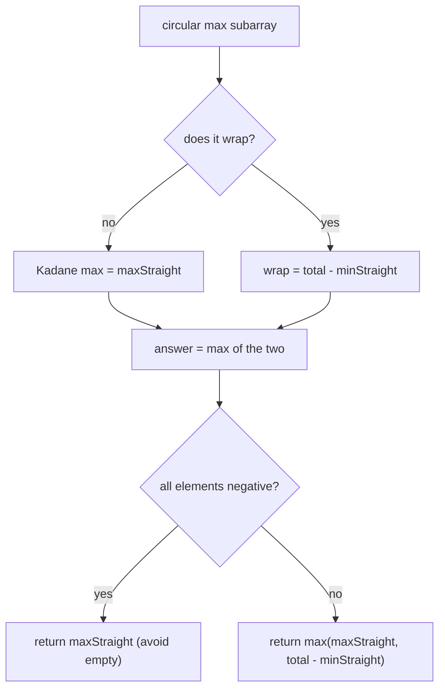
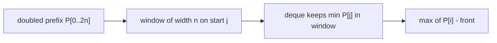
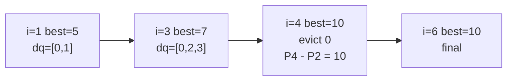
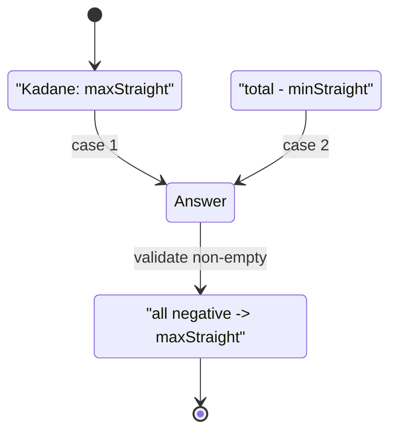

# Maximum Sum Circular Subarray

| Meta | Value |
|------|-------|
| Problem | Maximum Sum Circular Subarray |
| Source | LeetCode #918 |
| Reference | https://leetcode.com/problems/maximum-sum-circular-subarray/ |
| Difficulty | Medium |
| Topics | Array, Dynamic Programming, Prefix Sum, Monotonic Queue, Kadane |
| Time | $O(n)$ |
| Space | $O(n)$ |

---

## Problem Statement

Given a **circular** integer array `nums` of length `n`, return the maximum possible sum of a **non-empty** subarray. Circular means the element after index `n-1` is index `0` again, so a subarray may wrap around the end. A subarray may use each index **at most once** (its total length is at most `n`).

```text
Input:  nums = [5, -3, 5]
Output: 10
Explanation:
  the wrapping subarray [5, (wrap), 5] uses index 2 and index 0
  sum = 5 + 5 = 10, which beats any non-wrapping subarray
```

---

## Approach (WHY)

There are exactly two cases for the optimal subarray:

1. **Non-wrapping** — it lies within `nums[0..n-1]` as a normal contiguous block. Standard **Kadane** gives this maximum, `maxStraight`.
2. **Wrapping** — it uses a prefix and a suffix, leaving a **contiguous gap in the middle**. Maximizing a wrapping sum is equivalent to **minimizing the discarded middle block**. So the wrapping answer is `total - minStraight`, where `minStraight` is the minimum-sum subarray (found by a Kadane variant), and `total` is the sum of all elements.

$$
ans = \max\big(maxStraight,\; total - minStraight\big)
$$

One edge case: if **every** element is negative, then `minStraight == total`, making `total - minStraight == 0` — but the subarray must be non-empty, so a sum of `0` (empty) is invalid. We guard by returning `maxStraight` in that situation.



A unifying view through **prefix sums + a monotonic deque** explains *why* `total - minStraight` is correct and connects this problem to the windowed-DP toolkit. Duplicate the array conceptually and use prefix sums $P[0..2n]$; a circular subarray of length `<= n` ending at `i` has sum `P[i] - P[j]` with `j \in [i-n, i-1]`. Maximizing means tracking the **window minimum of `P`** with an increasing deque — exactly the bounded-length technique.

$$
ans = \max_{\,1 \le i \le 2n}\Big(P[i] - \min_{\,i-n \le j \le i-1} P[j]\Big)
$$



```python
from collections import deque

def maxSubarraySumCircular(nums):
    n = len(nums)
    total = sum(nums)

    # Kadane for max and min straight subarrays.
    max_straight = cur_max = nums[0]
    min_straight = cur_min = nums[0]
    for x in nums[1:]:
        cur_max = x + max(cur_max, 0)
        max_straight = max(max_straight, cur_max)
        cur_min = x + min(cur_min, 0)
        min_straight = min(min_straight, cur_min)

    if max_straight < 0:               # all negative: empty wrap not allowed
        return max_straight
    return max(max_straight, total - min_straight)


def maxSubarraySumCircular_deque(nums):
    # Prefix-sum + monotonic-deque view (length <= n window on doubled array).
    n = len(nums)
    P = [0] * (2 * n + 1)
    for i in range(2 * n):
        P[i + 1] = P[i] + nums[i % n]
    best = nums[0]
    dq = deque([0])                    # indices into P, P increasing front->back
    for i in range(1, 2 * n + 1):
        while dq and dq[0] < i - n:    # subarray length capped at n
            dq.popleft()
        best = max(best, P[i] - P[dq[0]])
        while dq and P[dq[-1]] >= P[i]:
            dq.pop()
        dq.append(i)
    return best
```

```cpp
#include <bits/stdc++.h>
using namespace std;

long long maxSubarraySumCircular(const vector<int>& nums) {
    int n = (int)nums.size();
    long long total = 0;
    for (int x : nums) total += x;

    long long max_straight = nums[0], cur_max = nums[0];
    long long min_straight = nums[0], cur_min = nums[0];
    for (int i = 1; i < n; ++i) {
        long long x = nums[i];
        cur_max = x + max(cur_max, 0LL);
        max_straight = max(max_straight, cur_max);
        cur_min = x + min(cur_min, 0LL);
        min_straight = min(min_straight, cur_min);
    }
    if (max_straight < 0)               // all negative: empty wrap not allowed
        return max_straight;
    return max(max_straight, total - min_straight);
}

long long maxSubarraySumCircular_deque(const vector<int>& nums) {
    int n = (int)nums.size();
    vector<long long> P(2 * n + 1, 0);
    for (int i = 0; i < 2 * n; ++i) P[i + 1] = P[i] + nums[i % n];
    long long best = nums[0];
    deque<int> dq;
    dq.push_back(0);                    // indices into P, P increasing
    for (int i = 1; i <= 2 * n; ++i) {
        while (!dq.empty() && dq.front() < i - n)   // length capped at n
            dq.pop_front();
        best = max(best, P[i] - P[dq.front()]);
        while (!dq.empty() && P[dq.back()] >= P[i])
            dq.pop_back();
        dq.push_back(i);
    }
    return best;
}
```

---

## Trace

Run the **deque** view on `nums = [5, -3, 5]`, `n = 3`. The doubled prefix sums (`nums[i % n]`):

```text
elements doubled: 5, -3, 5, 5, -3, 5
P = [0, 5, 2, 7, 12, 9, 14]            (indices 0..6)

i=1  evict 0 < 1-3=-2? no; best=max(5, P[1]-P[0]=5)=5
     back-pop P[0]=0>=5? no -> append    dq=[0,1]
i=2  evict 0 < -1? no; best=max(5, P[2]-P[0]=2)=5
     back-pop P[1]=5>=P[2]=2 yes pop; P[0]=0>=2? no; append
     dq=[0,2]                            (P front: 0)
i=3  evict 0 < 3-3=0? no; best=max(5, P[3]-P[0]=7)=7
     back-pop P[2]=2>=7? no -> append    dq=[0,2,3]
i=4  evict 0 < 4-3=1? yes popleft -> dq=[2,3]; front 2 not < 1
     best=max(7, P[4]-P[2]=12-2=10)=10
     back-pop P[3]=7>=12? no -> append   dq=[2,3,4]
i=5  evict 2 < 5-3=2? no; best=max(10, P[5]-P[2]=9-2=7)=10
     back-pop P[4]=12>=P[5]=9 yes pop; P[3]=7>=9? no; append
     dq=[2,3,5]                          (P front: 2)
i=6  evict 2 < 6-3=3? yes popleft -> dq=[3,5]; front 3 not < 3
     best=max(10, P[6]-P[3]=14-7=7)=10
answer best = 10
```

The winning value `10` appears at `i = 4`: start `j = 2`, end `i = 4`, sum `P[4] - P[2] = 12 - 2 = 10`. In original indices that is `nums[2]` then wrapping to `nums[0]` (`5 + 5`), exactly the wrapping subarray — and `j = 2` is the front **minimum prefix** kept by the increasing deque.





---

## Complexity

- **Time:** $O(n)$ for the Kadane solution (two running scalars in one pass); $O(n)$ for the deque view (the doubled array is length `2n`, each index pushed and popped once).
- **Space:** $O(1)$ extra for the Kadane version; $O(n)$ for the prefix-sum + deque version.

---

## Takeaway

A circular-array maximum splits into **non-wrapping** (plain Kadane) and **wrapping** (`total - minSubarray`) cases, with an all-negative guard so the wrapping branch never returns an empty subarray. The deeper lesson is the **prefix-sum + monotonic-deque** reformulation: a circular subarray of bounded length `n` is a windowed `P[i] - min P[j]` problem on the doubled array — the same tool that solves bounded-length max-sum subarrays, now wrapped around.
