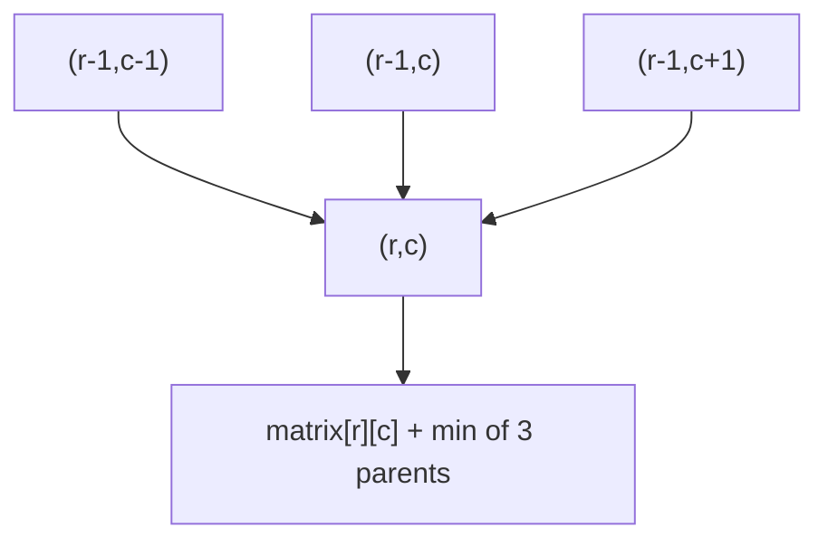
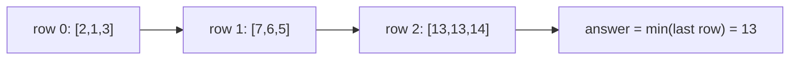

# Minimum Falling Path Sum

| Meta | Value |
|------|-------|
| Source | LeetCode #931 |
| Difficulty | Medium |
| Topics | Array, Dynamic Programming, Matrix |
| Link | https://leetcode.com/problems/minimum-falling-path-sum/ |

---

## Problem Statement
Given an `n x n` integer matrix, find the minimum sum of a **falling path**. A falling path
starts at **any** cell in the first row and moves to the cell directly **below**, or
diagonally **below-left** or **below-right**, on each step.

```text
Input:  matrix = [[2,1,3],
                  [6,5,4],
                  [7,8,9]]
Output: 13
        // path 1 -> 4 -> 8  (or 1 -> 5 -> 7)
```

---

## Approach (WHY)

A cell `(r,c)` can be entered from up to **three** cells in the row above: directly above, and
the two diagonals. Choose the cheapest of those, then add this cell's value:

$$
dp[r][c] = matrix[r][c] + \min\big(dp[r-1][c-1],\; dp[r-1][c],\; dp[r-1][c+1]\big)
$$

The first row is its own base case ($dp[0][c] = matrix[0][c]$), and the answer is the minimum
over the **entire last row**, since a path may end at any column.



Because the recurrence reads diagonals, we must read the **previous** row while writing the
current one — so we keep `prev` and build a fresh `cur` rather than updating in place.

```python
def min_falling_path_sum(matrix):
    n = len(matrix)
    prev = matrix[0][:]
    for r in range(1, n):
        cur = [0] * n
        for c in range(n):
            best = prev[c]
            if c > 0:
                best = min(best, prev[c - 1])
            if c < n - 1:
                best = min(best, prev[c + 1])
            cur[c] = matrix[r][c] + best
        prev = cur
    return min(prev)
```

```cpp
#include <bits/stdc++.h>
using namespace std;

long long min_falling_path_sum(vector<vector<int>>& matrix) {
    int n = matrix.size();
    vector<long long> prev(matrix[0].begin(), matrix[0].end());
    for (int r = 1; r < n; ++r) {
        vector<long long> cur(n, 0);
        for (int c = 0; c < n; ++c) {
            long long best = prev[c];
            if (c > 0)     best = min(best, prev[c - 1]);
            if (c < n - 1) best = min(best, prev[c + 1]);
            cur[c] = matrix[r][c] + best;
        }
        prev = cur;
    }
    return *min_element(prev.begin(), prev.end());
}
```

---

## Filled Grid Trace

For `[[2,1,3],[6,5,4],[7,8,9]]`, each cell stores the best falling cost ending there:

```text
matrix          dp (min falling cost)
2 1 3           2   1   3
6 5 4     -->   7   6   5
7 8 9          13  13  14
                ^ min of last row = 13
```



Tracing back from a `13`: cell `(2,0)=7+min(6,7)=13` and `(2,1)=8+min(7,6,5)=13`, both rooted
at the column-1 start value `1` — matching paths $1 \to 4 \to 8$ and $1 \to 5 \to 7$.

---

## Complexity
- **Time:** $O(n^2)$ — each of the $n^2$ cells inspects a constant three parents.
- **Space:** $O(n)$ — two rolling rows (`prev` and `cur`).

---

## Takeaway
Falling-path DP generalizes the right/down grid to **three parents** (straight + two
diagonals), and the start/end are *free* across the top/bottom rows. Because the transition
reads diagonals from the row above, use a separate `prev` row instead of an in-place update,
and answer with the minimum of the final row.
