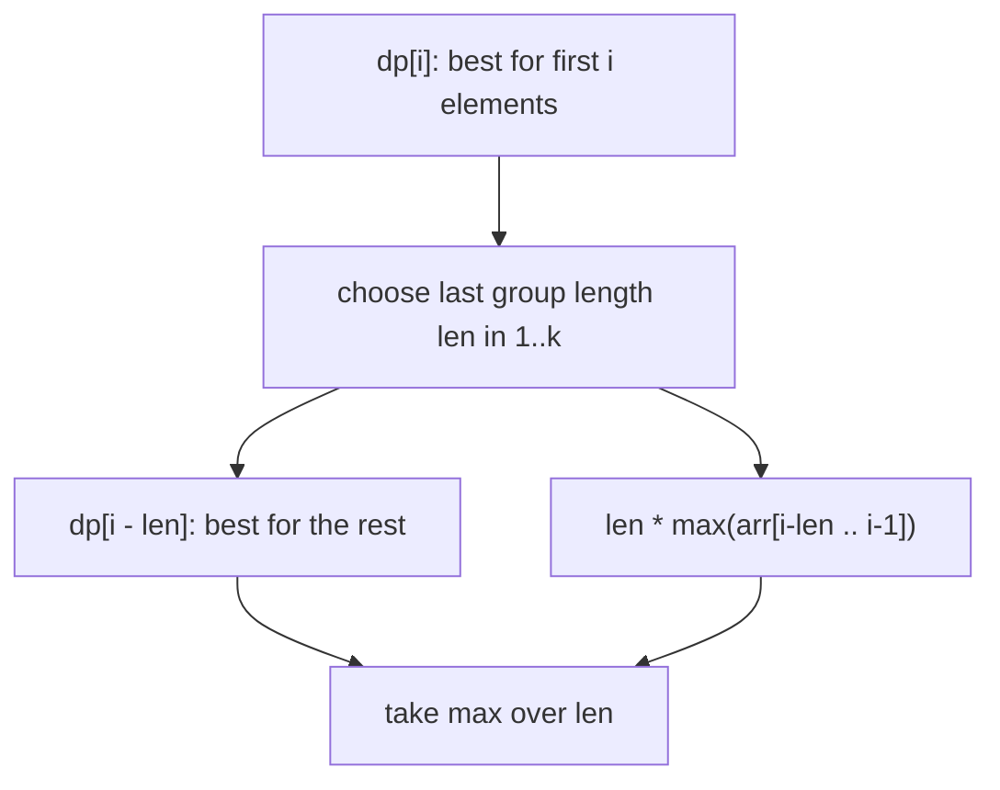
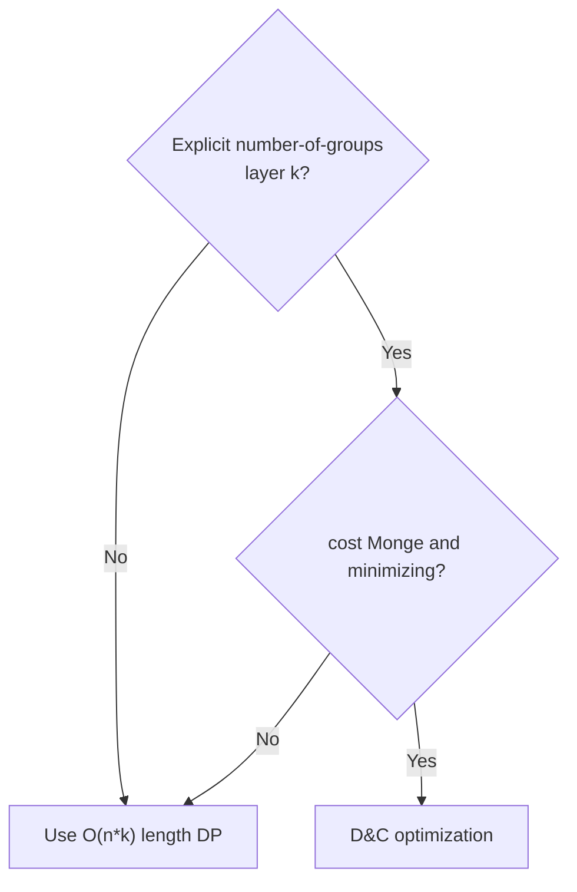
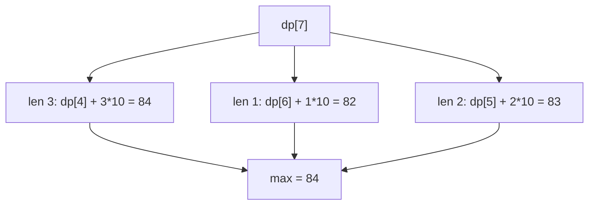

# LeetCode 1043: Partition Array for Maximum Sum

| Meta | Value |
| --- | --- |
| Source | LeetCode 1043 |
| Difficulty | Medium |
| Technique | 1D DP over the last segment length |
| Complexity | $O(n k)$ time, $O(n)$ space |
| Relation to D&C opt | Contrast — D&C optimization does **not** directly apply |

## Problem Statement

Given an integer array `arr` and an integer `k`, partition `arr` into contiguous subarrays of length **at most `k`**. After partitioning, every element of a subarray becomes the **maximum** value of that subarray. Return the largest sum of the resulting array.

```text
Input:  arr = [1, 15, 7, 9, 2, 5, 10],  k = 3
Output: 84

Explanation:
  Partition as [1, 15, 7] [9] [2, 5, 10]
  becomes      [15,15,15] [9] [10,10,10]
  sum = 15*3 + 9 + 10*3 = 45 + 9 + 30 = 84.
```

Note: here `k` is the **maximum group length**, not a fixed number of groups, and we **maximize**. This is a different DP shape from the canonical D&C optimization problem.

## Approach (WHY)

Let `dp[i]` be the maximum total after optimally partitioning the prefix `arr[0..i-1]` (first `i` elements). The last group has some length `len` between `1` and `k`, covering `arr[i-len .. i-1]`. All those elements become the group's maximum `m`:

$$
dp[i] = \max_{1 \le \text{len} \le \min(k,\, i)} \Big( dp[i - \text{len}] + \text{len} \times \max(arr[i-\text{len} .. i-1]) \Big)
$$

Base case `dp[0] = 0`. Answer is `dp[n]`.



**Why D&C optimization does not directly apply.** D&C optimization needs:

1. an explicit "number of groups `k`" layer dimension, and
2. a cost satisfying the **quadrangle inequality** so that the optimal split is monotone, and a **minimization**.

Here:

- `k` bounds the **segment length**, not the count of groups — there is no `dp[k][i]` layering.
- The objective is a **maximum**, and the segment "cost" `len * max(segment)` is **not** Monge — the optimal last-group length is **not** monotone in `i`. For example, a large value entering the window can suddenly shrink the best `len`.

So the right tool is the plain $O(nk)$ DP. We include this problem precisely to mark the boundary: *length-bounded, max-objective partitions* are out of scope for D&C optimization.



## Implementation

```python
def maxSumAfterPartitioning(arr, k):
    n = len(arr)
    dp = [0] * (n + 1)  # dp[i] = best for first i elements

    for i in range(1, n + 1):
        cur_max = 0
        best = 0
        # last group covers arr[i-len .. i-1], len = 1..k
        for length in range(1, min(k, i) + 1):
            cur_max = max(cur_max, arr[i - length])
            cand = dp[i - length] + length * cur_max
            if cand > best:
                best = cand
        dp[i] = best

    return dp[n]


if __name__ == "__main__":
    print(maxSumAfterPartitioning([1, 15, 7, 9, 2, 5, 10], 3))  # 84
```

```cpp
#include <bits/stdc++.h>
using namespace std;

const long long INF = 1e18;

long long maxSumAfterPartitioning(const vector<long long>& arr, int k) {
    int n = (int)arr.size();
    vector<long long> dp(n + 1, 0);  // dp[i] = best for first i elements

    for (int i = 1; i <= n; ++i) {
        long long cur_max = 0;
        long long best = 0;
        // last group covers arr[i-len .. i-1], len = 1..k
        for (int length = 1; length <= min(k, i); ++length) {
            cur_max = max(cur_max, arr[i - length]);
            long long cand = dp[i - length] + (long long)length * cur_max;
            if (cand > best) best = cand;
        }
        dp[i] = best;
    }

    return dp[n];
}

int main() {
    vector<long long> arr = {1, 15, 7, 9, 2, 5, 10};
    cout << maxSumAfterPartitioning(arr, 3) << "\n";  // 84
    return 0;
}
```

## Trace

`arr = [1, 15, 7, 9, 2, 5, 10]`, `k = 3`.

| `i` | prefix | best last-group choice | `dp[i]` |
| --- | --- | --- | --- |
| 1 | [1] | len 1, max 1 | 1 |
| 2 | [1,15] | len 2, max 15 → `0 + 2*15` | 30 |
| 3 | [1,15,7] | len 3, max 15 → `0 + 3*15` | 45 |
| 4 | +9 | len 1, `dp[3] + 9` | 54 |
| 5 | +2 | len 2, `dp[3] + 2*9` | 63 |
| 6 | +5 | len 3, `dp[3] + 3*9`=72 | 72 |
| 7 | +10 | len 3, `dp[4] + 3*10`=84 | 84 |

For `i = 7`, scanning `len = 1,2,3`:



Note the winning `len` jumped around as `i` grew (1, 2, 3, 1, 2, 3, 3) — **non-monotone**, confirming D&C optimization would be invalid here.

## Complexity

- **Time:** $O(n k)$ — for each of `n` prefixes we scan up to `k` last-group lengths.
- **Space:** $O(n)$ — single `dp` array.

## Takeaway

LeetCode 1043 is a length-bounded, max-objective partition: the optimal last-group length is **not monotone**, and there is no explicit group-count layer, so divide-and-conquer optimization does **not** apply. The clean $O(nk)$ DP is the intended solution; recognizing *why* D&C opt fails here sharpens the judgment of when it succeeds.
