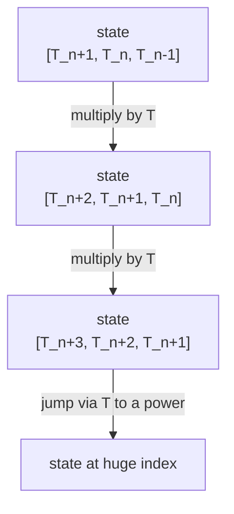
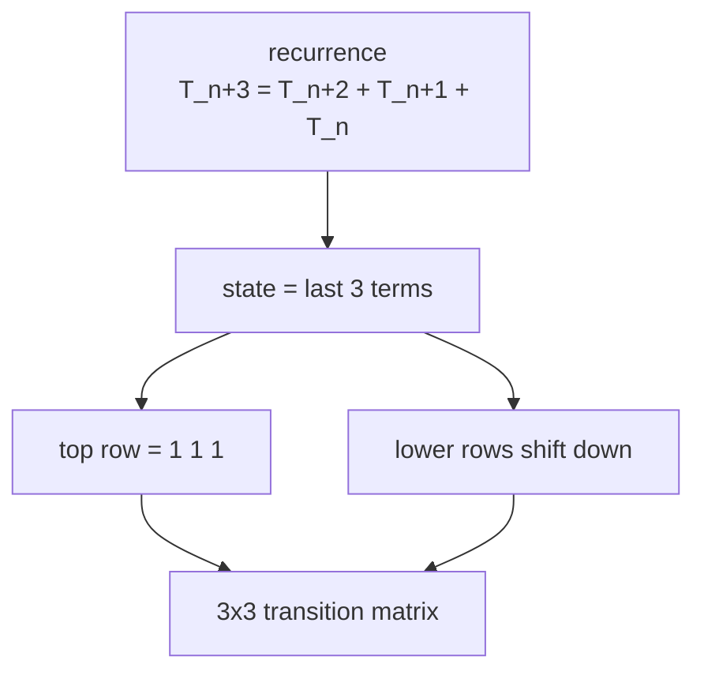
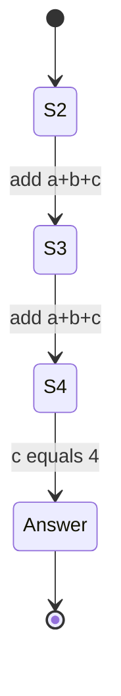

# N-th Tribonacci Number

| Meta | Value |
|------|-------|
| Problem | N-th Tribonacci Number |
| Source | LeetCode #1137 |
| Reference | https://leetcode.com/problems/n-th-tribonacci-number/ |
| Difficulty | Easy (with a Hard-flavored matrix follow-up) |
| Topics | Dynamic Programming, Math, Matrix Exponentiation |
| Time | $O(n)$ simple DP / $O(\log n)$ matrix |
| Space | $O(1)$ |

---

## Problem Statement

The Tribonacci sequence is defined by

$$
T_0 = 0,\quad T_1 = 1,\quad T_2 = 1,\quad T_{n+3} = T_n + T_{n+1} + T_{n+2}.
$$

Given `n`, return the value of $T_n$.

```text
Input:  n = 4
Output: 4
Explanation:
  T_3 = 0 + 1 + 1 = 2
  T_4 = 1 + 1 + 2 = 4

Input:  n = 25
Output: 1389537
```

---

## Approach (WHY)

Each term depends only on the **previous three**, so the obvious DP keeps a sliding window of three
values and rolls forward. That is $O(n)$ and is the right call when $n$ is small (LeetCode caps
$n \le 37$).

But Tribonacci is a **linear recurrence with constant coefficients**, so it also yields to
**matrix exponentiation** — the technique that matters when $n$ is astronomically large. Bundle the
last three terms into a state vector and find a $3 \times 3$ matrix that slides the window by one:

$$
\begin{bmatrix} T_{n+2} \\ T_{n+1} \\ T_{n} \end{bmatrix}
=
\begin{bmatrix}
1 & 1 & 1 \\
1 & 0 & 0 \\
0 & 1 & 0
\end{bmatrix}
\begin{bmatrix} T_{n+1} \\ T_{n} \\ T_{n-1} \end{bmatrix}.
$$

The top row encodes $T_{n+2} = T_{n+1} + T_n + T_{n-1}$; the lower rows just shift old values down.
Raising that matrix to a power jumps many steps at once in $O(\log n)$.





### Simple DP (rolling window)

```python
def tribonacci(n: int) -> int:
    if n == 0:
        return 0
    if n <= 2:
        return 1
    a, b, c = 0, 1, 1          # T_0, T_1, T_2
    for _ in range(3, n + 1):
        a, b, c = b, c, a + b + c   # slide the window forward
    return c
```

```cpp
#include <bits/stdc++.h>
using namespace std;

long long tribonacci(int n) {
    if (n == 0) return 0;
    if (n <= 2) return 1;
    long long a = 0, b = 1, c = 1;     // T_0, T_1, T_2
    for (int i = 3; i <= n; ++i) {
        long long nxt = a + b + c;     // slide the window forward
        a = b; b = c; c = nxt;
    }
    return c;
}
```

### Matrix-power method

```python
def tribonacci_matrix(n: int) -> int:
    if n == 0:
        return 0
    if n <= 2:
        return 1

    def mat_mult(A, B):
        m = len(A)
        C = [[0] * m for _ in range(m)]
        for i in range(m):
            for t in range(m):
                if A[i][t]:
                    for j in range(m):
                        C[i][j] += A[i][t] * B[t][j]
        return C

    def mat_pow(M, e):
        m = len(M)
        result = [[1 if i == j else 0 for j in range(m)] for i in range(m)]
        base = [row[:] for row in M]
        while e > 0:
            if e & 1:
                result = mat_mult(result, base)
            base = mat_mult(base, base)
            e >>= 1
        return result

    T = [[1, 1, 1],
         [1, 0, 0],
         [0, 1, 0]]
    P = mat_pow(T, n - 2)          # map [T2, T1, T0] forward to index n
    # state vector [T2, T1, T0] = [1, 1, 0], answer sits on top
    return P[0][0] * 1 + P[0][1] * 1 + P[0][2] * 0
```

```cpp
#include <bits/stdc++.h>
using namespace std;

vector<vector<long long>> mat_mult(const vector<vector<long long>>& A,
                                   const vector<vector<long long>>& B) {
    int m = (int)A.size();
    vector<vector<long long>> C(m, vector<long long>(m, 0));
    for (int i = 0; i < m; ++i)
        for (int t = 0; t < m; ++t)
            if (A[i][t])
                for (int j = 0; j < m; ++j)
                    C[i][j] += A[i][t] * B[t][j];
    return C;
}

vector<vector<long long>> mat_pow(vector<vector<long long>> base, long long e) {
    int m = (int)base.size();
    vector<vector<long long>> result(m, vector<long long>(m, 0));
    for (int i = 0; i < m; ++i) result[i][i] = 1;
    while (e > 0) {
        if (e & 1) result = mat_mult(result, base);
        base = mat_mult(base, base);
        e >>= 1;
    }
    return result;
}

long long tribonacci_matrix(int n) {
    if (n == 0) return 0;
    if (n <= 2) return 1;
    vector<vector<long long>> T = {
        {1, 1, 1},
        {1, 0, 0},
        {0, 1, 0}
    };
    vector<vector<long long>> P = mat_pow(T, n - 2);   // map [T2, T1, T0] forward to index n
    // state vector [T2, T1, T0] = [1, 1, 0], answer sits on top
    return P[0][0] * 1 + P[0][1] * 1 + P[0][2] * 0;
}
```

---

## Trace (n = 4)

Rolling window, starting from $(a,b,c) = (T_0,T_1,T_2) = (0,1,1)$:

| step (build index) | a | b | c (= newest) |
|--------------------|---|---|--------------|
| start (T_2)        | 0 | 1 | 1 |
| build T_3          | 1 | 1 | 0+1+1 = 2 |
| build T_4          | 1 | 2 | 1+1+2 = 4 |

So $T_4 = 4$. The matrix method computes $T^{\,2}$ and reads the top-left combination to land on the
same value without iterating each step.



---

## Complexity

| Method | Time | Space |
|--------|------|-------|
| Rolling-window DP | $O(n)$ | $O(1)$ |
| Matrix exponentiation | $O(3^3 \log n) = O(\log n)$ | $O(1)$ |

---

## Takeaway

Tribonacci is the canonical *"order-3 linear recurrence."* The rolling window is perfect for small
$n$, but recognizing the matrix form is what unlocks $O(\log n)$ evaluation for gigantic $n$ — and
the exact same $3 \times 3$ companion-matrix pattern transfers to any constant-coefficient
recurrence.
