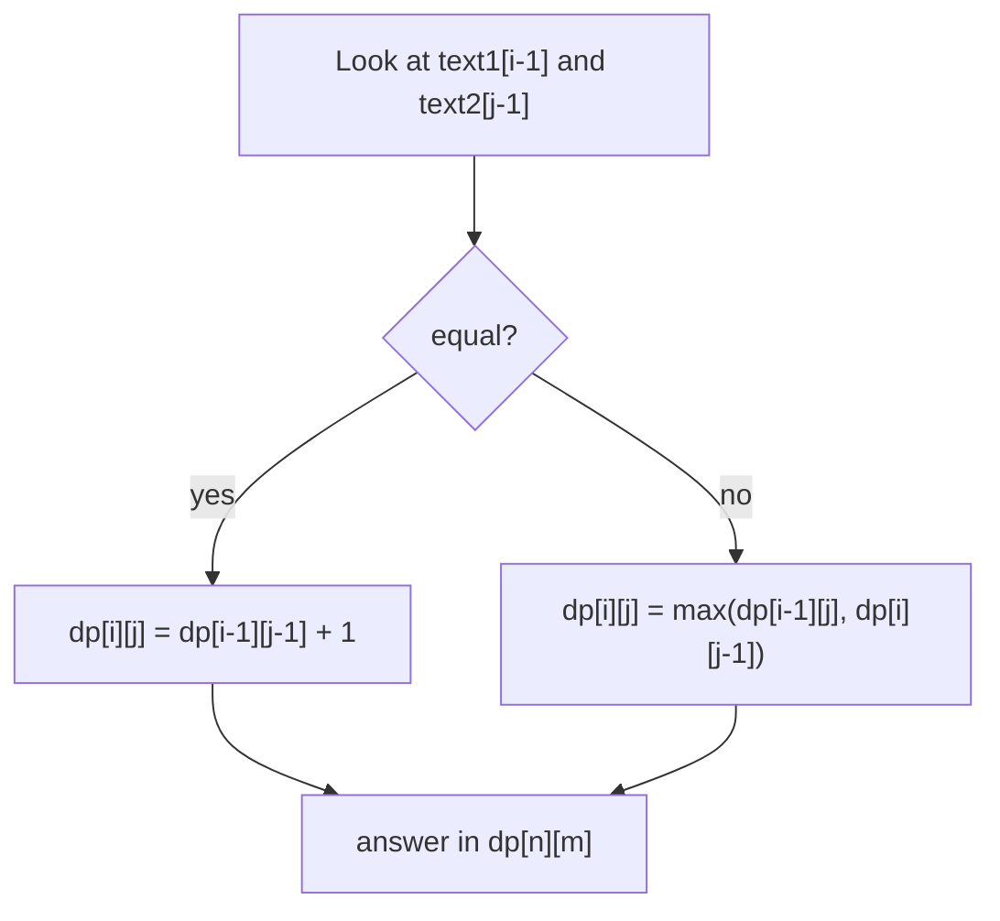
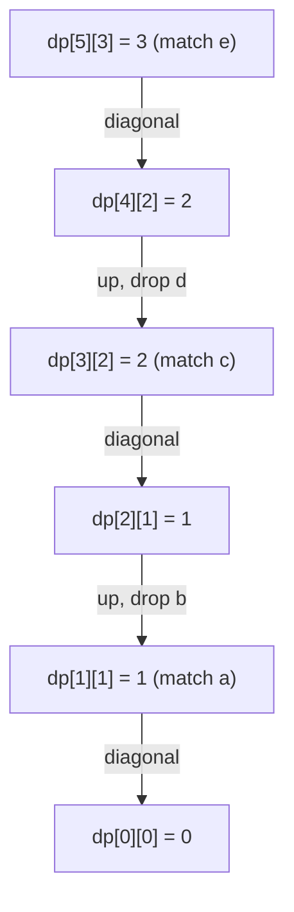

# Longest Common Subsequence

| Meta | Value |
|------|-------|
| Source | LeetCode #1143 |
| Difficulty | Medium |
| Topics | String, Dynamic Programming |
| Link | https://leetcode.com/problems/longest-common-subsequence/ |

---

## Problem Statement

Given two strings `text1` and `text2`, return the length of their **longest common
subsequence**. A subsequence keeps relative order but may skip characters. If there is no
common subsequence, return `0`.

```text
Input:  text1 = "abcde", text2 = "ace"
Output: 3
Explanation: The LCS is "ace", of length 3.

Input:  text1 = "abc", text2 = "def"
Output: 0
```

---

## Approach (WHY)

Define the prefix table

$$
\text{dp}[i][j] = \text{LCS length of } text1[0..i-1] \text{ and } text2[0..j-1].
$$

Branch on the **last characters**. If they are equal, they can both join the LCS, so we
extend the diagonal by one. If not, one of them is useless, so we drop a character from
either string and keep the better answer:

$$
\text{dp}[i][j] =
\begin{cases}
\text{dp}[i-1][j-1] + 1 & text1[i-1] = text2[j-1] \\[4pt]
\max\big(\text{dp}[i-1][j],\ \text{dp}[i][j-1]\big) & \text{otherwise}
\end{cases}
$$

Empty prefixes give `dp[0][*] = dp[*][0] = 0`. The answer is `dp[n][m]`.



### Code

```python
def longestCommonSubsequence(text1: str, text2: str) -> int:
    n, m = len(text1), len(text2)
    dp = [[0] * (m + 1) for _ in range(n + 1)]
    for i in range(1, n + 1):
        for j in range(1, m + 1):
            if text1[i - 1] == text2[j - 1]:
                dp[i][j] = dp[i - 1][j - 1] + 1
            else:
                dp[i][j] = max(dp[i - 1][j], dp[i][j - 1])
    return dp[n][m]
```

```cpp
#include <bits/stdc++.h>
using namespace std;

class Solution {
public:
    int longestCommonSubsequence(string text1, string text2) {
        int n = text1.size(), m = text2.size();
        vector<vector<long long>> dp(n + 1, vector<long long>(m + 1, 0));
        for (int i = 1; i <= n; i++) {
            for (int j = 1; j <= m; j++) {
                if (text1[i - 1] == text2[j - 1])
                    dp[i][j] = dp[i - 1][j - 1] + 1;
                else
                    dp[i][j] = max(dp[i - 1][j], dp[i][j - 1]);
            }
        }
        return (int)dp[n][m];
    }
};
```

### Space-optimized (one row)

```python
def longestCommonSubsequence_1d(text1: str, text2: str) -> int:
    n, m = len(text1), len(text2)
    dp = [0] * (m + 1)
    for i in range(1, n + 1):
        diag = 0
        for j in range(1, m + 1):
            tmp = dp[j]
            if text1[i - 1] == text2[j - 1]:
                dp[j] = diag + 1
            else:
                dp[j] = max(dp[j], dp[j - 1])
            diag = tmp
    return dp[m]
```

```cpp
#include <bits/stdc++.h>
using namespace std;

long long longestCommonSubsequence_1d(string text1, string text2) {
    int n = text1.size(), m = text2.size();
    vector<long long> dp(m + 1, 0);
    for (int i = 1; i <= n; i++) {
        long long diag = 0;
        for (int j = 1; j <= m; j++) {
            long long tmp = dp[j];
            if (text1[i - 1] == text2[j - 1])
                dp[j] = diag + 1;
            else
                dp[j] = max(dp[j], dp[j - 1]);
            diag = tmp;
        }
    }
    return dp[m];
}
```

---

## DP Grid Trace

For `text1 = "abcde"` (rows) and `text2 = "ace"` (columns). Cell `(i, j)` holds
`dp[i][j]`; the bold diagonal jumps mark character matches.

|        | "" | a | c | e |
|--------|----|---|---|---|
| **""** | 0  | 0 | 0 | 0 |
| **a**  | 0  | **1** | 1 | 1 |
| **b**  | 0  | 1 | 1 | 1 |
| **c**  | 0  | 1 | **2** | 2 |
| **d**  | 0  | 1 | 2 | 2 |
| **e**  | 0  | 1 | 2 | **3** |

Reading the bottom-right corner gives `dp[5][3] = 3`, matching the LCS `"ace"`.



---

## Complexity

| Version | Time | Space |
|---|---|---|
| 2D table | $O(nm)$ | $O(nm)$ |
| One row | $O(nm)$ | $O(\min(n,m))$ |

---

## Takeaway

The LCS recurrence is the canonical two-string DP: split on whether the last characters
match, extend the diagonal on a match, otherwise take the max of dropping one character.
Every other problem in this module (edit distance, min deletions, supersequence) is a
twist on this exact grid.
