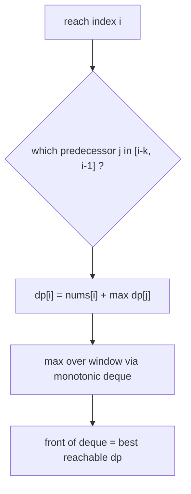
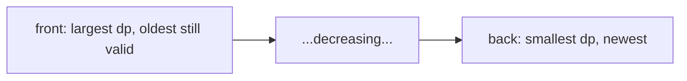
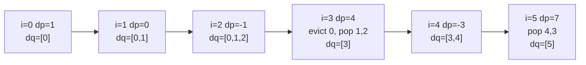

# Jump Game VI

| Meta | Value |
|------|-------|
| Problem | Jump Game VI |
| Source | LeetCode #1696 |
| Reference | https://leetcode.com/problems/jump-game-vi/ |
| Difficulty | Medium |
| Topics | Array, Dynamic Programming, Monotonic Queue, Sliding Window |
| Time | $O(n)$ |
| Space | $O(n)$ |

---

## Problem Statement

You start at index `0` of an integer array `nums`. From index `i` you may jump to any index `j` with `i < j <= i + k`. Each visited index adds `nums[j]` to your score. Reach the last index `n-1` and return the **maximum** total score (you always start at index `0`, so `nums[0]` is included).

```text
Input:  nums = [1, -1, -2, 4, -7, 3], k = 2
Output: 7
Explanation:
  one optimal path: 0 -> 1 -> 3 -> 5  (indices)
  scores:           1 + (-1) + 4 + 3 = 7
  every hop moves forward by at most k = 2
```

---

## Approach (WHY)

Let `dp[i]` be the maximum score to **reach index `i`**. To land on `i` you must have jumped from some index `j` in the window `[i-k, i-1]`, and you add `nums[i]` regardless of which `j` you came from. So `nums[i]` is the window-independent `base`, and the only choice is the **best reachable predecessor**:

$$
dp[i] = nums[i] + \max_{\,i-k \,\le\, j \,\le\, i-1} dp[j]
$$

This is exactly the **windowed-transition** shape. The inner $\max$ is a sliding-window maximum over previous `dp` values, so a **monotonic deque** of indices (with `dp` values decreasing front-to-back) delivers it in $O(1)$ amortized, turning a $O(nk)$ DP into $O(n)$.



The deque stores **indices** so we can evict ones that have slid out of the window (`dq[0] < i - k`), and it stays **decreasing in `dp`** so the front is always the window maximum.



```python
from collections import deque

def maxResult(nums, k):
    n = len(nums)
    dp = [0] * n
    dp[0] = nums[0]
    dq = deque([0])                    # indices, dp[dq] decreasing front->back
    for i in range(1, n):
        while dq and dq[0] < i - k:    # evict predecessors out of window
            dq.popleft()
        dp[i] = nums[i] + dp[dq[0]]    # front holds best reachable dp
        while dq and dp[dq[-1]] <= dp[i]:   # keep deque monotone decreasing
            dq.pop()
        dq.append(i)
    return dp[n - 1]
```

```cpp
#include <bits/stdc++.h>
using namespace std;

long long maxResult(const vector<int>& nums, int k) {
    int n = (int)nums.size();
    vector<long long> dp(n, 0);
    dp[0] = nums[0];
    deque<int> dq;
    dq.push_back(0);                       // indices, dp[dq] decreasing
    for (int i = 1; i < n; ++i) {
        while (!dq.empty() && dq.front() < i - k)   // evict out-of-window
            dq.pop_front();
        dp[i] = nums[i] + dp[dq.front()];           // front = best reachable
        while (!dq.empty() && dp[dq.back()] <= dp[i])  // monotone decreasing
            dq.pop_back();
        dq.push_back(i);
    }
    return dp[n - 1];
}
```

---

## Trace

Run on `nums = [1, -1, -2, 4, -7, 3]`, `k = 2`. The deque holds indices; the comparison is on `dp` values.

```text
i=0  dp[0]=1                       dq=[0]            (vals dp: 1)
i=1  evict none; dp[1]=-1+dp[0]=0  push: dp[1]=0 <= dp[0]=1 -> append
     dq=[0,1]                                       (vals dp: 1, 0)
i=2  evict none; dp[2]=-2+dp[0]=-1 push: dp[2]=-1 <= 0 -> append
     dq=[0,1,2]                                     (vals dp: 1, 0, -1)
i=3  front 0 < 3-2=1 -> popleft; now front 1
     dp[3]=4+dp[1]=4; back-pop dp[2]=-1<=4, dp[1]=0<=4 -> pop both
     dq=[3]                                         (vals dp: 4)
i=4  front 3 not < 2; dp[4]=-7+dp[3]=-3
     push: -3 <= 4 -> append   dq=[3,4]             (vals dp: 4, -3)
i=5  front 3 < 5-2=3? no; dp[5]=3+dp[3]=7
     back-pop dp[4]=-3<=7, dp[3]=4<=7 -> pop both
     dq=[5]                                         (vals dp: 7)
answer dp[n-1]=dp[5]=7
```



Notice at `i=3` the front `0` expired (window is `[1,2]`), so the algorithm correctly used `dp[1]` rather than the larger-but-unreachable `dp[0]`. That eviction is why the deque must store **indices**.

---

## Complexity

- **Time:** $O(n)$ — each index is pushed and popped from the deque at most once.
- **Space:** $O(n)$ for `dp` plus $O(k)$ for the deque. Using a rolling `dp` value is possible but `dp[dq[0]]` lookups need the full array unless you store values in the deque.

---

## Takeaway

Jump Game VI is the textbook **windowed-max DP**: `dp[i] = base[i] + max(dp over a sliding window)`. Spot the "add a per-state cost to the best previous value within a bounded distance" shape and reach for a monotonic deque of indices kept decreasing in `dp` — that collapses the inner $O(k)$ search to $O(1)$ amortized and the whole DP to linear time.
