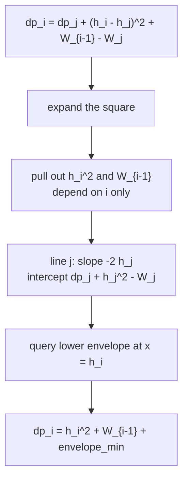
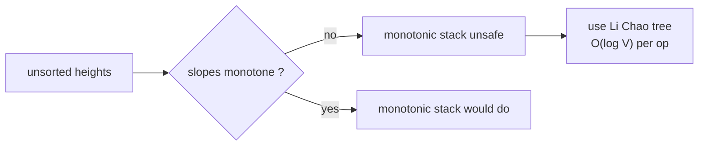
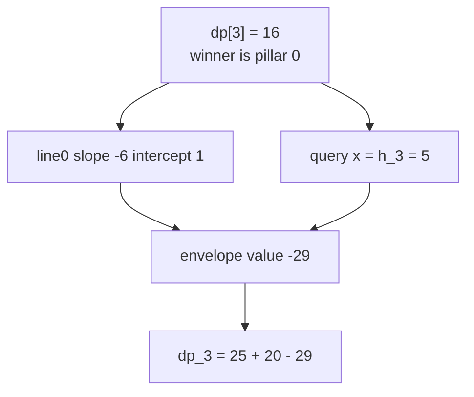

# Building Bridges — CHT via Li Chao Tree

| Meta | Value |
|------|-------|
| Problem | Building Bridges (connect pillars minimising bridge plus demolition cost) |
| Source | Classic CHT problem (CSES-style / CodeChef BRIDGE) |
| Reference | https://cp-algorithms.com/geometry/convex_hull_trick.html |
| Difficulty | Hard |
| Topics | Dynamic Programming, DP Optimization, Convex Hull Trick, Li Chao Tree |
| Time | $O(n \log V)$ |
| Space | $O(V)$ |

---

## Problem Statement

There are `n` pillars in a row. Pillar `i` (1-indexed) has **height** $h_i$ and a **demolition
cost** $c_i$. You build a chain of bridges starting at pillar `1` and ending at pillar `n`: from a
chosen pillar `j` you build a bridge to a later chosen pillar `i`, paying $(h_i - h_j)^2$. Every
pillar strictly **between** two bridged pillars must be demolished, paying its cost $c$. Minimise
the total cost (all bridges plus all demolitions).

Let $W_k = c_1 + c_2 + \cdots + c_k$ be the prefix sum of demolition costs, with $W_0 = 0$. With
$dp_1 = 0$,

$$
dp_i = \min_{1 \le j < i}\Big(dp_j + (h_i - h_j)^2 + (W_{i-1} - W_j)\Big).
$$

The answer is $dp_n$. **Heights are arbitrary** (not sorted), so slopes and queries are not
monotone — a Li Chao tree is the clean tool.

```text
Input:
  n = 4
  h = [3, 7, 1, 5]      // heights (1-indexed)
  c = [8, 2, 10, 4]     // demolition costs
Output:
  16

Prefix W = [0, 8, 10, 20, 24]   (W[0..4])
  dp[1] = 0
  dp[2] = 0 + (7-3)^2 + (W1 - W1) = 16
  dp[3] = min( j=1: 0+(1-3)^2+(W2-W1)=4+2=6,  j=2: 16+(1-7)^2+0=52 ) = 6
  dp[4] = min( j=1: 0+(5-3)^2+(W3-W1)=4+12=16,
               j=2: 16+(5-7)^2+(W3-W2)=16+4+10=30,
               j=3: 6+(5-1)^2+0=22 )                                = 16
```

---

## Approach (WHY)

Expand the square and separate the terms that depend on `i` only from those that depend on `j` only:

$$
dp_i = (h_i - h_j)^2 + dp_j + W_{i-1} - W_j
     = h_i^2 + W_{i-1} + \min_{j < i}\Big(\underbrace{-2h_j}_{m_j}\cdot \underbrace{h_i}_{x_i} + \underbrace{dp_j + h_j^2 - W_j}_{b_j}\Big)
$$

So pillar `j` contributes the line $y = (-2h_j)\,x + (dp_j + h_j^2 - W_j)$, and pillar `i` queries
the lower envelope at $x = h_i$, then adds $h_i^2 + W_{i-1}$.



Because $h$ is **unsorted**, the slopes $-2h_j$ are not monotone and the queries $h_i$ are not
monotone. The monotonic stack would fail, so we keep the same envelope inside a **Li Chao tree**
over the height domain $[lo, hi]$, which accepts any insert order and any query in $O(\log V)$.



```python
class LiChaoMin:
    """Lower envelope over integer domain [lo, hi]; any insert and query order."""
    def __init__(self, lo, hi):
        self.lo, self.hi = lo, hi
        self.tree = {}                                # node -> (m, b)

    @staticmethod
    def _f(line, x):
        return line[0] * x + line[1]

    def add(self, m, b, node=1, l=None, r=None):
        if l is None:
            l, r = self.lo, self.hi
        new = (m, b)
        cur = self.tree.get(node)
        if cur is None:
            self.tree[node] = new
            return
        mid = (l + r) // 2
        if self._f(new, mid) < self._f(cur, mid):     # new better at midpoint
            self.tree[node] = new
            new, cur = cur, new
        if l == r:
            return
        if self._f(new, l) < self._f(cur, l):         # loser may still win on the left
            self.add(new[0], new[1], node * 2, l, mid)
        else:
            self.add(new[0], new[1], node * 2 + 1, mid + 1, r)

    def query(self, x, node=1, l=None, r=None):
        if l is None:
            l, r = self.lo, self.hi
        cur = self.tree.get(node)
        res = float("inf") if cur is None else self._f(cur, x)
        if l == r:
            return res
        mid = (l + r) // 2
        if x <= mid:
            return min(res, self.query(x, node * 2, l, mid))
        return min(res, self.query(x, node * 2 + 1, mid + 1, r))


def building_bridges(h, c):
    # h, c are 1-indexed conceptually; pass 0-indexed lists of length n
    n = len(h)
    W = [0] * (n + 1)
    for i in range(n):
        W[i + 1] = W[i] + c[i]                        # prefix demolition cost
    LO, HI = min(h), max(h)
    lichao = LiChaoMin(LO, HI)
    dp = [0] * n
    # pillar 1 (index 0): dp = 0, contribute its line
    lichao.add(-2 * h[0], dp[0] + h[0] * h[0] - W[1])
    for i in range(1, n):
        best = lichao.query(h[i])                     # lower envelope at x = h[i]
        dp[i] = h[i] * h[i] + W[i] + best             # W[i] == W_{(i+1)-1}
        lichao.add(-2 * h[i], dp[i] + h[i] * h[i] - W[i + 1])
    return dp[n - 1]
```

```cpp
#include <bits/stdc++.h>
using namespace std;
const long long INF = 1e18;

struct LiChaoMin {
    // Lower envelope over integer domain [lo, hi]; any insert and query order.
    struct Line { long long m = 0, b = INF; };
    long long lo, hi;
    vector<Line> tree;
    LiChaoMin(long long lo_, long long hi_) : lo(lo_), hi(hi_) {
        tree.assign(4 * (hi - lo + 1) + 4, Line{});
    }
    static long long f(const Line& ln, long long x) { return ln.m * x + ln.b; }

    void add(long long m, long long b, int node, long long l, long long r) {
        Line nw{m, b};
        long long mid = (l + r) >> 1;
        if (f(nw, mid) < f(tree[node], mid)) swap(tree[node], nw);   // new better at mid
        if (l == r) return;
        if (f(nw, l) < f(tree[node], l)) add(nw.m, nw.b, node * 2, l, mid);
        else add(nw.m, nw.b, node * 2 + 1, mid + 1, r);
    }
    void add(long long m, long long b) { add(m, b, 1, lo, hi); }

    long long query(long long x, int node, long long l, long long r) {
        long long res = f(tree[node], x);
        if (l == r) return res;
        long long mid = (l + r) >> 1;
        if (x <= mid) return min(res, query(x, node * 2, l, mid));
        return min(res, query(x, node * 2 + 1, mid + 1, r));
    }
    long long query(long long x) { return query(x, 1, lo, hi); }
};

long long building_bridges(vector<long long>& h, vector<long long>& c) {
    int n = (int)h.size();
    vector<long long> W(n + 1, 0);
    for (int i = 0; i < n; ++i) W[i + 1] = W[i] + c[i];   // prefix demolition cost
    long long LO = *min_element(h.begin(), h.end());
    long long HI = *max_element(h.begin(), h.end());
    LiChaoMin lichao(LO, HI);
    vector<long long> dp(n, 0);
    lichao.add(-2 * h[0], dp[0] + h[0] * h[0] - W[1]);
    for (int i = 1; i < n; ++i) {
        long long best = lichao.query(h[i]);              // lower envelope at x = h[i]
        dp[i] = h[i] * h[i] + W[i] + best;                // W[i] == W_{(i+1)-1}
        lichao.add(-2 * h[i], dp[i] + h[i] * h[i] - W[i + 1]);
    }
    return dp[n - 1];
}
```

A quadratic reference implementation, useful to validate the Li Chao version:

```python
def building_bridges_naive(h, c):
    n = len(h)
    W = [0] * (n + 1)
    for i in range(n):
        W[i + 1] = W[i] + c[i]
    INF = float("inf")
    dp = [0] * n
    for i in range(1, n):
        best = INF
        for j in range(i):                            # try every earlier pillar
            cost = dp[j] + (h[i] - h[j]) ** 2 + (W[i] - W[j + 1])
            best = min(best, cost)
        dp[i] = best
    return dp[n - 1]
```

```cpp
#include <bits/stdc++.h>
using namespace std;

long long building_bridges_naive(vector<long long>& h, vector<long long>& c) {
    int n = (int)h.size();
    vector<long long> W(n + 1, 0);
    for (int i = 0; i < n; ++i) W[i + 1] = W[i] + c[i];
    const long long INF = 1e18;
    vector<long long> dp(n, 0);
    for (int i = 1; i < n; ++i) {
        long long best = INF;
        for (int j = 0; j < i; ++j) {                 // try every earlier pillar
            long long d = h[i] - h[j];
            long long cost = dp[j] + d * d + (W[i] - W[j + 1]);
            best = min(best, cost);
        }
        dp[i] = best;
    }
    return dp[n - 1];
}
```

---

## Trace

Run on `h = [3, 7, 1, 5]`, `c = [8, 2, 10, 4]`, `W = [0, 8, 10, 20, 24]`. Lines use slope $-2h_j$
and intercept $dp_j + h_j^2 - W_{j+1}$ (with 0-indexing, `j+1` is the 1-indexed pillar number).

```text
pillar 0 (h=3): dp=0
  line0: slope -6, intercept 0 + 9 - W[1]=8  -> -6 x + 1

i=1 (h=7): query x=7 on { line0 } -> -6*7 + 1 = -41
  dp[1] = 7^2 + W[1] + (-41) = 49 + 8 - 41 = 16
  line1: slope -14, intercept 16 + 49 - W[2]=10 -> -14 x + 55

i=2 (h=1): query x=1 on { line0, line1 }
  line0 -> -6*1 + 1 = -5 ; line1 -> -14*1 + 55 = 41 ; min = -5
  dp[2] = 1^2 + W[2] + (-5) = 1 + 10 - 5 = 6
  line2: slope -2, intercept 6 + 1 - W[3]=20 -> -2 x - 13

i=3 (h=5): query x=5 on { line0, line1, line2 }
  line0 -> -29 ; line1 -> -15 ; line2 -> -23 ; min = -29 (from pillar 0)
  dp[3] = 5^2 + W[3] + (-29) = 25 + 20 - 29 = 16
answer = dp[3] = 16
```



---

## Complexity

| Measure | Value |
|---------|-------|
| States | $O(n)$ pillars |
| Add line | $O(\log V)$ in Li Chao tree |
| Query | $O(\log V)$ in Li Chao tree |
| Time | $O(n \log V)$ |
| Space | $O(V)$ for the Li Chao tree, $V = h_{\max} - h_{\min} + 1$ |

The naive reference is $O(n^2)$.

---

## Takeaway

Building Bridges is the textbook reason to know the **Li Chao tree** flavour of CHT. Expanding
$(h_i - h_j)^2$ produces lines with slope $-2h_j$, but because heights are **unsorted**, neither
slopes nor queries are monotone — the cheap stack breaks. The Li Chao tree maintains the very same
lower envelope while accepting arbitrary insertions and queries at $O(\log V)$, taking the DP from
$O(n^2)$ to $O(n \log V)$. Remember to fold the $i$-only terms $h_i^2 + W_{i-1}$ outside the
minimisation and to keep every product in `long long`.
