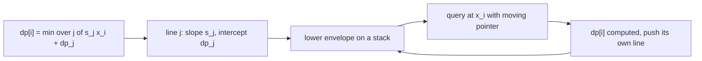
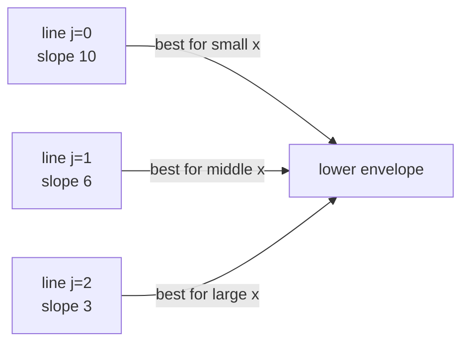
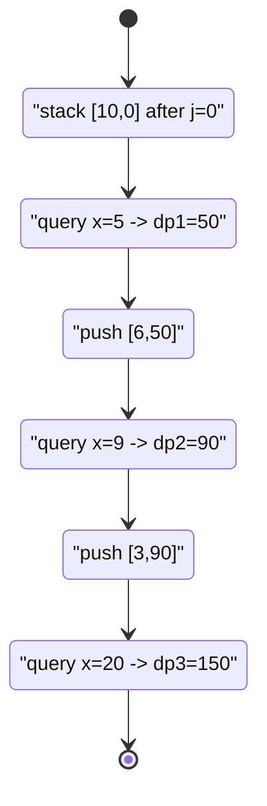

# Convex Hull Trick — Canonical Minimum Linear DP

| Meta | Value |
|------|-------|
| Problem | Canonical line-minimum DP solved with the Convex Hull Trick |
| Source | Classic (CHT teaching example) |
| Reference | https://cp-algorithms.com/geometry/convex_hull_trick.html |
| Difficulty | Medium |
| Topics | Dynamic Programming, DP Optimization, Convex Hull Trick |
| Time | $O(n)$ with monotonic CHT |
| Space | $O(n)$ |

---

## Problem Statement

You process `n` items in order, indices $0, 1, \ldots, n-1$. To "finish" item `i` you must adopt a
**plan** that was set at some earlier item `j < i`. Plan `j` has a fixed per-unit **rate**
$s_j$ and an accumulated **setup cost** $dp_j$ (the optimal cost to reach item `j`). Finishing item
`i` under plan `j` costs $s_j \cdot x_i + dp_j$, where $x_i$ is item `i`'s **workload**. Let
$dp_0 = 0$ and

$$
dp_i = \min_{0 \le j < i}\big(s_j \cdot x_i + dp_j\big).
$$

The rates are given in **strictly decreasing** order ($s_0 > s_1 > \cdots$) and the workloads in
**non-decreasing** order ($x_0 \le x_1 \le \cdots$). Return $dp_{n-1}$.

```text
Input:
  s = [10, 6, 3, 1]      // rates, strictly decreasing
  x = [_,  5, 9, 20]     // workloads (x[0] unused; queries are non-decreasing)
Output:
  150

Explanation:
  dp[0] = 0
  dp[1] = s0*x1 + dp0 = 10*5 + 0   = 50
  dp[2] = min( s0*9+0 = 90, s1*9+50 = 104 )            = 90
  dp[3] = min( s0*20+0=200, s1*20+50=170, s2*20+90=150 ) = 150
```

---

## Approach (WHY)

Every earlier item `j` is a **line** $y = s_j \cdot x + dp_j$ with slope $s_j$ and intercept
$dp_j$. Computing $dp_i$ asks: *which line is lowest at $x = x_i$?* That is a lower-envelope query.

$$
dp_i = \min_{j < i}\big(\underbrace{s_j}_{\text{slope}}\cdot \underbrace{x_i}_{\text{query}} + \underbrace{dp_j}_{\text{intercept}}\big)
$$

Because rates (slopes) arrive **decreasing** and workloads (queries) arrive **non-decreasing**, the
monotonic Convex Hull Trick applies directly: maintain the lower envelope on a stack, add one line
per item, and answer each query by sweeping a forward-only pointer. Total work is $O(n)$.



The hand-off of the winning line as `x` grows: steeper (larger-slope) lines win for small
workloads, flatter lines take over as workload increases.



The `bad()` redundancy test (cross-product, no division): line $L_2$ is dropped when the
intersection of $L_1$ and $L_3$ is not to the right of the intersection of $L_1$ and $L_2$:

$$
(b_3 - b_1)(m_1 - m_2)\ \le\ (b_2 - b_1)(m_1 - m_3).
$$

```python
class CHTMin:
    """Lower envelope for MINIMUM queries.
    Lines added with strictly decreasing slopes; queries non-decreasing."""
    def __init__(self):
        self.lines = []     # (m, b) pairs on the envelope
        self.ptr = 0

    @staticmethod
    def _bad(l1, l2, l3):
        m1, b1 = l1
        m2, b2 = l2
        m3, b3 = l3
        return (b3 - b1) * (m1 - m2) <= (b2 - b1) * (m1 - m3)

    def add(self, m, b):
        line = (m, b)
        while len(self.lines) >= 2 and self._bad(self.lines[-2], self.lines[-1], line):
            self.lines.pop()
        self.lines.append(line)

    def query(self, x):
        if self.ptr >= len(self.lines):
            self.ptr = len(self.lines) - 1
        while self.ptr + 1 < len(self.lines):
            m1, b1 = self.lines[self.ptr]
            m2, b2 = self.lines[self.ptr + 1]
            if m2 * x + b2 <= m1 * x + b1:
                self.ptr += 1
            else:
                break
        m, b = self.lines[self.ptr]
        return m * x + b


def solve(s, x):
    # dp[i] = min_{j<i} ( s[j]*x[i] + dp[j] ), dp[0] = 0
    n = len(s)
    dp = [0] * n
    cht = CHTMin()
    cht.add(s[0], dp[0])                  # line for j = 0
    for i in range(1, n):
        dp[i] = cht.query(x[i])           # query lower envelope at workload x[i]
        cht.add(s[i], dp[i])              # item i contributes a line for the future
    return dp[n - 1]
```

```cpp
#include <bits/stdc++.h>
using namespace std;

struct CHTMin {
    // Lower envelope for MINIMUM queries.
    // Lines added with strictly decreasing slopes; queries non-decreasing.
    vector<long long> M, B;
    int ptr = 0;
    static bool bad(long long m1, long long b1, long long m2, long long b2,
                    long long m3, long long b3) {
        return (b3 - b1) * (m1 - m2) <= (b2 - b1) * (m1 - m3);
    }
    void add(long long m, long long b) {
        while (M.size() >= 2 &&
               bad(M[M.size() - 2], B[M.size() - 2], M.back(), B.back(), m, b)) {
            M.pop_back();
            B.pop_back();
        }
        M.push_back(m);
        B.push_back(b);
    }
    long long query(long long x) {
        if (ptr >= (int)M.size()) ptr = (int)M.size() - 1;
        while (ptr + 1 < (int)M.size() &&
               M[ptr + 1] * x + B[ptr + 1] <= M[ptr] * x + B[ptr]) {
            ptr++;
        }
        return M[ptr] * x + B[ptr];
    }
};

long long solve(vector<long long>& s, vector<long long>& x) {
    // dp[i] = min_{j<i} ( s[j]*x[i] + dp[j] ), dp[0] = 0
    int n = (int)s.size();
    vector<long long> dp(n, 0);
    CHTMin cht;
    cht.add(s[0], dp[0]);                 // line for j = 0
    for (int i = 1; i < n; ++i) {
        dp[i] = cht.query(x[i]);          // query lower envelope at workload x[i]
        cht.add(s[i], dp[i]);             // item i contributes a line for the future
    }
    return dp[n - 1];
}
```

A baseline $O(n^2)$ version is handy for stress-testing the CHT against:

```python
def solve_naive(s, x):
    n = len(s)
    INF = float("inf")
    dp = [0] * n
    for i in range(1, n):
        best = INF
        for j in range(i):                # scan every earlier plan
            best = min(best, s[j] * x[i] + dp[j])
        dp[i] = best
    return dp[n - 1]
```

```cpp
#include <bits/stdc++.h>
using namespace std;

long long solve_naive(vector<long long>& s, vector<long long>& x) {
    int n = (int)s.size();
    const long long INF = 1e18;
    vector<long long> dp(n, 0);
    for (int i = 1; i < n; ++i) {
        long long best = INF;
        for (int j = 0; j < i; ++j)       // scan every earlier plan
            best = min(best, s[j] * x[i] + dp[j]);
        dp[i] = best;
    }
    return dp[n - 1];
}
```

---

## Trace

Run on `s = [10, 6, 3, 1]`, `x = [_, 5, 9, 20]`, `dp[0] = 0`. The envelope keeps all three useful
lines; the query pointer only ever moves forward.

```text
add line j=0: (m=10, b=0)         stack = [ (10,0) ]
i=1: query x=5
     ptr=0 -> 10*5 + 0 = 50       dp[1] = 50
add line j=1: (m=6, b=50)
     bad? only 2 lines -> keep     stack = [ (10,0), (6,50) ]
i=2: query x=9
     ptr=0 -> 90 ; line1 at 9 = 6*9+50 = 104 (>90) -> stay ptr=0
     dp[2] = 90
add line j=2: (m=3, b=90)
     bad((10,0),(6,50),(3,90))?
       (90-0)*(10-6)=360  vs  (50-0)*(10-3)=350  -> 360<=350 false -> keep
     stack = [ (10,0), (6,50), (3,90) ]
i=3: query x=20
     ptr=0 -> 200 ; line1 at 20 = 170 (<200) -> ptr=1
     ptr=1 -> 170 ; line2 at 20 = 3*20+90 = 150 (<170) -> ptr=2
     dp[3] = 150
answer = dp[3] = 150
```



---

## Complexity

| Measure | Value |
|---------|-------|
| States | $O(n)$ items |
| Add line | amortized $O(1)$ |
| Query | amortized $O(1)$ via forward pointer |
| Time | $O(n)$ |
| Space | $O(n)$ for the envelope and `dp` |

The naive baseline is $O(n^2)$ — identical answers, far slower.

---

## Takeaway

This is the **canonical** Convex Hull Trick DP: every earlier state is a line $s_j x + dp_j$, and
each new state is a lowest-line query. Because slopes arrive decreasing and queries arrive
non-decreasing, a stack-based lower envelope with a forward pointer collapses the $O(n^2)$ scan to
$O(n)$. Master the **query-then-add** loop and the division-free `bad()` test here, and the
flashier CHT problems become routine.
