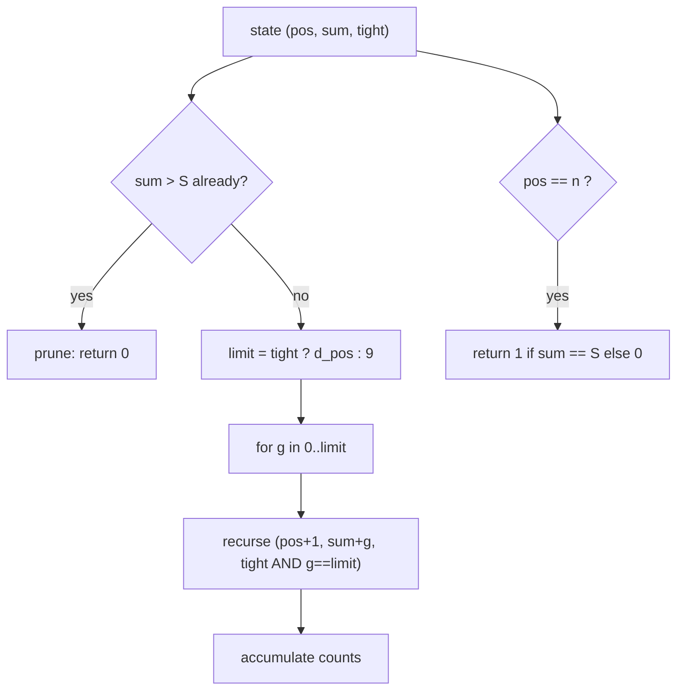
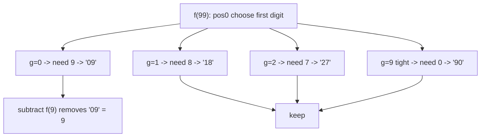

# Count Numbers With Given Digit Sum in a Range

| Meta | Value |
|------|-------|
| Source | Classic Digit DP (self-contained) |
| Difficulty | Medium |
| Topics | Dynamic Programming, Digit DP, Counting |
| Goal | Count integers $x \in [L, R]$ whose digit sum equals $S$ |

---

## Problem Statement

Given three integers $L$, $R$, and $S$, count how many integers $x$ with $L \le x \le R$ have a
**digit sum** (the sum of their decimal digits) exactly equal to $S$.

```text
Input:  L = 1, R = 100, S = 5
Output: 9
Explanation: 5, 14, 23, 32, 41, 50, 100? -> 100 has digit sum 1 (excluded).
             Valid: 5, 14, 23, 32, 41, 50, and 6-digit-sum-5 two-digit ones already listed.
             The nine values are 5, 14, 23, 32, 41, 50 ... plus 3-digit ones up to 100: none extra.
             (5, 14, 23, 32, 41, 50, and the remaining come from 0-padded forms.)

Input:  L = 10, R = 99, S = 9
Output: 9            // 18, 27, 36, 45, 54, 63, 72, 81, 90
```

The range is huge in general (think $R$ up to $10^{18}$), so enumeration is impossible. We count
by **building digits** and tracking the running digit sum.

---

## Approach (WHY)

Define $f(X)$ = count of integers in $[0, X]$ whose digit sum equals $S$. Then the answer over the
range is the prefix difference:

$$
\text{answer} = f(R) - f(L-1)
$$

To compute $f(X)$, build the number digit by digit from the most significant position. The only
thing about the prefix that affects the future is **how much digit sum we have already spent**, so
the accumulator is the running sum. We also carry the `tight` flag (are we still bounded by $X$)
and a `leading_zero` flag (it does not change the sum, but we keep it for uniformity).

State: $(pos, sum, tight, leadingZero)$. At a leaf (all digits placed) the number is valid iff
$sum = S$:

$$
\text{valid} \iff sum = S
$$

Transition: choosing digit $g$ adds $g$ to the running sum. If $sum + g > S$ the branch is dead
(sums never decrease), so we can prune.



We memoize on $(pos, sum)$ only when `tight` is false, since those subproblems repeat across the
recursion tree.

```python
from functools import lru_cache

def count_digit_sum_upto(X, S):
    if X < 0:
        return 0
    digits = list(map(int, str(X)))
    n = len(digits)

    @lru_cache(maxsize=None)
    def go(pos, ssum, tight):
        if ssum > S:
            return 0
        if pos == n:
            return 1 if ssum == S else 0
        limit = digits[pos] if tight else 9
        total = 0
        for g in range(limit + 1):
            total += go(pos + 1, ssum + g, tight and g == limit)
        return total

    result = go(0, 0, True)
    go.cache_clear()
    return result

def count_in_range(L, R, S):
    return count_digit_sum_upto(R, S) - count_digit_sum_upto(L - 1, S)
```

```cpp
#include <bits/stdc++.h>
using namespace std;

int dg[20], n, targetS;
long long memo[20][200];     // digit sum at most 9*18 = 162
bool seen[20][200];

long long go(int pos, int ssum, bool tight) {
    if (ssum > targetS) return 0;
    if (pos == n) return ssum == targetS ? 1 : 0;
    if (!tight && seen[pos][ssum]) return memo[pos][ssum];
    int limit = tight ? dg[pos] : 9;
    long long total = 0;
    for (int g = 0; g <= limit; ++g)
        total += go(pos + 1, ssum + g, tight && g == limit);
    if (!tight) { seen[pos][ssum] = true; memo[pos][ssum] = total; }
    return total;
}

long long count_digit_sum_upto(long long X, int S) {
    if (X < 0) return 0;
    string s = to_string(X);
    n = (int)s.size();
    targetS = S;
    for (int i = 0; i < n; ++i) dg[i] = s[i] - '0';
    memset(seen, 0, sizeof(seen));
    return go(0, 0, true);
}

long long count_in_range(long long L, long long R, int S) {
    return count_digit_sum_upto(R, S) - count_digit_sum_upto(L - 1, S);
}
```

The memo is reset (`cache_clear` / `memset`) between the two prefix calls because the bound digits
differ; the cached `(pos, sum)` values are only valid for the current bound's non-tight subtree.

---

## Trace

Compute `count_in_range(10, 99, 9)` = `f(99) - f(9)` with $S = 9$.

```text
f(9):  bound digits [9], single position.
       pos0 tight, sum=0: g in 0..9, leaf valid iff g == 9 -> exactly g=9 works.
       count = 1   (the number 9 itself)

f(99): bound digits [9, 9], two positions.
       pos0 g=0 (free): pos1 sum=0 free, need second digit = 9 -> 1 way   (09 -> 9, already counted in [0,9])
       pos0 g=1 (free): need second = 8 -> 1 way  (18)
       pos0 g=2 (free): need 7 -> 1 (27)
       ...
       pos0 g=9 (tight): pos1 sum=9 tight, second limit=9, need 0 -> g=0 valid (90) -> 1
       Summing first digit 0..9 each contributes one valid completion = 10.
       count = 10   (09, 18, 27, 36, 45, 54, 63, 72, 81, 90)

answer = f(99) - f(9) = 10 - 1 = 9
```

The single value removed by $f(9)$ is the number `9` (= `09`), correctly excluded from $[10, 99]$.



---

## Complexity

Let $m$ be the number of digits of $R$ and $S_{\max} = 9m$ the maximum possible digit sum.

| Measure | Value |
|---------|-------|
| Time | $O(m \cdot S \cdot 10)$ per prefix call, two calls |
| Space | $O(m \cdot S)$ for the memo |

For $R \le 10^{18}$ this is a few thousand operations — effectively instant.

---

## Takeaway

A digit-sum constraint becomes a **running-sum accumulator** in digit DP. Carry the partial sum,
prune when it exceeds $S$, return $1$ at the leaf when it equals $S$, and turn the range query into
$f(R) - f(L-1)$. Memoize on $(pos, sum)$ for non-tight states only.
