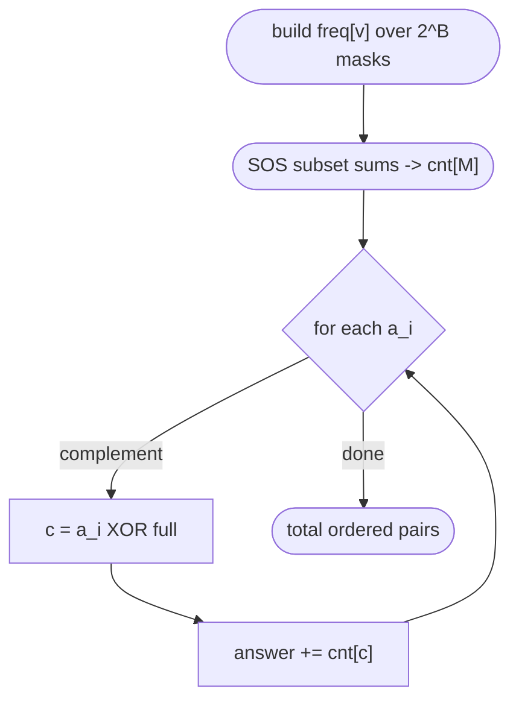
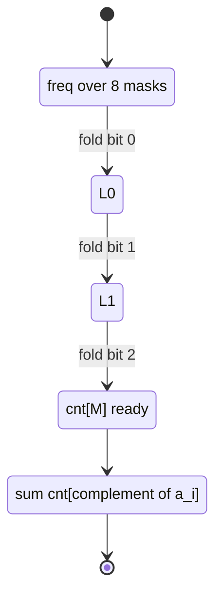

# Count Pairs With Bitwise AND Equal to Zero

| Meta | Value |
| :--- | :--- |
| Topic | Dynamic Programming / SOS DP |
| Difficulty | Medium-Hard |
| Technique | Subset SOS over Complements |
| Time | $O(B \cdot 2^B + m)$ |
| Space | $O(2^B)$ |

---

## Problem Statement

Given an array $a$ of $m$ non-negative integers, each fitting in $B$ bits, count the number of **ordered** pairs $(i, j)$ such that

$$
a_i \mathbin{\&} a_j = 0
$$

(the bitwise AND is zero — the two values share no set bit). Pairs with $i = j$ count only when $a_i = 0$, and ordered means $(i,j)$ and $(j,i)$ are both counted.

```text
Input:
  B = 3                # values < 8
  a = [1, 2, 3, 4]     # bits: 001, 010, 011, 100

Valid ordered pairs (AND == 0):
  (1,2): 001 & 010 = 000  ok
  (2,1): 010 & 001 = 000  ok
  (1,4): 001 & 100 = 000  ok
  (4,1): 100 & 001 = 000  ok
  (2,4): 010 & 100 = 000  ok
  (4,2): 100 & 010 = 000  ok
  (3,4): 011 & 100 = 000  ok
  (4,3): 100 & 011 = 000  ok

Output:
  8
```

---

## Approach (WHY)

For a fixed $a_i$, a partner $a_j$ satisfies $a_i \mathbin{\&} a_j = 0$ exactly when $a_j$ uses **only** bits that $a_i$ does **not** use. In set terms, $a_j$ must be a **submask of the complement** of $a_i$:

$$
a_i \mathbin{\&} a_j = 0 \iff a_j \subseteq \overline{a_i}
$$

where $\overline{a_i} = a_i \oplus (2^B - 1)$ is the complement within $B$ bits.

So if we build a frequency array $\mathrm{freq}[v]$ = how many elements equal $v$, and then compute its **subset sums**

$$
\mathrm{cnt}[M] = \sum_{T \subseteq M} \mathrm{freq}[T],
$$

then $\mathrm{cnt}[\overline{a_i}]$ is exactly the number of valid partners for $a_i$ (including itself when $a_i = 0$). Summing $\mathrm{cnt}[\overline{a_i}]$ over all $i$ gives the ordered pair count. The subset sums come from one SOS DP in $O(B \cdot 2^B)$.



Why SOS and not a per-element submask loop? Enumerating submasks of each complement costs $O(3^B)$ overall; the SOS table answers every complement query in $O(1)$ after an $O(B 2^B)$ build.

$$
\text{answer} = \sum_{i=1}^{m} \mathrm{cnt}\!\left[\,\overline{a_i}\,\right]
$$

---

## Code

```python
def count_pairs_and_zero(a, B):
    full = (1 << B) - 1
    freq = [0] * (1 << B)
    for v in a:
        freq[v] += 1

    # SOS DP: cnt[M] = number of elements whose value is a submask of M
    cnt = freq[:]
    for i in range(B):
        bit = 1 << i
        for M in range(1 << B):
            if M & bit:
                cnt[M] += cnt[M ^ bit]

    # each a_i pairs with every value that is a submask of its complement
    answer = 0
    for v in a:
        answer += cnt[v ^ full]
    return answer


if __name__ == "__main__":
    print(count_pairs_and_zero([1, 2, 3, 4], 3))   # 8
```

```cpp
#include <bits/stdc++.h>
using namespace std;

long long count_pairs_and_zero(const vector<int>& a, int B) {
    int full = (1 << B) - 1;
    vector<long long> cnt(1 << B, 0);
    for (int v : a) cnt[v] += 1;                 // freq, reused as SOS table

    // SOS DP: cnt[M] = #elements whose value is a submask of M
    for (int i = 0; i < B; ++i) {
        int bit = 1 << i;
        for (int M = 0; M < (1 << B); ++M) {
            if (M & bit) {
                cnt[M] += cnt[M ^ bit];
            }
        }
    }

    // each a_i pairs with every submask of its complement
    long long answer = 0;
    for (int v : a) {
        answer += cnt[v ^ full];
    }
    return answer;
}

int main() {
    vector<int> a = {1, 2, 3, 4};
    cout << count_pairs_and_zero(a, 3) << '\n';   // 8
    return 0;
}
```

---

## Trace — SOS Table After Each Bit Layer

With $B = 3$ and $a = [1,2,3,4]$, the frequency array over masks `000..111` is:

| Mask | 000 | 001 | 010 | 011 | 100 | 101 | 110 | 111 |
| :--- | :-- | :-- | :-- | :-- | :-- | :-- | :-- | :-- |
| freq | 0 | 1 | 1 | 1 | 1 | 0 | 0 | 0 |

Folding bit by bit (only masks with that bit set change):

| Mask | freq | After bit 0 | After bit 1 | After bit 2 (cnt) |
| :--- | :-- | :-- | :-- | :-- |
| `000` | 0 | 0 | 0 | 0 |
| `001` | 1 | 1 | 1 | 1 |
| `010` | 1 | 1 | 1 | 1 |
| `011` | 1 | 1 + 1 = 2 | 2 + 1 = 3 | 3 |
| `100` | 1 | 1 | 1 | 1 |
| `101` | 0 | 0 + 1 = 1 | 1 | 1 + 1 = 2 |
| `110` | 0 | 0 | 0 + 1 = 1 | 1 + 1 = 2 |
| `111` | 0 | 0 | 0 | 0 → folds → 4 |

Final `cnt[111] = 4` (all four elements are submasks of the full mask). Now sum complements:

| $a_i$ | $\overline{a_i}$ | $\mathrm{cnt}[\overline{a_i}]$ |
| :-- | :-- | :-- |
| `001` | `110` | 2 |
| `010` | `101` | 2 |
| `011` | `100` | 1 |
| `100` | `011` | 3 |

Total $= 2 + 2 + 1 + 3 = 8$. ✔



---

## Complexity

| Resource | Cost |
| :--- | :--- |
| Build freq | $O(m)$ |
| SOS DP | $O(B \cdot 2^B)$ |
| Query loop | $O(m)$ |
| Total time | $O(B \cdot 2^B + m)$ |
| Space | $O(2^B)$ |

---

## Takeaway

"AND equals zero" is a disguised **submask-of-complement** query. Precompute subset sums of the value frequencies with one SOS DP, then each element's answer is a single lookup at its complement — turning a quadratic $O(m^2)$ scan or an $O(3^B)$ submask loop into $O(B 2^B + m)$.
