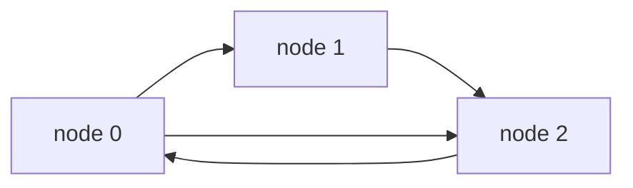
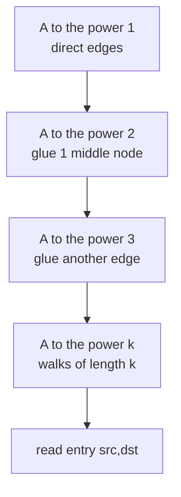
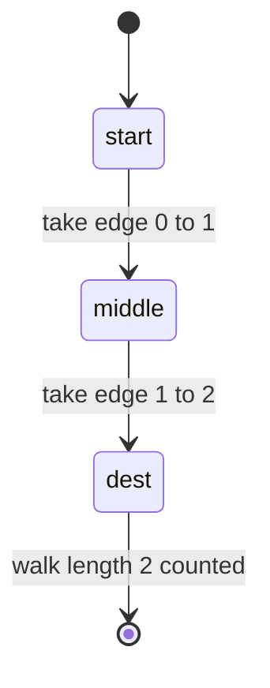

# Count Paths of Length Exactly K (Adjacency Matrix Power)

| Meta | Value |
|------|-------|
| Problem | Number of walks of length exactly $k$ between two nodes |
| Source | Classic (self-contained) |
| Reference | https://en.wikipedia.org/wiki/Adjacency_matrix#Matrix_powers |
| Difficulty | Medium |
| Topics | Graphs, Dynamic Programming, Matrix Exponentiation, Modular Arithmetic |
| Time | $O(V^3 \log k)$ |
| Space | $O(V^2)$ |

---

## Problem Statement

You are given a directed graph on $V$ nodes as an adjacency matrix $A$, where $A[i][j] = 1$ if there
is an edge $i \to j$ and $0$ otherwise. Given a source `src`, a destination `dst`, and a length
$k$ (which may be enormous), return the number of **walks of length exactly $k$** from `src` to
`dst`, taken modulo $10^9 + 7$. A *walk* may repeat nodes and edges; only the number of edges used
must equal $k$.

```text
Graph (3 nodes), edges:
  0 -> 1
  1 -> 2
  2 -> 0
  0 -> 2

Adjacency matrix A:
  [0 1 1]
  [0 0 1]
  [1 0 0]

Input:  src = 0, dst = 2, k = 2
Output: 1
Explanation: length-2 walks 0 -> ? -> 2 are only 0 -> 1 -> 2. (0 -> 2 -> ? cannot reach 2.)
```

---

## Approach (WHY)

A length-1 walk count from $i$ to $j$ is exactly $A[i][j]$. For length 2, sum over every possible
middle node $t$:

$$
(A^2)[i][j] = \sum_{t} A[i][t]\,A[t][j],
$$

which counts walks $i \to t \to j$. By induction, each additional power glues one more edge onto
every walk, giving the key identity

$$
(A^{k})[i][j] = \#\{\text{walks of length exactly } k \text{ from } i \text{ to } j\}.
$$

So instead of a DP that runs $k$ rounds of relaxation ($O(k V^2)$), we raise $A$ to the $k$-th power
with **binary exponentiation** in $O(V^3 \log k)$ — essential when $k$ is up to $10^{18}$. Every
multiply is reduced modulo $10^9 + 7$.





```python
MOD = 1_000_000_007

def mat_mult(A, B):
    n = len(A)
    C = [[0] * n for _ in range(n)]
    for i in range(n):
        for t in range(n):
            a = A[i][t]
            if a:                          # skip zero entries
                Bt = B[t]
                Ci = C[i]
                for j in range(n):
                    Ci[j] = (Ci[j] + a * Bt[j]) % MOD
    return C

def mat_pow(M, e):
    n = len(M)
    result = [[1 if i == j else 0 for j in range(n)] for i in range(n)]  # identity
    base = [row[:] for row in M]
    while e > 0:
        if e & 1:                          # fold on set bit
            result = mat_mult(result, base)
        base = mat_mult(base, base)        # square
        e >>= 1
    return result

def count_paths(adj, src, dst, k):
    if k == 0:                             # length-0 walk only stays put
        return 1 if src == dst else 0
    Ak = mat_pow(adj, k)
    return Ak[src][dst] % MOD
```

```cpp
#include <bits/stdc++.h>
using namespace std;
const long long MOD = 1e9 + 7;

vector<vector<long long>> mat_mult(const vector<vector<long long>>& A,
                                   const vector<vector<long long>>& B) {
    int n = (int)A.size();
    vector<vector<long long>> C(n, vector<long long>(n, 0));
    for (int i = 0; i < n; ++i)
        for (int t = 0; t < n; ++t) {
            long long a = A[i][t];
            if (a) {                                   // skip zero entries
                for (int j = 0; j < n; ++j)
                    C[i][j] = (C[i][j] + a * B[t][j]) % MOD;
            }
        }
    return C;
}

vector<vector<long long>> mat_pow(vector<vector<long long>> base, long long e) {
    int n = (int)base.size();
    vector<vector<long long>> result(n, vector<long long>(n, 0));
    for (int i = 0; i < n; ++i) result[i][i] = 1;      // identity
    while (e > 0) {
        if (e & 1) result = mat_mult(result, base);    // fold on set bit
        base = mat_mult(base, base);                   // square
        e >>= 1;
    }
    return result;
}

long long count_paths(const vector<vector<long long>>& adj,
                      int src, int dst, long long k) {
    if (k == 0)                                        // length-0 walk only stays put
        return src == dst ? 1 : 0;
    vector<vector<long long>> Ak = mat_pow(adj, k);
    return Ak[src][dst] % MOD;
}
```

---

## Trace (src = 0, dst = 2, k = 2)

Start with

$$
A =
\begin{bmatrix}
0 & 1 & 1 \\
0 & 0 & 1 \\
1 & 0 & 0
\end{bmatrix},
\qquad
A^2 = A \cdot A =
\begin{bmatrix}
1 & 0 & 1 \\
1 & 0 & 0 \\
0 & 1 & 1
\end{bmatrix}.
$$

Compute entry $(0,2)$ of $A^2$: $\sum_t A[0][t]\,A[t][2] = A[0][0]A[0][2] + A[0][1]A[1][2] +
A[0][2]A[2][2] = 0\cdot1 + 1\cdot1 + 1\cdot0 = 1$. The single length-2 walk is $0 \to 1 \to 2$.



---

## Complexity

| Quantity | Value |
|----------|-------|
| Matrix multiplies | $O(\log k)$ |
| Cost per multiply | $O(V^3)$ |
| Total time | $O(V^3 \log k)$ |
| Space | $O(V^2)$ |

Compare to the naive layer-by-layer DP at $O(k V^2)$, which is hopeless once $k$ reaches $10^{18}$.

---

## Takeaway

Powers of the adjacency matrix *are* a counting DP in disguise: $(A^k)[i][j]$ counts length-$k$
walks because each multiply glues one more edge across all middle nodes. Pair this with mod-aware
binary exponentiation and any "count paths/walks of huge fixed length" question solves in
$O(V^3 \log k)$.
