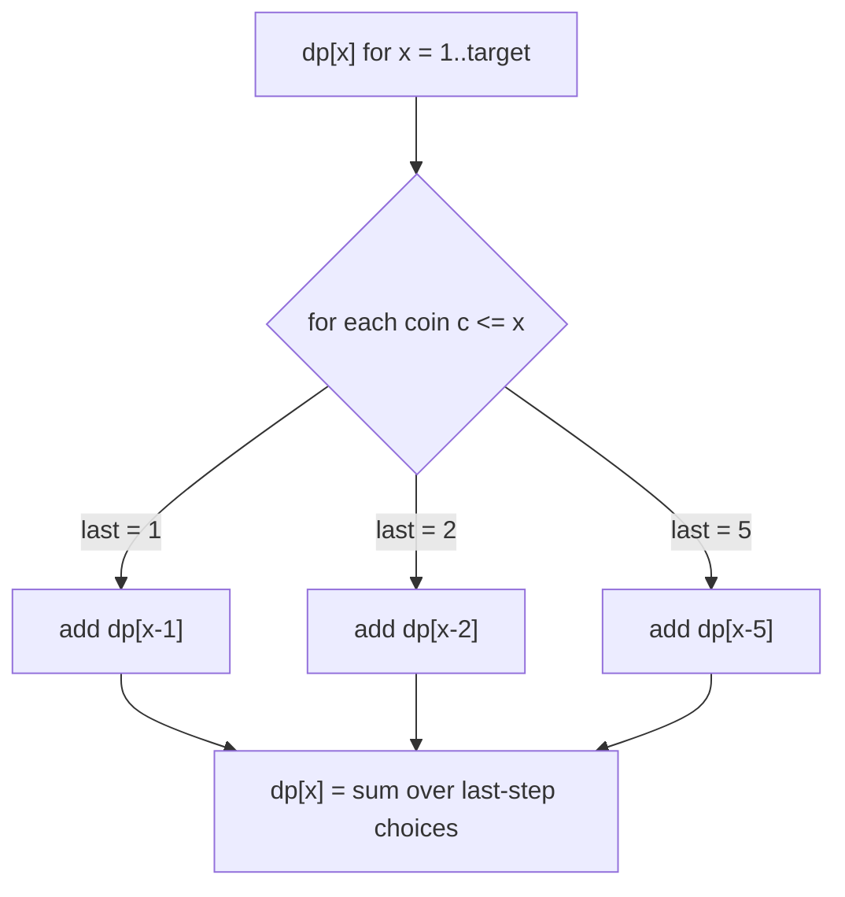
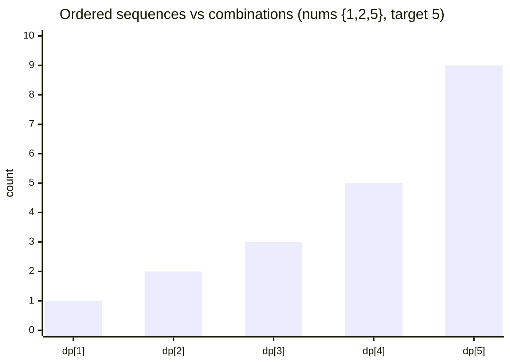
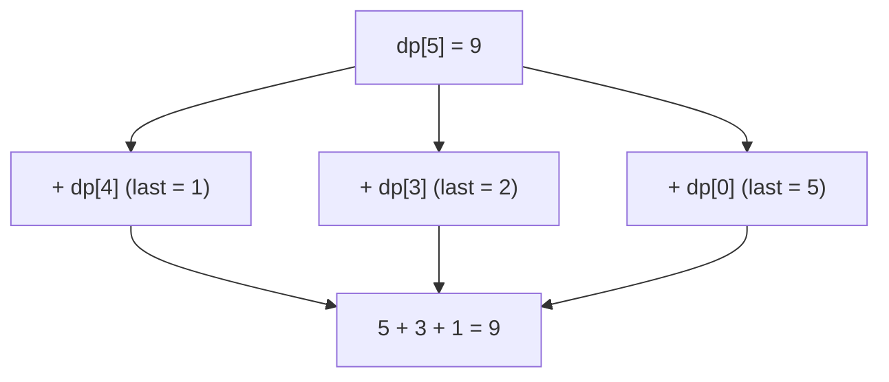

# Count Ways — Ordered Combinations (Sequences)

| Meta | Value |
|------|-------|
| Problem | Count Ordered Ways to Sum to Target |
| Source | Self-contained (Combination Sum IV / staircase family) |
| Reference | https://leetcode.com/problems/combination-sum-iv/ |
| Difficulty | Medium |
| Topics | Dynamic Programming, Unbounded Knapsack, Counting, Permutations |
| Time | $O(k \cdot A)$ |
| Space | $O(A)$ |

---

## Problem Statement

Given an array of distinct positive integers `nums` (denominations, reusable without limit) and a
`target`, count the number of **ordered** sequences whose elements sum to `target`. Unlike Coin
Change II, **order matters**: $(1,2)$ and $(2,1)$ are two different ways.

```text
Input:  nums = [1, 2, 5], target = 5
Output: ... (ordered sequences summing to 5)
  Examples: (5), (1,1,1,1,1), (1,2,2), (2,1,2), (2,2,1), (1,1,1,2), ...

Input:  nums = [1, 2], target = 3
Output: 3
  Sequences: (1,1,1), (1,2), (2,1)
```

---

## Approach (WHY)

Let $dp[x]$ be the number of **ordered sequences** summing to $x$, with $dp[0] = 1$ (the empty
sequence). For a sequence ending at amount $x$, consider its **last** element $c$. Removing it
leaves an ordered sequence summing to $x - c$:

$$
dp[x] \mathrel{+}= dp[x - c] \quad\text{for each } c \le x.
$$

The arithmetic is identical to Coin Change II — the difference is **loop order**. Here the **amount
loop is OUTER** and the **coins loop is INNER**, so at every amount *every* denomination is treated
as a possible last step. Sequences ending in different values stay distinct, so all orderings are
counted.

$$
\underbrace{dp[x] \mathrel{+}= dp[x-c]}_{\text{same update}} \quad\Rightarrow\quad
\begin{cases}
\text{coins outer} & \to \text{combinations (518)} \\
\text{amount outer} & \to \text{ordered sequences (this problem)}
\end{cases}
$$



---

## Solution

```python
def count_sequences(nums, target):
    dp = [0] * (target + 1)
    dp[0] = 1                            # empty sequence
    for x in range(1, target + 1):      # AMOUNT OUTER -> ordered
        for c in nums:                  # coins inner
            if c <= x:
                dp[x] += dp[x - c]
    return dp[target]
```

```cpp
#include <bits/stdc++.h>
using namespace std;

long long count_sequences(vector<int>& nums, int target) {
    vector<long long> dp(target + 1, 0);
    dp[0] = 1;                              // empty sequence
    for (int x = 1; x <= target; x++) {     // AMOUNT OUTER -> ordered
        for (int c : nums) {                // coins inner
            if (c <= x)
                dp[x] += dp[x - c];
        }
    }
    return dp[target];
}
```

---

## DP-Table Trace

`nums = [1, 2, 5]`, `target = 5`. Each amount sums contributions from *every* coin as the last step.

| x | contributions | dp[x] |
|---|---------------|-------|
| 0 | base | 1 |
| 1 | dp[0] | 1 |
| 2 | dp[1] + dp[0] | 2 |
| 3 | dp[2] + dp[1] | 3 |
| 4 | dp[3] + dp[2] | 5 |
| 5 | dp[4] + dp[3] + dp[0] | **9** |

Contrast with Coin Change II on the same input, where `dp[5] = 4`. Ordered counting is strictly
larger because each multiset expands into its distinct permutations.





---

## Complexity

- **Time:** $O(k \cdot A)$ — every amount $1\ldots target$ scans all $k$ denominations.
- **Space:** $O(A)$ — single 1D table.

---

## Takeaway

Ordered counting = unbounded knapsack with `+=` and **amount on the outer loop**. The only
difference from Coin Change II (#518) is which loop is outer: amount-outer treats every coin as a
valid last step, so orderings are distinct (permutations); coins-outer freezes the order, collapsing
to combinations. Same update, opposite loop nesting, completely different answer.
