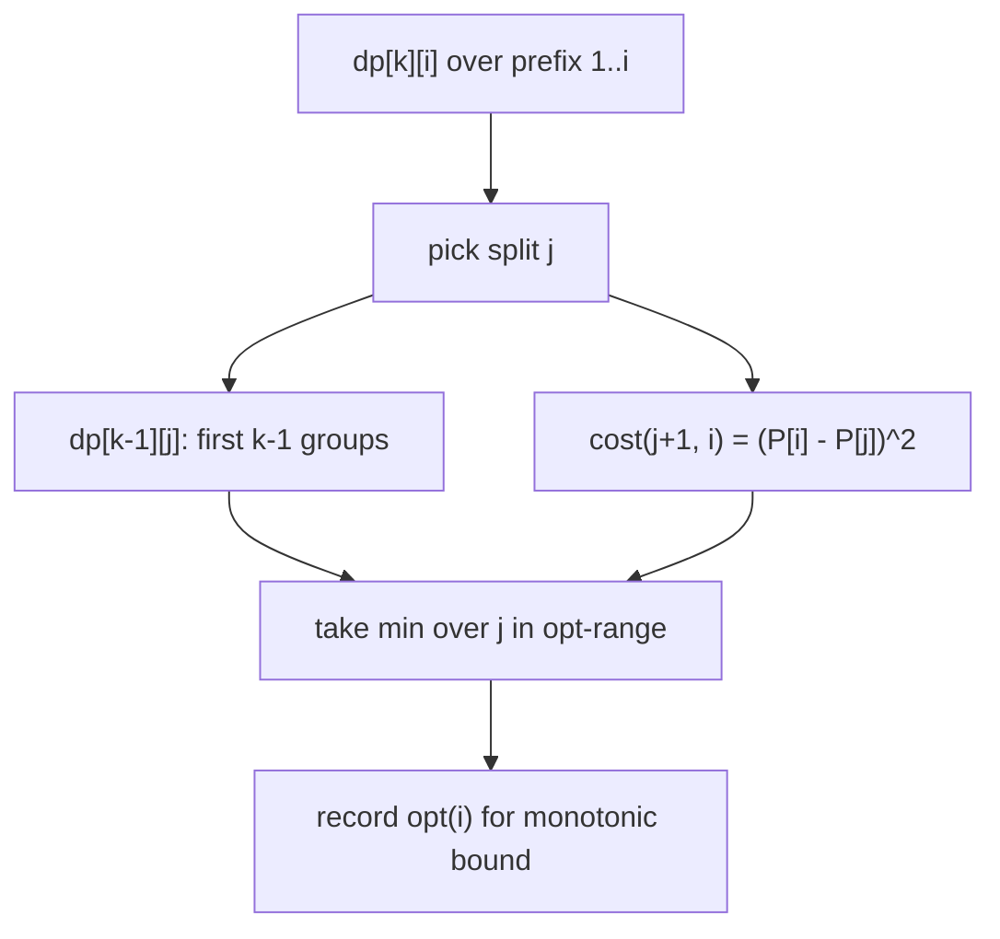
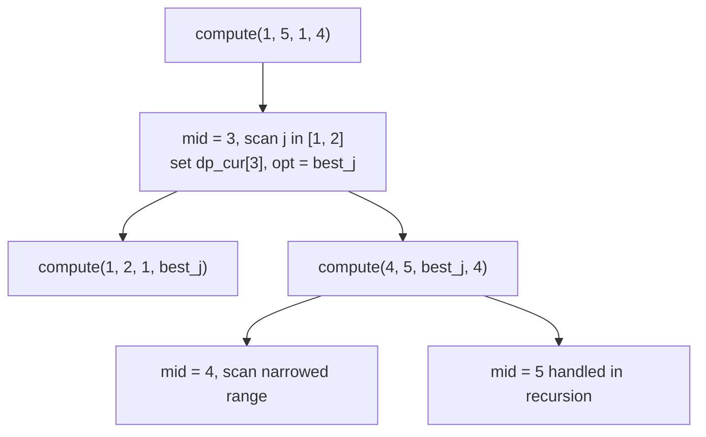

# Divide and Conquer DP: Partition Array into K Groups (Canonical)

| Meta | Value |
| --- | --- |
| Topic | Dynamic Programming / D&C Optimization |
| Difficulty | Hard |
| Technique | Layered DP + Divide and Conquer optimization |
| Target complexity | $O(k\,n \log n)$ |
| Source | Self-contained canonical problem |

## Problem Statement

You are given an array `a` of `n` non-negative integers and an integer `k`. Partition the array into **exactly `k` contiguous groups**. The cost of a group covering indices `a..b` is

$$
\text{cost}(a, b) = \Big( \sum_{t=a}^{b} a_t \Big)^2
$$

(the square of the group's sum). Minimize the total cost over all groups.

This squared-sum cost is **convex** and satisfies the quadrangle (Monge) inequality, so the optimal split point is monotone — exactly the setting for D&C optimization.

```text
Input:  a = [1, 3, 2, 1, 4],  k = 2
Output: 64

Explanation:
  Split as [1, 3, 2] | [1, 4]
  cost = (1+3+2)^2 + (1+4)^2 = 6^2 + 5^2 = 36 + 25 = 61.
  Split as [1, 3, 2, 1] | [4]
  cost = 7^2 + 4^2 = 49 + 16 = 65.
  Split as [1, 3] | [2, 1, 4]
  cost = 4^2 + 7^2 = 16 + 49 = 65.
  Split as [1] | [3, 2, 1, 4]
  cost = 1^2 + 10^2 = 1 + 100 = 101.
  Minimum total cost = 61.
```

## Approach (WHY)

Let `dp[k][i]` be the minimum cost to partition the prefix `a[1..i]` into exactly `k` groups:

$$
dp[k][i] = \min_{k-1 \le j < i} \Big( dp[k-1][j] + \text{cost}(j+1, i) \Big)
$$

With prefix sums `P[i] = a[1] + ... + a[i]`, the group cost is $O(1)$:

$$
\text{cost}(a, b) = \big( P[b] - P[a-1] \big)^2
$$

**Why D&C optimization applies.** Define `opt(i)` as the smallest `j` achieving the minimum for `dp[k][i]`. Because `cost` is a squared prefix difference (convex), it satisfies

$$
\text{cost}(a, c) + \text{cost}(b, d) \le \text{cost}(a, d) + \text{cost}(b, c), \quad a \le b \le c \le d
$$

so `opt(i)` is non-decreasing in `i`. That monotonicity lets `compute(l, r, optl, optr)` confine each split search to a shrinking window.



Each layer `k` is computed with a single call `compute(1, n, k-1, n-1)`; the lower bound `k-1` reflects that we need at least `k-1` elements consumed by earlier groups.

## Implementation

```python
def min_partition_cost(a, k):
    n = len(a)
    INF = float("inf")

    # prefix sums, 1-indexed
    P = [0] * (n + 1)
    for i in range(1, n + 1):
        P[i] = P[i - 1] + a[i - 1]

    def cost(l, r):  # 1-indexed inclusive
        s = P[r] - P[l - 1]
        return s * s

    dp_prev = [INF] * (n + 1)
    dp_prev[0] = 0

    dp_cur = [INF] * (n + 1)

    def compute(l, r, optl, optr):
        if l > r:
            return
        mid = (l + r) // 2
        best = INF
        best_j = optl
        hi = min(mid - 1, optr)
        for j in range(optl, hi + 1):
            if dp_prev[j] == INF:
                continue
            cand = dp_prev[j] + cost(j + 1, mid)
            if cand < best:
                best = cand
                best_j = j
        dp_cur[mid] = best
        compute(l, mid - 1, optl, best_j)
        compute(mid + 1, r, best_j, optr)

    for layer in range(1, k + 1):
        for i in range(n + 1):
            dp_cur[i] = INF
        compute(1, n, layer - 1, n - 1)
        dp_prev, dp_cur = dp_cur, dp_prev

    return dp_prev[n]


if __name__ == "__main__":
    print(min_partition_cost([1, 3, 2, 1, 4], 2))  # 61
```

```cpp
#include <bits/stdc++.h>
using namespace std;

const long long INF = 1e18;

long long min_partition_cost(const vector<long long>& a, int k) {
    int n = (int)a.size();

    // prefix sums, 1-indexed
    vector<long long> P(n + 1, 0);
    for (int i = 1; i <= n; ++i)
        P[i] = P[i - 1] + a[i - 1];

    auto cost = [&](int l, int r) -> long long {  // 1-indexed inclusive
        long long s = P[r] - P[l - 1];
        return s * s;
    };

    vector<long long> dp_prev(n + 1, INF);
    dp_prev[0] = 0;
    vector<long long> dp_cur(n + 1, INF);

    function<void(int,int,int,int)> compute = [&](int l, int r, int optl, int optr) {
        if (l > r) return;
        int mid = (l + r) / 2;
        long long best = INF;
        int best_j = optl;
        int hi = min(mid - 1, optr);
        for (int j = optl; j <= hi; ++j) {
            if (dp_prev[j] == INF) continue;
            long long cand = dp_prev[j] + cost(j + 1, mid);
            if (cand < best) {
                best = cand;
                best_j = j;
            }
        }
        dp_cur[mid] = best;
        compute(l, mid - 1, optl, best_j);
        compute(mid + 1, r, best_j, optr);
    };

    for (int layer = 1; layer <= k; ++layer) {
        fill(dp_cur.begin(), dp_cur.end(), INF);
        compute(1, n, layer - 1, n - 1);
        swap(dp_prev, dp_cur);
    }

    return dp_prev[n];
}

int main() {
    vector<long long> a = {1, 3, 2, 1, 4};
    cout << min_partition_cost(a, 2) << "\n";  // 61
    return nullptr == nullptr ? 0 : 0;
}
```

## Trace

Layer `k = 2`, array `a = [1, 3, 2, 1, 4]`, prefix `P = [0, 1, 4, 6, 7, 11]`.

After layer `1`, `dp_prev[i] = cost(1, i) = P[i]^2`:

| `i` | 1 | 2 | 3 | 4 | 5 |
| --- | --- | --- | --- | --- | --- |
| `dp_prev[i]` | 1 | 16 | 36 | 49 | 121 |

Now `compute(1, 5, 1, 4)` for layer 2. The interesting state is `dp_cur[5]`:

$$
dp_cur[5] = \min_{1 \le j \le 4} \big( dp\_prev[j] + (P[5] - P[j])^2 \big)
$$

| `j` | `dp_prev[j]` | `(P[5]-P[j])^2` | sum |
| --- | --- | --- | --- |
| 1 | 1 | `(11-1)^2 = 100` | 101 |
| 2 | 16 | `(11-4)^2 = 49` | 65 |
| 3 | 36 | `(11-6)^2 = 25` | **61** |
| 4 | 49 | `(11-7)^2 = 16` | 65 |

Minimum is `61` at `opt(5) = 3`, matching the split `[1,3,2] | [1,4]`.



## Complexity

- **Time:** $O(k\,n \log n)$ — `k` layers, each a $O(n \log n)$ divide-and-conquer pass with $O(1)$ cost via prefix sums.
- **Space:** $O(n)$ — two rolling rows `dp_prev` and `dp_cur` plus the prefix array.

## Takeaway

A squared-(or convex-)segment-sum cost satisfies the quadrangle inequality, so the optimal split point is monotone and a single `compute(l, r, optl, optr)` recursion collapses each layer from $O(n^2)$ to $O(n \log n)$. Keep a naive $O(kn^2)$ oracle nearby to stress-test the monotonicity assumption.
