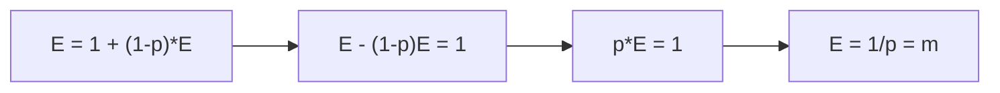
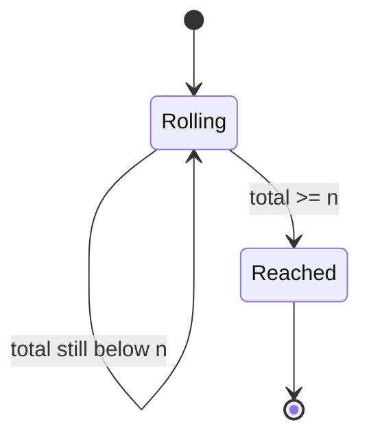

# Expected Dice Rolls to Reach a Target

| Meta | Value |
|------|-------|
| Source | Self-contained (classic expected-value DP) |
| Difficulty | Medium |
| Topics | Dynamic Programming, Probability, Expected Value |
| Link | — |

---

## Problem Statement

You repeatedly roll a fair `m`-sided die (faces `1..m`, each with probability `1/m`),
adding each result to a running total that starts at `0`. You stop the instant the total is
**`n` or more**. Return the **expected number of rolls** needed to reach a total of at least
`n`.

A second classic variant: what is the expected number of rolls to get the **first** specific
face (say a `6`)? Both are solved with the same expected-value recurrence and the self-loop
trick.

```text
Input:  n = 1, m = 6
Output: 1.0
        // Any single roll (1..6) already reaches total >= 1.

Input:  n = 2, m = 6
Output: 1.1666667
        // 5/6 of the time the first roll (2..6) finishes;
        // 1/6 of the time (rolled 1) we need expected E[1] = 1 more.
        // E[2] = 1 + (1/6)*E[1] = 1 + (1/6)*1 = 7/6.

Input:  first 6 with m = 6
Output: 6.0
        // E = 1 + (5/6)E  ->  E = 6.
```

---

## Approach (WHY)

**Part A — expected rolls to reach total `≥ n`.** Let `E[r]` be the expected number of
rolls when the **remaining distance** is `r` (i.e. you still need to gain `r` more to hit
the target). Each roll costs `1` and advances by a uniform amount `k ∈ {1..m}`, reducing the
remaining distance to `max(0, r - k)`:

$$
\mathbb{E}[r] = 1 + \frac{1}{m}\sum_{k=1}^{m} \mathbb{E}[\,\max(0, r-k)\,],
\qquad \mathbb{E}[0] = 0.
$$

Every `E[r]` references only **smaller** remaining distances, so this is a DAG — fill `r`
from `1` up to `n`. By **linearity of expectation**, the global "expected total rolls" splits
into "one roll now" plus the probability-weighted expectation of where we land.


```python
def expected_rolls_to_target(n, m):
    # E[r] = expected rolls when remaining distance is r
    E = [0.0] * (n + 1)
    window = 0.0          # running sum of E[max(0, r-k)] over k = 1..m
    for r in range(1, n + 1):
        window += E[r - 1]            # E[r-1] enters the band
        if r - 1 - m >= 0:
            window -= E[r - 1 - m]    # term that slid out of the band
        E[r] = 1.0 + window / m
    return E[n]
```

```cpp
#include <bits/stdc++.h>
using namespace std;

double expected_rolls_to_target(long long n, int m) {
    // E[r] = expected rolls when remaining distance is r
    vector<double> E(n + 1, 0.0);
    double window = 0.0;   // running sum of E[max(0, r-k)] over k = 1..m
    for (long long r = 1; r <= n; ++r) {
        window += E[r - 1];                 // E[r-1] enters the band
        if (r - 1 - m >= 0) window -= E[r - 1 - m]; // term sliding out
        E[r] = 1.0 + window / (double)m;
    }
    return E[n];
}
```

> Note: the `max(0, r-k)` clamp means any overshoot lands on the **absorbing** state
> `E[0] = 0`; for small `r` several of the `m` terms collapse to `E[0]`, which the running
> window handles because those slots are still inside `[0, r-1]`.

**Part B — expected rolls for the first specific face (self-loop).** Here a single
non-absorbing state loops back to itself when the desired face does not appear. With success
probability `p = 1/m`:

$$
\mathbb{E} = 1 + (1 - p)\,\mathbb{E}
\;\;\Longrightarrow\;\;
\mathbb{E} = \frac{1}{p} = m.
$$



```python
def expected_rolls_first_face(m):
    # success prob p = 1/m; E = 1 + (1-p)*E  ->  E = 1/p
    p = 1.0 / m
    return 1.0 / p
```

```cpp
#include <bits/stdc++.h>
using namespace std;

double expected_rolls_first_face(int m) {
    // success prob p = 1/m; E = 1 + (1-p)*E  ->  E = 1/p
    double p = 1.0 / m;
    return 1.0 / p;
}
```

---

## Trace (n = 3, m = 6)

| r | band = E[max(0, r-k)], k=1..6 | E[r] = 1 + band/6 |
|---|-------------------------------|-------------------|
| 0 | — | 0 (absorbing) |
| 1 | E0,E0,E0,E0,E0,E0 = 0 | 1 + 0/6 = 1.0000 |
| 2 | E1,E0,E0,E0,E0,E0 = 1 | 1 + 1/6 = 1.1667 |
| 3 | E2,E1,E0,E0,E0,E0 = 2.1667 | 1 + 2.1667/6 ≈ 1.3611 |

So `E[3] ≈ 1.3611` expected rolls to reach a total of at least `3` with a fair d6.



`Reached` (remaining distance `0`) is the **absorbing** base case with `E = 0`; every
recurrence drains toward it.

---

## Complexity

| Variant | Time | Space |
|---------|------|-------|
| Reach total `≥ n` (sliding window) | $O(n)$ | $O(n)$ |
| Naive band recompute | $O(n \cdot m)$ | $O(n)$ |
| First specific face (algebra) | $O(1)$ | $O(1)$ |

---

## Takeaway

Expected-value DP rests on **linearity of expectation**: `E[r] = 1 + average of reachable
E`. When the state graph is acyclic, fill it in dependency order and accelerate the band sum
with a **sliding window**. When a state loops to itself, the recurrence `E = a + p·E` solves
in one line to `E = a / (1 - p)` — here giving the clean `E = m` for the first-face variant.
