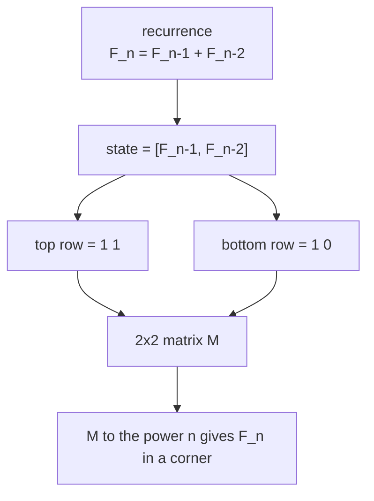
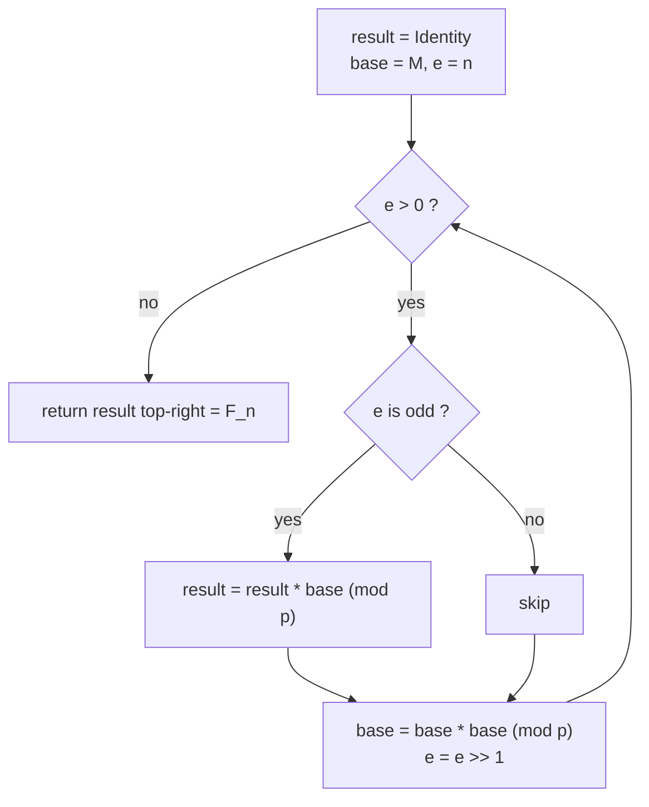
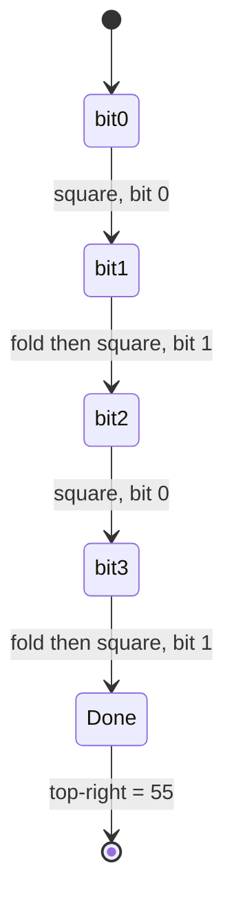

# Fibonacci via 2×2 Matrix Power

| Meta | Value |
|------|-------|
| Problem | Fibonacci modulo $10^9 + 7$ for very large $n$ |
| Source | Classic (self-contained) |
| Reference | https://en.wikipedia.org/wiki/Fibonacci_number#Matrix_form |
| Difficulty | Medium |
| Topics | Dynamic Programming, Math, Matrix Exponentiation, Modular Arithmetic |
| Time | $O(\log n)$ |
| Space | $O(1)$ |

---

## Problem Statement

Define the Fibonacci sequence by

$$
F_0 = 0,\quad F_1 = 1,\quad F_n = F_{n-1} + F_{n-2}\ (n \ge 2).
$$

Given an integer $n$ (possibly up to $10^{18}$), return $F_n \bmod (10^9 + 7)$.

```text
Input:  n = 10
Output: 55

Input:  n = 100
Output: 687995182      (F_100 mod 1e9+7)

Input:  n = 1000000000000000000
Output: 209783453      (computed in O(log n) matrix multiplies)
```

---

## Approach (WHY)

Walking the recurrence one step at a time is $O(n)$ — impossible for $n = 10^{18}$. Fibonacci is a
**linear recurrence with constant coefficients**, so a single $2 \times 2$ matrix advances the
state by one step:

$$
\begin{bmatrix} F_{n} \\ F_{n-1} \end{bmatrix}
=
\begin{bmatrix} 1 & 1 \\ 1 & 0 \end{bmatrix}
\begin{bmatrix} F_{n-1} \\ F_{n-2} \end{bmatrix}.
$$

Applying the matrix $n$ times gives the famous identity

$$
\begin{bmatrix} 1 & 1 \\ 1 & 0 \end{bmatrix}^{\,n}
=
\begin{bmatrix} F_{n+1} & F_{n} \\ F_{n} & F_{n-1} \end{bmatrix}.
$$

So $F_n$ is simply the top-right entry of $M^n$, and $M^n$ is computed with **binary exponentiation**
in $O(\log n)$ matrix multiplications. Because the numbers grow exponentially, we reduce **modulo
$10^9 + 7$** after every multiply.





```python
MOD = 1_000_000_007

def mat_mult(A, B):
    # 2x2 matrix multiply under MOD
    return [
        [(A[0][0] * B[0][0] + A[0][1] * B[1][0]) % MOD,
         (A[0][0] * B[0][1] + A[0][1] * B[1][1]) % MOD],
        [(A[1][0] * B[0][0] + A[1][1] * B[1][0]) % MOD,
         (A[1][0] * B[0][1] + A[1][1] * B[1][1]) % MOD],
    ]

def fib(n: int) -> int:
    if n == 0:
        return 0
    result = [[1, 0], [0, 1]]          # identity
    base = [[1, 1], [1, 0]]            # the Fibonacci matrix M
    e = n
    while e > 0:
        if e & 1:                      # fold base into result on set bit
            result = mat_mult(result, base)
        base = mat_mult(base, base)    # square the base
        e >>= 1                        # consume one exponent bit
    # M^n top-right entry equals F_n
    return result[0][1]
```

```cpp
#include <bits/stdc++.h>
using namespace std;
const long long MOD = 1e9 + 7;

array<array<long long, 2>, 2> mat_mult(const array<array<long long, 2>, 2>& A,
                                       const array<array<long long, 2>, 2>& B) {
    // 2x2 matrix multiply under MOD
    array<array<long long, 2>, 2> C{};
    C[0][0] = (A[0][0] * B[0][0] + A[0][1] * B[1][0]) % MOD;
    C[0][1] = (A[0][0] * B[0][1] + A[0][1] * B[1][1]) % MOD;
    C[1][0] = (A[1][0] * B[0][0] + A[1][1] * B[1][0]) % MOD;
    C[1][1] = (A[1][0] * B[0][1] + A[1][1] * B[1][1]) % MOD;
    return C;
}

long long fib(long long n) {
    if (n == 0) return 0;
    array<array<long long, 2>, 2> result = {{{1, 0}, {0, 1}}};  // identity
    array<array<long long, 2>, 2> base   = {{{1, 1}, {1, 0}}};  // Fibonacci matrix M
    long long e = n;
    while (e > 0) {
        if (e & 1)                                  // fold base into result on set bit
            result = mat_mult(result, base);
        base = mat_mult(base, base);                // square the base
        e >>= 1;                                    // consume one exponent bit
    }
    // M^n top-right entry equals F_n
    return result[0][1];
}
```

---

## Trace (n = 10)

Exponent $10 = 1010_2$. We square the base each step and fold it in only on set bits (positions 1
and 3, counting from 0):

| bit read | bit value | action | result top-right after step |
|----------|-----------|--------|------------------------------|
| 0 (LSB)  | 0 | square only | $F$ corner stays at identity |
| 1        | 1 | fold + square | accumulates $M^{2}$ |
| 2        | 0 | square only | base now $M^{4}$ |
| 3        | 1 | fold + square | accumulates $M^{8}$ |

Folding $M^{2}$ and $M^{8}$ gives $M^{10}$, whose top-right entry is $F_{10} = 55$.



---

## Complexity

| Quantity | Value |
|----------|-------|
| Matrix multiplies | $O(\log n)$ |
| Cost per multiply | $O(1)$ (fixed $2 \times 2$) |
| Total time | $O(\log n)$ |
| Space | $O(1)$ |

---

## Takeaway

Fibonacci is the textbook entry point into matrix exponentiation: a fixed $2 \times 2$ matrix whose
$n$-th power *is* the sequence. Master the identity $M^n = \begin{bmatrix} F_{n+1} & F_n \\ F_n &
F_{n-1}\end{bmatrix}$ together with mod-aware binary exponentiation, and every constant-coefficient
recurrence becomes an $O(\log n)$ computation.
