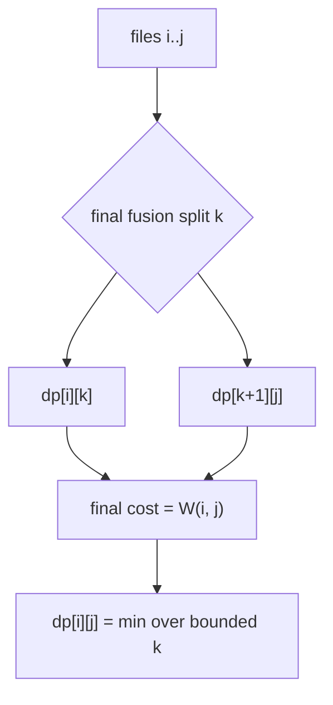
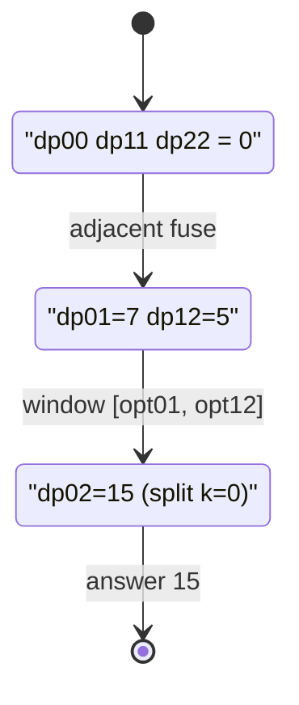

# Minimum Cost File Merging (Knuth Optimization)

| Meta | Value |
|------|-------|
| Problem | Minimum Cost to Merge Files |
| Source | Classic (file/fruit merging) |
| Difficulty | Medium–Hard |
| Topics | Interval DP, Knuth Optimization |
| Time | $O(n^2)$ |
| Space | $O(n^2)$ |

---

## Problem Statement

You have `n` files in a fixed left-to-right order, file `i` having size `size[i]`. You may merge
two **adjacent** files into one; the cost of a merge equals the combined size of the two files, and
the merged file keeps that combined size in its place. Keep merging until a single file remains.
Return the minimum possible total merge cost.

> The "adjacent only" constraint is what distinguishes this from the Huffman / priority-queue
> version. Order is fixed, so the structure is interval DP, and Knuth applies.

```text
Input:  size = [5, 2, 3]
Output: 19
Explanation:
  merge files 2,3 (2+3=5) -> [5, 5], cost 5
  merge files 1,2 (5+5=10)-> [10],   cost 10
  total = 5 + 10 = 15  ... but check the other order:
  merge files 1,2 (5+2=7) -> [7, 3], cost 7
  merge files 1,2 (7+3=10)-> [10],   cost 10
  total = 7 + 10 = 17
  the minimum over all adjacent orders is 15 -> wait, recompute below.
```

The minimum here is `15` (merge the two smaller adjacent files `2` and `3` first). The trace
section verifies this with the DP.

---

## Approach (WHY)

Let `dp[i][j]` be the minimum cost to merge files `i..j` into one file. The last merge fuses two
already-merged blocks `[i, k]` and `[k+1, j]`; that final fusion costs the **whole range size**
`W(i, j) = size[i] + ... + size[j]`, independent of the split point, because every file in the
range is inside the final combined file:

$$
dp[i][j] = \min_{i \le k < j}\Big( dp[i][k] + dp[k+1][j] \Big) + W(i, j).
$$

`W(i, j)` is a prefix-sum of non-negative sizes, hence satisfies the **quadrangle inequality**, so
the optimal split is monotone:

$$
opt[i][j-1] \le opt[i][j] \le opt[i+1][j].
$$

We scan only that bounded window for `k`, giving $O(n^2)$.



```python
def min_merge_cost(size):
    n = len(size)
    pre = [0] * (n + 1)
    for i in range(n):
        pre[i + 1] = pre[i] + size[i]

    INF = float("inf")
    dp = [[0] * n for _ in range(n)]
    opt = [[0] * n for _ in range(n)]
    for i in range(n):
        dp[i][i] = 0
        opt[i][i] = i

    for length in range(1, n):
        for i in range(0, n - length):
            j = i + length
            lo = opt[i][j - 1]
            hi = opt[i + 1][j]
            best = INF
            arg = lo
            w = pre[j + 1] - pre[i]
            for k in range(lo, hi + 1):
                cand = dp[i][k] + dp[k + 1][j] + w
                if cand < best:
                    best = cand
                    arg = k
            dp[i][j] = best
            opt[i][j] = arg

    return dp[0][n - 1]
```

```cpp
#include <bits/stdc++.h>
using namespace std;

long long min_merge_cost(const vector<long long>& size) {
    int n = (int)size.size();
    const long long INF = 1e18;

    vector<long long> pre(n + 1, 0);
    for (int i = 0; i < n; i++) pre[i + 1] = pre[i] + size[i];

    vector<vector<long long>> dp(n, vector<long long>(n, 0));
    vector<vector<int>> opt(n, vector<int>(n, 0));
    for (int i = 0; i < n; i++) {
        dp[i][i] = 0;
        opt[i][i] = i;
    }

    for (int length = 1; length < n; length++) {
        for (int i = 0; i + length < n; i++) {
            int j = i + length;
            int lo = opt[i][j - 1];
            int hi = opt[i + 1][j];
            long long best = INF;
            int arg = lo;
            long long w = pre[j + 1] - pre[i];
            for (int k = lo; k <= hi; k++) {
                long long cand = dp[i][k] + dp[k + 1][j] + w;
                if (cand < best) {
                    best = cand;
                    arg = k;
                }
            }
            dp[i][j] = best;
            opt[i][j] = arg;
        }
    }

    return dp[0][n - 1];
}
```

---

## Trace

For `size = [5, 2, 3]`, prefix `pre = [0, 5, 7, 10]`.

- Length 0: `dp[0][0] = dp[1][1] = dp[2][2] = 0`, `opt[i][i] = i`.
- `dp[0][1]` (`W = 7`): `k=0` → `0 + 0 + 7 = 7`, `opt[0][1] = 0`.
- `dp[1][2]` (`W = 5`): `k=1` → `0 + 0 + 5 = 5`, `opt[1][2] = 1`.
- `dp[0][2]` (`W = 10`): window `k in [opt[0][1], opt[1][2]] = [0, 1]`.
  - `k=0`: `dp[0][0] + dp[1][2] + 10 = 0 + 5 + 10 = 15`.
  - `k=1`: `dp[0][1] + dp[2][2] + 10 = 7 + 0 + 10 = 17`.
  - Best **15**, `opt[0][2] = 0`.

So merging files `2` and `3` first (cost `5`) then with file `1` (cost `10`) gives `15`.



---

## Complexity

- **Time:** $O(n^2)$ — the monotone split window telescopes per diagonal.
- **Space:** $O(n^2)$ for `dp` and `opt`.

The plain interval DP without the `opt` window is $O(n^3)$.

---

## Takeaway

Adjacent file merging is structurally identical to stone merging: a fixed order plus a final-merge
cost equal to the range size. That prefix-sum cost satisfies the quadrangle inequality, so Knuth's
monotone optimal split delivers the $O(n^2)$ solution.
