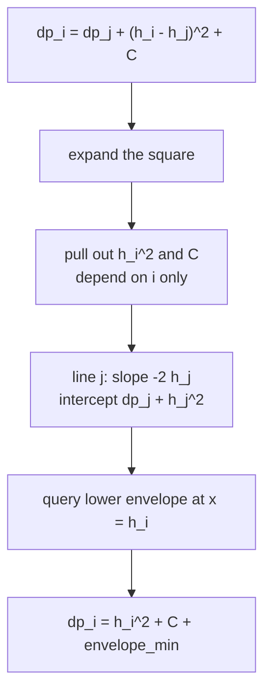
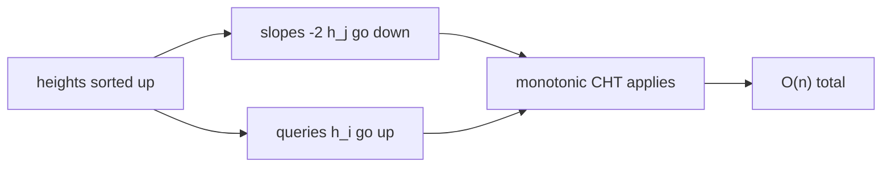
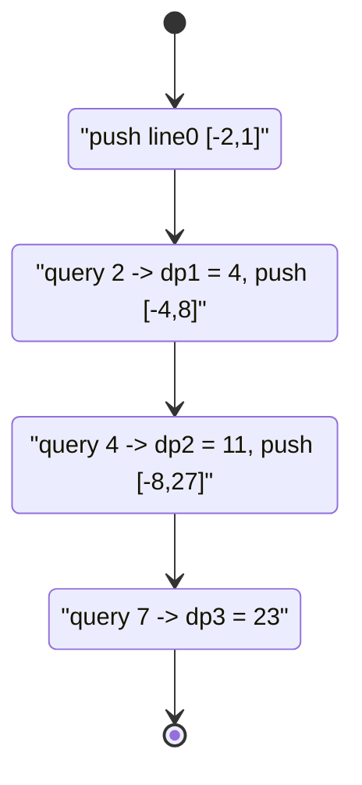

# Frog Jump — Squared-Distance DP via Convex Hull Trick

| Meta | Value |
|------|-------|
| Problem | Frog jumping across stones, jump cost is squared height gap plus a constant |
| Source | Classic CHT problem (APIO-style / "Frog" DP) |
| Reference | https://cp-algorithms.com/geometry/convex_hull_trick.html |
| Difficulty | Medium–Hard |
| Topics | Dynamic Programming, DP Optimization, Convex Hull Trick |
| Time | $O(n)$ with monotonic CHT |
| Space | $O(n)$ |

---

## Problem Statement

A frog starts on stone `1` and wants to reach stone `n`. The stones stand in a row with
**non-decreasing** heights $h_1 \le h_2 \le \cdots \le h_n$. From stone `j` the frog may jump to
any later stone `i > j`, paying

$$
(h_i - h_j)^2 + C,
$$

where `C` is a fixed positive constant (a per-jump penalty). Minimise the total cost to go from
stone `1` to stone `n`. With $dp_1 = 0$,

$$
dp_i = \min_{1 \le j < i}\Big(dp_j + (h_i - h_j)^2 + C\Big),
$$

and the answer is $dp_n$.

```text
Input:
  h = [1, 2, 4, 7]      // non-decreasing heights
  C = 3
Output:
  23

  dp[1] = 0
  dp[2] = 0 + (2-1)^2 + 3                                  = 4
  dp[3] = min( j1: 0+(4-1)^2+3=12, j2: 4+(4-2)^2+3=11 )    = 11
  dp[4] = min( j1: 0+(7-1)^2+3=39, j2: 4+(7-2)^2+3=32,
               j3: 11+(7-4)^2+3=23 )                        = 23
```

---

## Approach (WHY)

Expand $(h_i - h_j)^2 = h_i^2 - 2h_jh_i + h_j^2$ and split into `i`-only terms versus a line in
`j`:

$$
dp_i = h_i^2 + C + \min_{j < i}\Big(\underbrace{-2h_j}_{m_j}\cdot \underbrace{h_i}_{x_i} + \underbrace{dp_j + h_j^2}_{b_j}\Big)
$$

Each earlier stone `j` is a line $y = (-2h_j)\,x + (dp_j + h_j^2)$, queried at $x = h_i$; afterwards
add the constant block $h_i^2 + C$.



Now the key observation that makes this the **easy** CHT case: heights are **non-decreasing**, so
as `j` grows the slope $-2h_j$ **decreases** (lines added in decreasing-slope order), and as `i`
grows the query $h_i$ **increases** (non-decreasing queries). Both monotonicity preconditions hold,
so the simple stack-based lower envelope with a forward pointer gives $O(n)$ — no Li Chao tree
needed.



```python
class CHTMin:
    """Lower envelope for MINIMUM queries.
    Lines added with non-increasing slopes; queries non-decreasing."""
    def __init__(self):
        self.lines = []     # (m, b) on the envelope
        self.ptr = 0

    @staticmethod
    def _bad(l1, l2, l3):
        m1, b1 = l1
        m2, b2 = l2
        m3, b3 = l3
        return (b3 - b1) * (m1 - m2) <= (b2 - b1) * (m1 - m3)

    def add(self, m, b):
        line = (m, b)
        while len(self.lines) >= 2 and self._bad(self.lines[-2], self.lines[-1], line):
            self.lines.pop()
        self.lines.append(line)

    def query(self, x):
        if self.ptr >= len(self.lines):
            self.ptr = len(self.lines) - 1
        while self.ptr + 1 < len(self.lines):
            m1, b1 = self.lines[self.ptr]
            m2, b2 = self.lines[self.ptr + 1]
            if m2 * x + b2 <= m1 * x + b1:
                self.ptr += 1
            else:
                break
        m, b = self.lines[self.ptr]
        return m * x + b


def frog_jump(h, C):
    # dp[i] = min_{j<i} ( dp[j] + (h[i]-h[j])^2 + C ), dp[0] = 0
    n = len(h)
    dp = [0] * n
    cht = CHTMin()
    cht.add(-2 * h[0], dp[0] + h[0] * h[0])           # line for stone 0
    for i in range(1, n):
        best = cht.query(h[i])                        # lower envelope at x = h[i]
        dp[i] = h[i] * h[i] + C + best
        cht.add(-2 * h[i], dp[i] + h[i] * h[i])       # stone i contributes a line
    return dp[n - 1]
```

```cpp
#include <bits/stdc++.h>
using namespace std;

struct CHTMin {
    // Lower envelope for MINIMUM queries.
    // Lines added with non-increasing slopes; queries non-decreasing.
    vector<long long> M, B;
    int ptr = 0;
    static bool bad(long long m1, long long b1, long long m2, long long b2,
                    long long m3, long long b3) {
        return (b3 - b1) * (m1 - m2) <= (b2 - b1) * (m1 - m3);
    }
    void add(long long m, long long b) {
        while (M.size() >= 2 &&
               bad(M[M.size() - 2], B[M.size() - 2], M.back(), B.back(), m, b)) {
            M.pop_back();
            B.pop_back();
        }
        M.push_back(m);
        B.push_back(b);
    }
    long long query(long long x) {
        if (ptr >= (int)M.size()) ptr = (int)M.size() - 1;
        while (ptr + 1 < (int)M.size() &&
               M[ptr + 1] * x + B[ptr + 1] <= M[ptr] * x + B[ptr]) {
            ptr++;
        }
        return M[ptr] * x + B[ptr];
    }
};

long long frog_jump(vector<long long>& h, long long C) {
    // dp[i] = min_{j<i} ( dp[j] + (h[i]-h[j])^2 + C ), dp[0] = 0
    int n = (int)h.size();
    vector<long long> dp(n, 0);
    CHTMin cht;
    cht.add(-2 * h[0], dp[0] + h[0] * h[0]);          // line for stone 0
    for (int i = 1; i < n; ++i) {
        long long best = cht.query(h[i]);             // lower envelope at x = h[i]
        dp[i] = h[i] * h[i] + C + best;
        cht.add(-2 * h[i], dp[i] + h[i] * h[i]);      // stone i contributes a line
    }
    return dp[n - 1];
}
```

A quadratic baseline to cross-check the CHT answer:

```python
def frog_jump_naive(h, C):
    n = len(h)
    INF = float("inf")
    dp = [0] * n
    for i in range(1, n):
        best = INF
        for j in range(i):                            # try every earlier stone
            best = min(best, dp[j] + (h[i] - h[j]) ** 2 + C)
        dp[i] = best
    return dp[n - 1]
```

```cpp
#include <bits/stdc++.h>
using namespace std;

long long frog_jump_naive(vector<long long>& h, long long C) {
    int n = (int)h.size();
    const long long INF = 1e18;
    vector<long long> dp(n, 0);
    for (int i = 1; i < n; ++i) {
        long long best = INF;
        for (int j = 0; j < i; ++j) {                 // try every earlier stone
            long long d = h[i] - h[j];
            best = min(best, dp[j] + d * d + C);
        }
        dp[i] = best;
    }
    return dp[n - 1];
}
```

---

## Trace

Run on `h = [1, 2, 4, 7]`, `C = 3`. Lines use slope $-2h_j$ and intercept $dp_j + h_j^2$.

```text
stone 0 (h=1): dp=0
  line0: slope -2, intercept 0 + 1 = 1     -> -2 x + 1
  stack = [ (-2, 1) ]

i=1 (h=2): query x=2
  ptr=0 -> -2*2 + 1 = -3
  dp[1] = 2^2 + 3 + (-3) = 4 + 3 - 3 = 4
  line1: slope -4, intercept 4 + 4 = 8     -> -4 x + 8
  bad? only 2 lines -> keep                  stack = [ (-2,1), (-4,8) ]

i=2 (h=4): query x=4
  ptr=0 -> -2*4+1 = -7 ; line1 at 4 = -4*4+8 = -8 (< -7) -> ptr=1
  envelope min = -8
  dp[2] = 4^2 + 3 + (-8) = 16 + 3 - 8 = 11
  line2: slope -8, intercept 11 + 16 = 27   -> -8 x + 27
  bad((-2,1),(-4,8),(-8,27))?
    (27-1)*(-2-(-4)) = 26*2 = 52  vs  (8-1)*(-2-(-8)) = 7*6 = 42
    52 <= 42 ? false -> keep                 stack = [ (-2,1), (-4,8), (-8,27) ]

i=3 (h=7): query x=7
  ptr=1 -> -4*7+8 = -20 ; line2 at 7 = -8*7+27 = -29 (< -20) -> ptr=2
  envelope min = -29
  dp[3] = 7^2 + 3 + (-29) = 49 + 3 - 29 = 23
answer = dp[3] = 23
```



---

## Complexity

| Measure | Value |
|---------|-------|
| States | $O(n)$ stones |
| Add line | amortized $O(1)$ |
| Query | amortized $O(1)$ via forward pointer |
| Time | $O(n)$ |
| Space | $O(n)$ for the envelope and `dp` |

The naive baseline is $O(n^2)$ — same answer, much slower.

---

## Takeaway

The frog jump is the friendliest squared-distance DP: expanding $(h_i - h_j)^2$ exposes the cross
term $-2h_j h_i$ as **slope times query**, leaving $h_i^2 + C$ outside the minimisation. Because the
heights are **sorted**, slopes decrease and queries increase together, so the plain monotonic stack
with a forward pointer suffices — no Li Chao tree, just clean $O(n)$. When you later hit the *same*
recurrence with **unsorted** heights, swap the stack for a Li Chao tree and everything else stays
the same.
