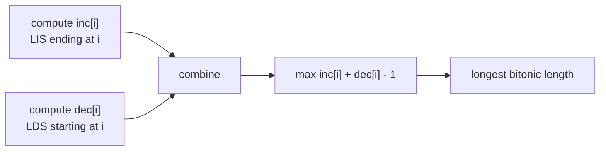
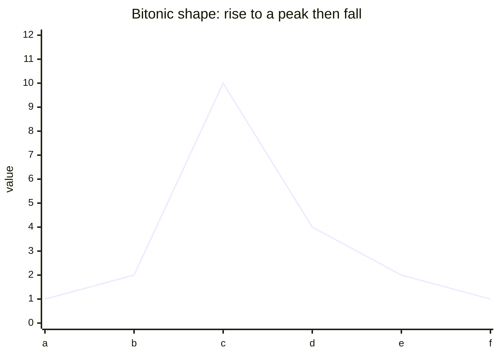
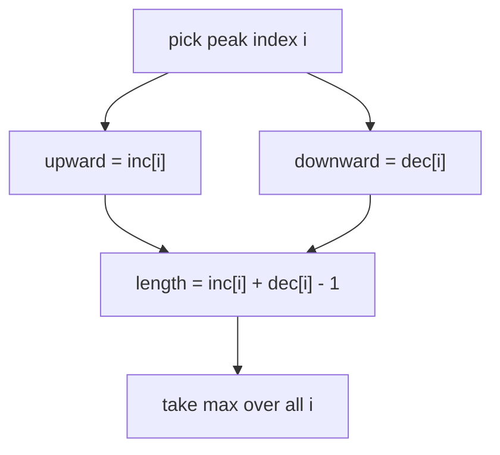

# Longest Bitonic Subsequence

| Meta | Value |
|------|-------|
| Source | Classic DP (GeeksforGeeks / interview staple) |
| Difficulty | Medium |
| Topics | Array, Dynamic Programming, LIS |
| Link | self-contained |

---

## Problem Statement
A sequence is **bitonic** if it first **strictly increases** and then **strictly
decreases**. A purely increasing or purely decreasing sequence also counts as bitonic
(one of the two phases may be empty). Given an array, return the length of its longest
bitonic subsequence.

```text
Input:  nums = [1, 11, 2, 10, 4, 5, 2, 1]
Output: 6
Explanation: a longest bitonic subsequence is [1, 2, 10, 4, 2, 1] (up then down).
```

---

## Approach (WHY)

Every bitonic subsequence has a single **peak**. If we fix the peak at index `i`, the best
bitonic subsequence with that peak is:

- the longest **increasing** subsequence ending at `i` (the upward part), plus
- the longest **decreasing** subsequence starting at `i` (the downward part),
- minus $1$ because the peak is counted in both parts.

Define:
- `inc[i]` = length of LIS ending at `i` (left to right).
- `dec[i]` = length of the longest decreasing subsequence starting at `i`, which equals the
  LIS ending at `i` when scanning **right to left**.

$$
\text{answer} = \max_{0 \le i < n} \big( inc[i] + dec[i] - 1 \big)
$$



```python
def longest_bitonic(nums):
    n = len(nums)
    if n == 0:
        return 0
    inc = [1] * n
    dec = [1] * n
    for i in range(n):                 # increasing part, left -> right
        for j in range(i):
            if nums[j] < nums[i]:
                inc[i] = max(inc[i], inc[j] + 1)
    for i in range(n - 1, -1, -1):     # decreasing part, right -> left
        for j in range(i + 1, n):
            if nums[j] < nums[i]:
                dec[i] = max(dec[i], dec[j] + 1)
    return max(inc[i] + dec[i] - 1 for i in range(n))
```

```cpp
#include <bits/stdc++.h>
using namespace std;

int longest_bitonic(const vector<int>& nums) {
    int n = (int)nums.size();
    if (n == 0) return 0;
    vector<int> inc(n, 1), dec(n, 1);
    for (int i = 0; i < n; ++i)              // increasing part
        for (int j = 0; j < i; ++j)
            if (nums[j] < nums[i])
                inc[i] = max(inc[i], inc[j] + 1);
    for (int i = n - 1; i >= 0; --i)         // decreasing part
        for (int j = i + 1; j < n; ++j)
            if (nums[j] < nums[i])
                dec[i] = max(dec[i], dec[j] + 1);
    long long best = 0;
    for (int i = 0; i < n; ++i)
        best = max(best, (long long)inc[i] + dec[i] - 1);
    return (int)best;
}
```

---

## Trace

`nums = [1, 11, 2, 10, 4, 5, 2, 1]`

| i | nums | inc | dec | inc+dec-1 |
|---|------|-----|-----|-----------|
| 0 | 1 | 1 | 1 | 1 |
| 1 | 11 | 2 | 5 | 6 |
| 2 | 2 | 2 | 4 | 5 |
| 3 | 10 | 3 | 4 | 6 |
| 4 | 4 | 3 | 3 | 5 |
| 5 | 5 | 4 | 3 | 6 |
| 6 | 2 | 2 | 2 | 3 |
| 7 | 1 | 1 | 1 | 1 |

The maximum `inc[i] + dec[i] - 1` is $6$ (peaks at index 1, 3, or 5).





---

## Complexity

| Step | Time | Space |
|------|------|-------|
| Build `inc` | $O(n^2)$ | $O(n)$ |
| Build `dec` | $O(n^2)$ | $O(n)$ |
| Combine | $O(n)$ | $O(1)$ |
| **Total** | $O(n^2)$ | $O(n)$ |

> Both `inc` and `dec` can be computed in $O(n \log n)$ with the tails method, giving an
> overall $O(n \log n)$ solution when $n$ is large.

---

## Takeaway
A "peak" structure splits cleanly into two independent LIS computations facing opposite
directions. Whenever a problem says **increase then decrease** (mountains, valleys when
inverted, bitonic), reach for the **`inc[i] + dec[i] - 1`** pattern.
