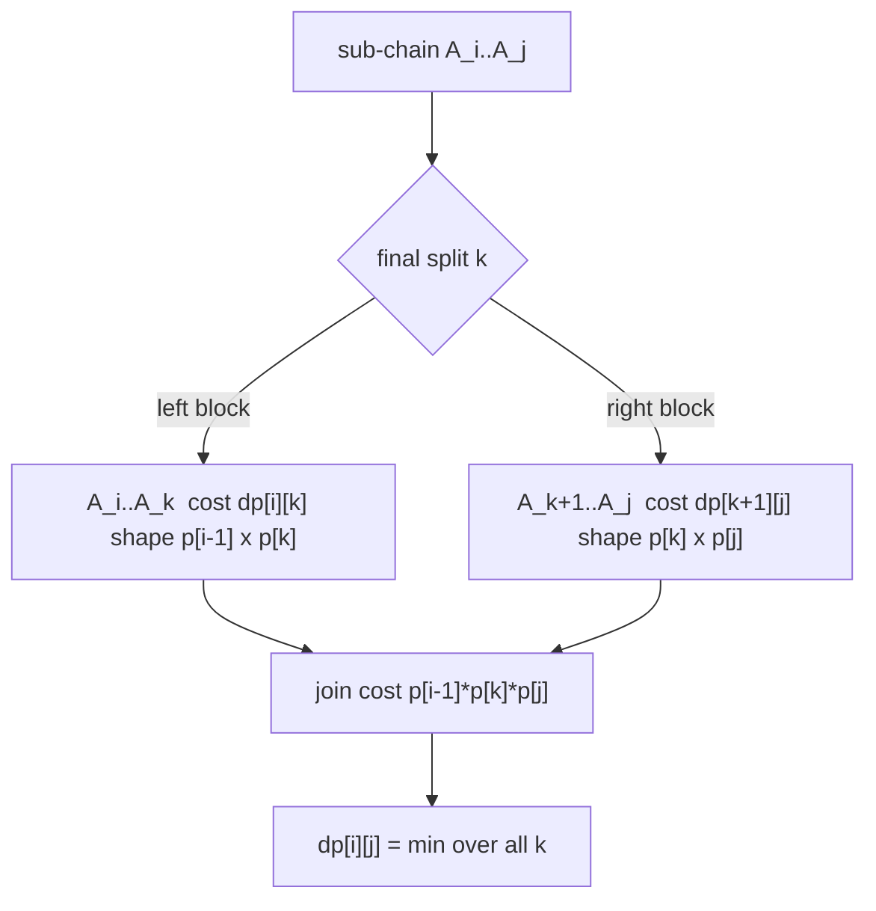
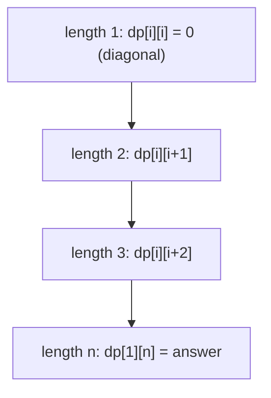
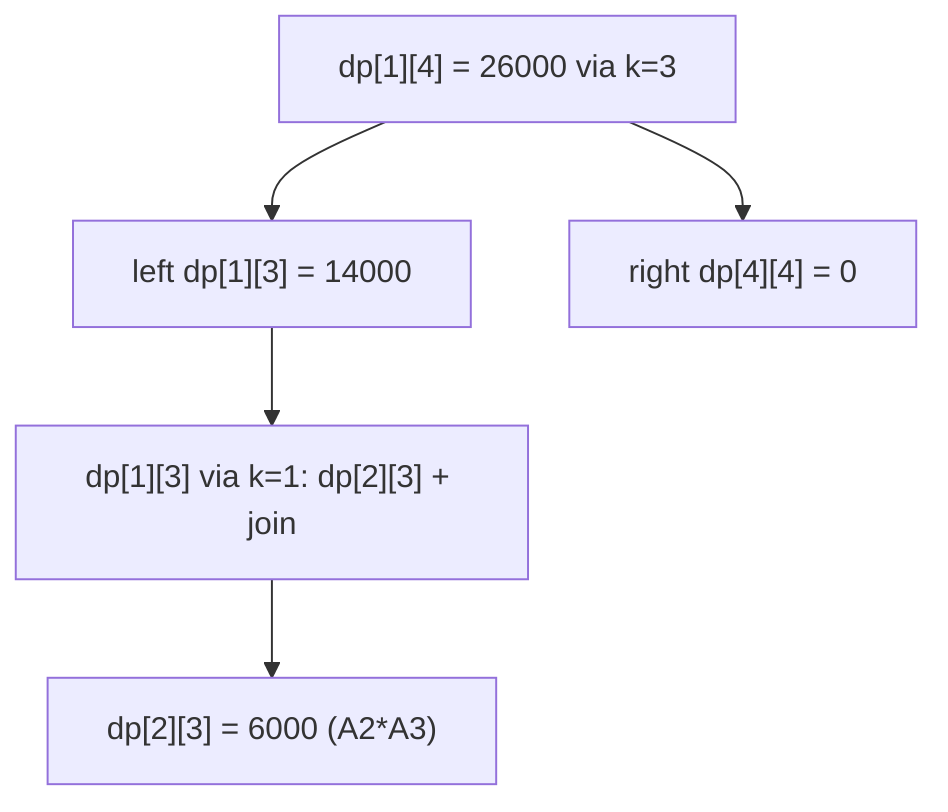

# Matrix Chain Multiplication

| Meta | Value |
|------|-------|
| Problem | Matrix Chain Multiplication (minimum scalar multiplications) |
| Source | Classic (CLRS) |
| Reference | https://en.wikipedia.org/wiki/Matrix_chain_multiplication |
| Difficulty | Medium–Hard |
| Topics | Dynamic Programming, Interval DP |
| Time | $O(n^3)$ |
| Space | $O(n^2)$ |

---

## Problem Statement

You are given a chain of `n` matrices $A_1, A_2, \ldots, A_n$ to multiply together. Matrix $A_i$
has dimension $p_{i-1} \times p_i$, so the whole chain is described by a single dimension array
`p` of length `n + 1`. Matrix multiplication is **associative**, so the result is the same no
matter how you parenthesise — but the *number of scalar multiplications* changes a lot.
Multiplying a $p_{i-1} \times p_k$ matrix by a $p_k \times p_j$ matrix costs $p_{i-1}\,p_k\,p_j$
scalar multiplications. Return the **minimum** total cost over all parenthesisations.

```text
Input:  p = [40, 20, 30, 10, 30]   // matrices: 40x20, 20x30, 30x10, 10x30
Output: 26000
Explanation:
  best parenthesisation is (A1 (A2 A3)) A4
  A2*A3       = 20*30*10 = 6000
  A1*(A2A3)   = 40*20*10 = 8000
  (..)*A4     = 40*10*30 = 12000
  total       = 6000 + 8000 + 12000 = 26000
```

---

## Approach (WHY)

The final multiplication that produces the answer joins a left block $A_i \cdots A_k$ with a right
block $A_{k+1} \cdots A_j$. Whatever order you used **inside** each block does not affect that last
join, so the two blocks are independent sub-problems.

Let `dp[i][j]` = the minimum cost to multiply the sub-chain $A_i \cdots A_j$ into a single matrix
(with $1 \le i \le j \le n$). The last join happens at some split `k`, and the resulting block has
shape $p_{i-1} \times p_j$:

$$
dp[i][j] = \min_{i \le k < j}\Big( dp[i][k] + dp[k+1][j] + p_{i-1}\,p_k\,p_j \Big)
$$

with base case $dp[i][i] = 0$ (a single matrix needs no multiplication).



Fill the upper-triangular table by **increasing chain length**, so shorter chains are final first:



```python
def matrix_chain_order(p):
    # p has length n+1; matrix i is p[i-1] x p[i], i = 1..n
    n = len(p) - 1
    INF = float("inf")
    dp = [[0] * (n + 1) for _ in range(n + 1)]
    for length in range(2, n + 1):                 # chain length
        for i in range(1, n - length + 2):         # left matrix index
            j = i + length - 1                     # right matrix index
            dp[i][j] = INF
            for k in range(i, j):                  # last split
                cost = dp[i][k] + dp[k + 1][j] + p[i - 1] * p[k] * p[j]
                dp[i][j] = min(dp[i][j], cost)
    return dp[1][n]
```

```cpp
#include <bits/stdc++.h>
using namespace std;

long long matrix_chain_order(vector<long long>& p) {
    // p has size n+1; matrix i is p[i-1] x p[i], i = 1..n
    int n = (int)p.size() - 1;
    const long long INF = LLONG_MAX / 4;
    vector<vector<long long>> dp(n + 1, vector<long long>(n + 1, 0));
    for (int length = 2; length <= n; ++length) {          // chain length
        for (int i = 1; i + length - 1 <= n; ++i) {        // left matrix index
            int j = i + length - 1;                        // right matrix index
            dp[i][j] = INF;
            for (int k = i; k < j; ++k) {                  // last split
                long long cost = dp[i][k] + dp[k + 1][j] + p[i - 1] * p[k] * p[j];
                dp[i][j] = min(dp[i][j], cost);
            }
        }
    }
    return dp[1][n];
}
```

---

## Trace

Run on `p = [40, 20, 30, 10, 30]` (4 matrices, `n = 4`).

```text
length 2 (single split forced):
  dp[1][2] = p0*p1*p2 = 40*20*30 = 24000
  dp[2][3] = p1*p2*p3 = 20*30*10 = 6000
  dp[3][4] = p2*p3*p4 = 30*10*30 = 9000

length 3:
  dp[1][3] = min(
      k=1: dp[1][1]+dp[2][3]+p0*p1*p3 = 0+6000+40*20*10 = 6000+8000 = 14000,
      k=2: dp[1][2]+dp[3][3]+p0*p2*p3 = 24000+0+40*30*10 = 24000+12000 = 36000
  ) = 14000
  dp[2][4] = min(
      k=2: dp[2][2]+dp[3][4]+p1*p2*p4 = 0+9000+20*30*30 = 9000+18000 = 27000,
      k=3: dp[2][3]+dp[4][4]+p1*p3*p4 = 6000+0+20*10*30 = 6000+6000 = 12000
  ) = 12000

length 4 (full chain):
  dp[1][4] = min(
      k=1: dp[1][1]+dp[2][4]+p0*p1*p4 = 0+12000+40*20*30 = 12000+24000 = 36000,
      k=2: dp[1][2]+dp[3][4]+p0*p2*p4 = 24000+9000+40*30*30 = 33000+36000 = 69000,
      k=3: dp[1][3]+dp[4][4]+p0*p3*p4 = 14000+0+40*10*30 = 14000+12000 = 26000
  ) = 26000
answer = 26000
```



---

## Complexity

| Measure | Value |
|---------|-------|
| States | $O(n^2)$ sub-chains `(i, j)` |
| Transition | $O(n)$ split points `k` |
| Time | $O(n^3)$ |
| Space | $O(n^2)$ for the `dp` table |

---

## Takeaway

Matrix Chain Multiplication is the canonical interval DP: the **last** multiplication splits the
chain at `k`, the two blocks are independent, and the join costs $p_{i-1} p_k p_j$. Define
`dp[i][j]` over the sub-chain, initialise the diagonal to `0`, and fill by **increasing length**.
Dimensions multiply fast, so use `long long` to keep the products safe.
