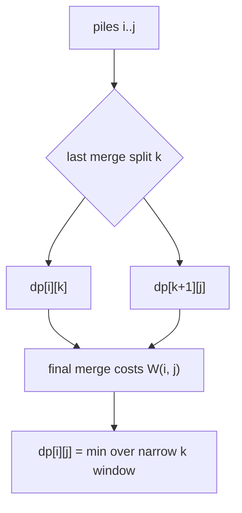
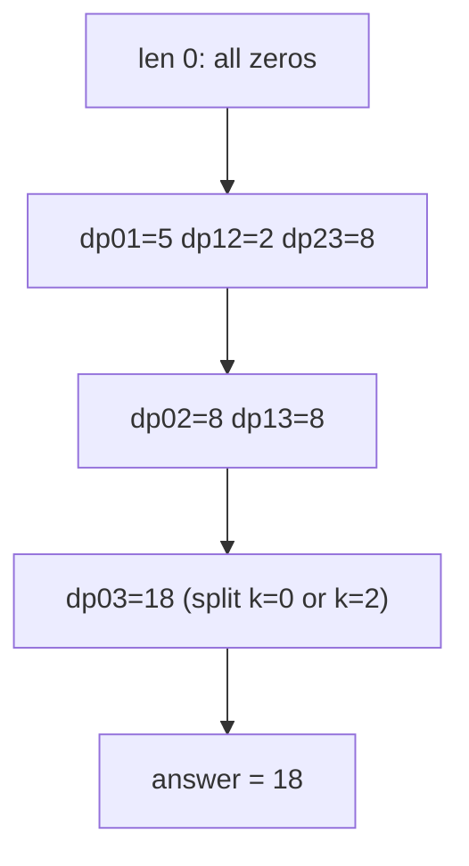

# Merge Stones — Minimum Cost (Knuth Optimization)

| Meta | Value |
|------|-------|
| Problem | Merge Adjacent Stone Piles |
| Source | Classic (IOI-style stone merge) |
| Difficulty | Medium–Hard |
| Topics | Interval DP, Knuth Optimization |
| Time | $O(n^2)$ |
| Space | $O(n^2)$ |

---

## Problem Statement

There are `n` piles of stones arranged **in a row**, the `i`-th pile holding `stones[i]` stones.
In one move you may merge **two adjacent piles** into a single pile, paying a cost equal to the
total number of stones in the two piles. You repeat until a single pile remains. Return the minimum
total cost to merge all piles into one.

```text
Input:  stones = [4, 1, 1, 4]
Output: 18
Explanation:
  merge piles 1,2 (1+1=2) -> [4, 2, 4], cost 2
  merge piles 1,2 (4+2=6) -> [6, 4],    cost 6
  merge piles 1,2 (6+4=10)-> [10],      cost 10
  total = 2 + 6 + 10 = 18 (this ordering is optimal)
```

---

## Approach (WHY)

Let `dp[i][j]` be the minimum cost to merge piles `i..j` into one. The very last merge joins two
fully-formed sub-piles `[i, k]` and `[k+1, j]`; that final merge always costs the **entire range
sum** `W(i, j) = stones[i] + ... + stones[j]`, no matter where the split is, because all stones in
the range end up in the final move:

$$
dp[i][j] = \min_{i \le k < j}\Big( dp[i][k] + dp[k+1][j] \Big) + W(i, j).
$$

The added cost `W(i, j)` is a prefix-sum of non-negative weights, so it satisfies the
**quadrangle inequality**. Hence the optimal split is monotone:

$$
opt[i][j-1] \le opt[i][j] \le opt[i+1][j],
$$

and we scan only that window instead of all of `[i, j)`, giving $O(n^2)$.



```python
def merge_stones(stones):
    n = len(stones)
    pre = [0] * (n + 1)
    for i in range(n):
        pre[i + 1] = pre[i] + stones[i]

    INF = float("inf")
    dp = [[0] * n for _ in range(n)]
    opt = [[0] * n for _ in range(n)]
    for i in range(n):
        dp[i][i] = 0
        opt[i][i] = i

    for length in range(1, n):
        for i in range(0, n - length):
            j = i + length
            lo = opt[i][j - 1]
            hi = opt[i + 1][j]
            best = INF
            arg = lo
            w = pre[j + 1] - pre[i]   # range sum, the final merge cost
            for k in range(lo, hi + 1):
                cand = dp[i][k] + dp[k + 1][j] + w
                if cand < best:
                    best = cand
                    arg = k
            dp[i][j] = best
            opt[i][j] = arg

    return dp[0][n - 1]
```

```cpp
#include <bits/stdc++.h>
using namespace std;

long long merge_stones(const vector<long long>& stones) {
    int n = (int)stones.size();
    const long long INF = 1e18;

    vector<long long> pre(n + 1, 0);
    for (int i = 0; i < n; i++) pre[i + 1] = pre[i] + stones[i];

    vector<vector<long long>> dp(n, vector<long long>(n, 0));
    vector<vector<int>> opt(n, vector<int>(n, 0));
    for (int i = 0; i < n; i++) {
        dp[i][i] = 0;
        opt[i][i] = i;
    }

    for (int length = 1; length < n; length++) {
        for (int i = 0; i + length < n; i++) {
            int j = i + length;
            int lo = opt[i][j - 1];
            int hi = opt[i + 1][j];
            long long best = INF;
            int arg = lo;
            long long w = pre[j + 1] - pre[i];   // range sum, the final merge cost
            for (int k = lo; k <= hi; k++) {
                long long cand = dp[i][k] + dp[k + 1][j] + w;
                if (cand < best) {
                    best = cand;
                    arg = k;
                }
            }
            dp[i][j] = best;
            opt[i][j] = arg;
        }
    }

    return dp[0][n - 1];
}
```

---

## Trace

For `stones = [4, 1, 1, 4]`, prefix `pre = [0, 4, 5, 6, 10]`.

- Length 0: all `dp[i][i] = 0`, `opt[i][i] = i`.
- `dp[0][1]` (`W = 5`): only `k=0` → `0 + 0 + 5 = 5`, `opt = 0`.
- `dp[1][2]` (`W = 2`): `k=1` → `2`, `opt = 1`.
- `dp[2][3]` (`W = 8`): `k=2` → `8`, `opt = 2`.
- `dp[0][2]` (`W = 6`): window `k in [opt[0][1], opt[1][2]] = [0, 1]`. `k=0`: `0 + dp[1][2] + 6 = 2 + 6 = 8`;
  `k=1`: `dp[0][1] + 0 + 6 = 5 + 6 = 11`. Best `8`, `opt = 0`.
- `dp[1][3]` (`W = 6`): window `k in [opt[1][2], opt[2][3]] = [1, 2]`. `k=1`: `0 + dp[2][3] + 6 = 8 + 6 = 14`;
  `k=2`: `dp[1][2] + 0 + 6 = 2 + 6 = 8`. Best `8`, `opt = 2`.
- `dp[0][3]` (`W = 10`): window `k in [opt[0][2], opt[1][3]] = [0, 2]`. `k=0`: `0 + dp[1][3] + 10 = 18`;
  `k=1`: `dp[0][1] + dp[2][3] + 10 = 5 + 8 + 10 = 23`; `k=2`: `dp[0][2] + 0 + 10 = 18`. Best **18**.



---

## Complexity

- **Time:** $O(n^2)$ — Knuth window keeps total split scanning linear per diagonal.
- **Space:** $O(n^2)$ for `dp` and `opt`.

The unoptimized interval DP is $O(n^3)$.

---

## Takeaway

Stone merging is the canonical "range-sum cost" interval DP: the final merge always pays the whole
range sum, a prefix-sum cost that satisfies the quadrangle inequality, so Knuth's monotone split
turns the cubic solution into a quadratic one.
