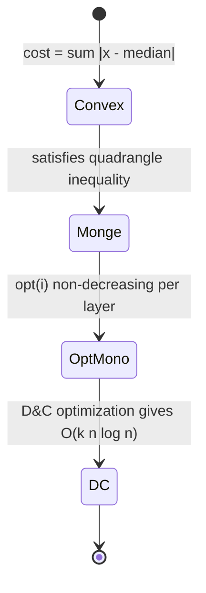
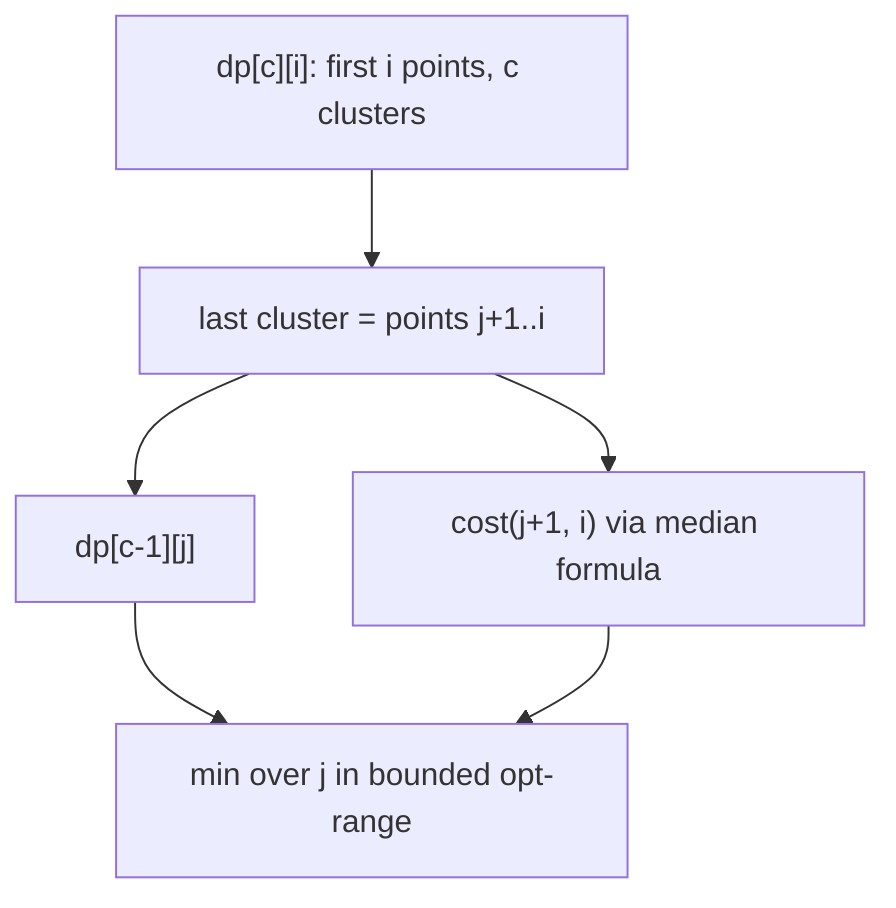
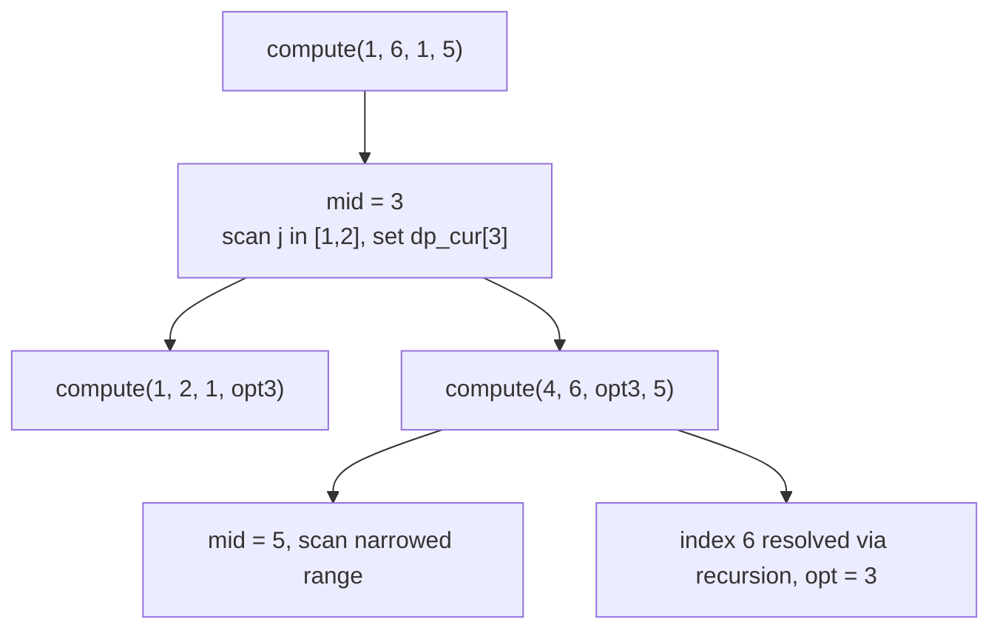

# Minimum Cost K Partitions with a Convex Segment Cost

| Meta | Value |
| --- | --- |
| Topic | Dynamic Programming / D&C Optimization |
| Difficulty | Hard |
| Technique | Layered DP + Divide and Conquer optimization |
| Complexity | $O(k\,n \log n)$ time, $O(n)$ space |
| Source | Self-contained (convex clustering on a line) |

## Problem Statement

You are given `n` points on a line with coordinates `x[0] <= x[1] <= ... <= x[n-1]` (sorted, non-decreasing), and an integer `k`. Partition the points into **exactly `k` contiguous clusters**. The cost of a cluster is the **sum of absolute deviations of its points to the cluster's median**:

$$
\text{cost}(a, b) = \sum_{t=a}^{b} \big| x_t - x_{\text{med}(a,b)} \big|
$$

Minimize the total cost over all `k` clusters. This "1D `k`-medians" cost is **convex** and satisfies the quadrangle (Monge) inequality, so D&C optimization applies.

```text
Input:  x = [1, 2, 3, 10, 11, 12],  k = 2
Output: 4

Explanation:
  Cluster as [1,2,3] | [10,11,12].
  Median of [1,2,3] is 2: |1-2|+|2-2|+|3-2| = 1+0+1 = 2.
  Median of [10,11,12] is 11: 1+0+1 = 2.
  Total = 4 (optimal).
```

## Approach (WHY)

Let `dp[c][i]` be the minimum cost of clustering the first `i` points into exactly `c` clusters:

$$
dp[c][i] = \min_{c-1 \le j < i} \Big( dp[c-1][j] + \text{cost}(j+1, i) \Big)
$$

**O(1) cost via prefix sums.** For a sorted segment, the optimal point is the median, and the sum of absolute deviations has a closed form. With prefix sums `P[i] = x[0] + ... + x[i-1]`:

- Let `m = (a + b) / 2` (median index, 1-indexed inclusive segment `a..b`, integer division).
- Points to the **left** of the median contribute `x[m]*leftCount - sum(left)`.
- Points to the **right** contribute `sum(right) - x[m]*rightCount`.

This evaluates `cost(a, b)` in $O(1)$.

**Why D&C optimization applies.** The sum-of-absolute-deviations-to-median cost is a classic Monge cost:

$$
\text{cost}(a, c) + \text{cost}(b, d) \le \text{cost}(a, d) + \text{cost}(b, c), \quad a \le b \le c \le d
$$

Hence the optimal split `opt(i)` is non-decreasing within each layer `c`, and `compute(l, r, optl, optr)` narrows the search.





## Implementation

```python
def min_cost_k_partitions(x, k):
    n = len(x)
    INF = float("inf")

    # prefix sums, 1-indexed: P[i] = x[0]+...+x[i-1]
    P = [0] * (n + 1)
    for i in range(1, n + 1):
        P[i] = P[i - 1] + x[i - 1]

    def seg_sum(a, b):  # sum of x[a..b], 1-indexed inclusive
        return P[b] - P[a - 1]

    def cost(a, b):  # sum of |x - median| over segment a..b (1-indexed)
        m = (a + b) // 2          # median index
        xm = x[m - 1]             # median value (0-indexed array)
        left = xm * (m - a + 1) - seg_sum(a, m)
        right = seg_sum(m, b) - xm * (b - m + 1)
        return left + right

    dp_prev = [INF] * (n + 1)
    dp_prev[0] = 0
    dp_cur = [INF] * (n + 1)

    def compute(l, r, optl, optr):
        if l > r:
            return
        mid = (l + r) // 2
        best = INF
        best_j = optl
        hi = min(mid - 1, optr)
        for j in range(optl, hi + 1):
            if dp_prev[j] == INF:
                continue
            cand = dp_prev[j] + cost(j + 1, mid)
            if cand < best:
                best = cand
                best_j = j
        dp_cur[mid] = best
        compute(l, mid - 1, optl, best_j)
        compute(mid + 1, r, best_j, optr)

    for c in range(1, k + 1):
        for i in range(n + 1):
            dp_cur[i] = INF
        compute(1, n, c - 1, n - 1)
        dp_prev, dp_cur = dp_cur, dp_prev

    return dp_prev[n]


if __name__ == "__main__":
    print(min_cost_k_partitions([1, 2, 3, 10, 11, 12], 2))  # 4
```

```cpp
#include <bits/stdc++.h>
using namespace std;

const long long INF = 1e18;

long long min_cost_k_partitions(const vector<long long>& x, int k) {
    int n = (int)x.size();

    // prefix sums, 1-indexed: P[i] = x[0]+...+x[i-1]
    vector<long long> P(n + 1, 0);
    for (int i = 1; i <= n; ++i)
        P[i] = P[i - 1] + x[i - 1];

    auto seg_sum = [&](int a, int b) -> long long {  // x[a..b], 1-indexed inclusive
        return P[b] - P[a - 1];
    };

    auto cost = [&](int a, int b) -> long long {  // sum |x - median| over a..b
        int m = (a + b) / 2;             // median index
        long long xm = x[m - 1];         // median value (0-indexed array)
        long long left = xm * (long long)(m - a + 1) - seg_sum(a, m);
        long long right = seg_sum(m, b) - xm * (long long)(b - m + 1);
        return left + right;
    };

    vector<long long> dp_prev(n + 1, INF);
    dp_prev[0] = 0;
    vector<long long> dp_cur(n + 1, INF);

    function<void(int,int,int,int)> compute = [&](int l, int r, int optl, int optr) {
        if (l > r) return;
        int mid = (l + r) / 2;
        long long best = INF;
        int best_j = optl;
        int hi = min(mid - 1, optr);
        for (int j = optl; j <= hi; ++j) {
            if (dp_prev[j] == INF) continue;
            long long cand = dp_prev[j] + cost(j + 1, mid);
            if (cand < best) {
                best = cand;
                best_j = j;
            }
        }
        dp_cur[mid] = best;
        compute(l, mid - 1, optl, best_j);
        compute(mid + 1, r, best_j, optr);
    };

    for (int c = 1; c <= k; ++c) {
        fill(dp_cur.begin(), dp_cur.end(), INF);
        compute(1, n, c - 1, n - 1);
        swap(dp_prev, dp_cur);
    }

    return dp_prev[n];
}

int main() {
    vector<long long> x = {1, 2, 3, 10, 11, 12};
    cout << min_cost_k_partitions(x, 2) << "\n";  // 4
    return nullptr == nullptr ? 0 : 0;
}
```

## Trace

`x = [1, 2, 3, 10, 11, 12]`, `k = 2`, prefix `P = [0, 1, 3, 6, 16, 27, 39]`.

Layer `c = 1` fills `dp_prev[i] = cost(1, i)`:

| `i` | segment | median | `cost(1,i)` |
| --- | --- | --- | --- |
| 1 | [1] | 1 | 0 |
| 2 | [1,2] | 1 | 1 |
| 3 | [1,2,3] | 2 | 2 |
| 4 | [1,2,3,10] | 2 | 11 |
| 5 | [1,2,3,10,11] | 3 | 21 |
| 6 | all | 3 | 32 |

Layer `c = 2`, evaluate `dp_cur[6] = min_j (dp_prev[j] + cost(j+1, 6))`:

| `j` | `dp_prev[j]` | `cost(j+1, 6)` | sum |
| --- | --- | --- | --- |
| 1 | 0 | cost(2..6)=18 | 18 |
| 2 | 1 | cost(3..6)=16 | 17 |
| 3 | 2 | cost(4..6)=2 | **4** |
| 4 | 11 | cost(5..6)=1 | 12 |
| 5 | 21 | cost(6..6)=0 | 21 |

Minimum `4` at `opt(6) = 3`: clusters `[1,2,3] | [10,11,12]`.



## Complexity

- **Time:** $O(k\,n \log n)$ — `k` layers, each an $O(n \log n)$ divide-and-conquer pass; `cost` is $O(1)$ through prefix sums and the median formula.
- **Space:** $O(n)$ — two rolling rows plus the prefix-sum array.

## Takeaway

1D `k`-medians clustering uses the sum-of-absolute-deviations-to-median cost, which is convex and Monge; the optimal split point is monotone, so a single `compute(l, r, optl, optr)` recursion per layer delivers $O(k\,n\log n)$. The reusable pattern: derive an $O(1)$ convex segment cost from prefix sums, confirm the quadrangle inequality (or stress-test it), then drop in the standard D&C routine.
