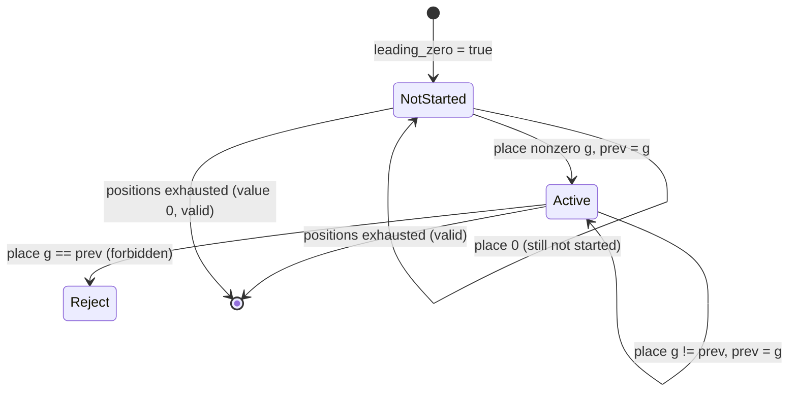
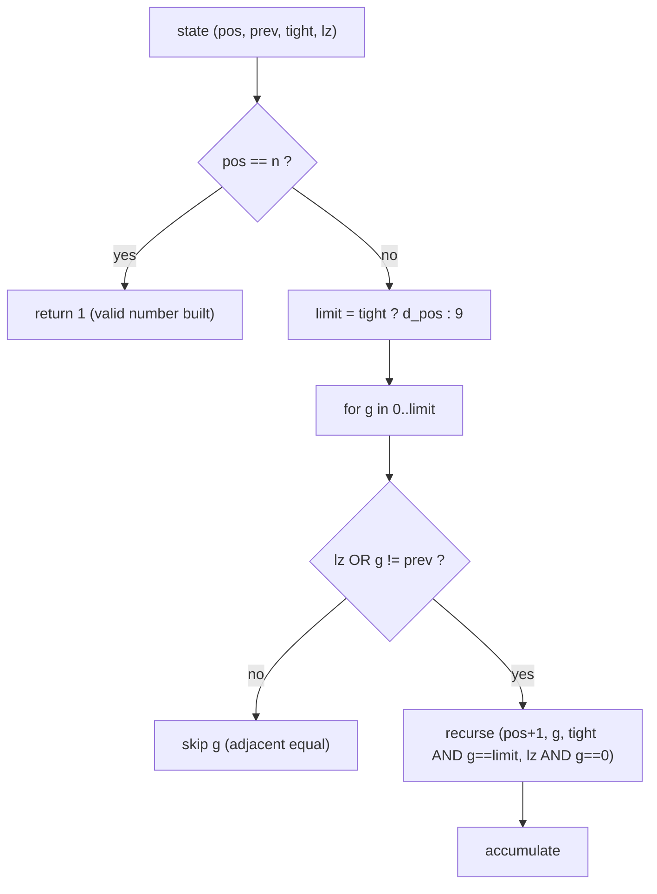
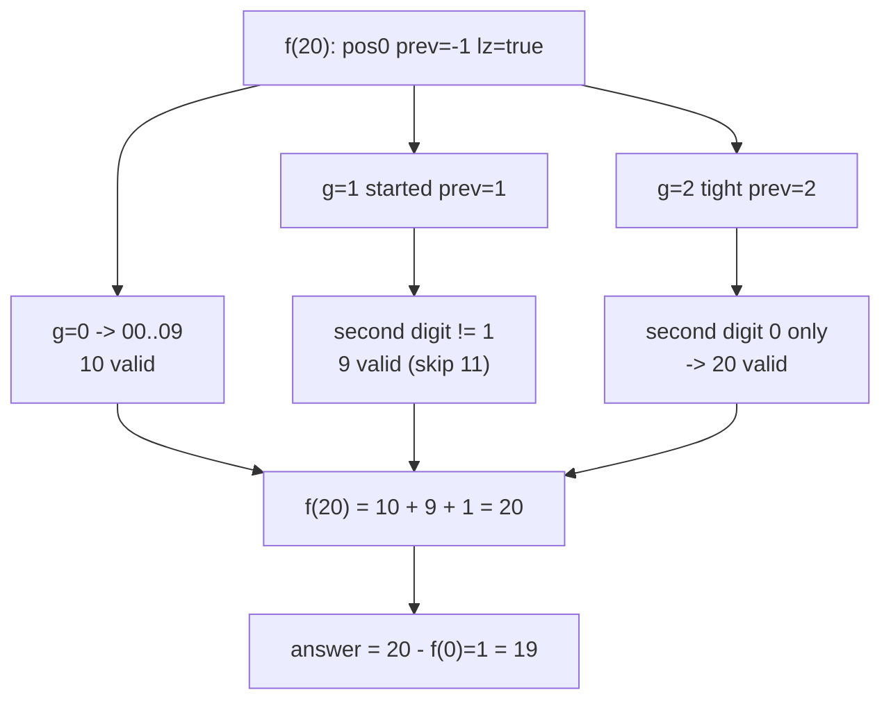

# Count Numbers Without Two Consecutive Equal Digits

| Meta | Value |
|------|-------|
| Source | Classic Digit DP (self-contained) |
| Difficulty | Medium |
| Topics | Dynamic Programming, Digit DP, Counting |
| Goal | Count integers $x \in [L, R]$ with no two **adjacent** equal digits |

---

## Problem Statement

Given integers $L$ and $R$, count how many integers $x$ with $L \le x \le R$ have **no two
consecutive (adjacent) equal digits**. That is, in the decimal representation no digit is
immediately followed by the same digit. `1212` is valid, `1221` is **not** (the `22`), and `100`
is **not** (the `00`).

```text
Input:  L = 1, R = 20
Output: 19
Explanation: every number 1..20 is valid except 11 (has "11").
             So 20 numbers minus 1 = 19.

Input:  L = 1, R = 9
Output: 9            // all single-digit numbers are trivially valid
```

The range can be enormous, so we build numbers digit by digit and reject any placement that repeats
the previous digit.

---

## Approach (WHY)

Define $f(X)$ = count of valid integers in $[0, X]$. The answer is the prefix difference:

$$
\text{answer} = f(R) - f(L-1)
$$

When building digit by digit, the only thing about the prefix that constrains the next digit is the
**previous digit** — we may place any digit except one equal to it. So the accumulator is `prev`,
the last placed digit. Crucially, while the number has not started yet (all leading zeros), there is
no "previous real digit", so we must use the `leading_zero` flag to avoid falsely blocking a digit.

State: $(pos, prev, tight, leadingZero)$. Transition rules:

$$
\text{allowed}(g) \iff \text{leadingZero} \ \lor\ g \ne prev
$$
$$
\text{prev}' = g, \qquad
\text{leadingZero}' = \text{leadingZero} \land (g = 0)
$$

If we are still in leading zeros, any digit is allowed (a leading zero is not a real previous
digit). Once started, we forbid $g = prev$.



The digit-choice fan-out, where the forbidden equal digit is pruned:



We memoize on $(pos, prev, leadingZero)$ for non-tight states. We keep `leadingZero` in the key
because it changes which digits are allowed.

```python
from functools import lru_cache

def count_no_adjacent_equal_upto(X):
    if X < 0:
        return 0
    digits = list(map(int, str(X)))
    n = len(digits)

    @lru_cache(maxsize=None)
    def go(pos, prev, tight, leading_zero):
        if pos == n:
            return 1
        limit = digits[pos] if tight else 9
        total = 0
        for g in range(limit + 1):
            if not leading_zero and g == prev:
                continue
            ntight = tight and g == limit
            nlz = leading_zero and g == 0
            nprev = g
            total += go(pos + 1, nprev, ntight, nlz)
        return total

    result = go(0, -1, True, True)
    go.cache_clear()
    return result

def count_in_range(L, R):
    return count_no_adjacent_equal_upto(R) - count_no_adjacent_equal_upto(L - 1)
```

```cpp
#include <bits/stdc++.h>
using namespace std;

int dg[20], n;
long long memo[20][11][2];     // prev in 0..9 (10 = none), leadingZero in {0,1}
bool seen[20][11][2];

long long go(int pos, int prev, bool tight, bool leadingZero) {
    if (pos == n) return 1;
    int pj = (prev < 0) ? 10 : prev;
    int lj = leadingZero ? 1 : 0;
    if (!tight && seen[pos][pj][lj]) return memo[pos][pj][lj];
    int limit = tight ? dg[pos] : 9;
    long long total = 0;
    for (int g = 0; g <= limit; ++g) {
        if (!leadingZero && g == prev) continue;
        bool ntight = tight && g == limit;
        bool nlz = leadingZero && g == 0;
        int nprev = g;
        total += go(pos + 1, nprev, ntight, nlz);
    }
    if (!tight) { seen[pos][pj][lj] = true; memo[pos][pj][lj] = total; }
    return total;
}

long long count_no_adjacent_equal_upto(long long X) {
    if (X < 0) return 0;
    string s = to_string(X);
    n = (int)s.size();
    for (int i = 0; i < n; ++i) dg[i] = s[i] - '0';
    memset(seen, 0, sizeof(seen));
    return go(0, -1, true, true);
}

long long count_in_range(long long L, long long R) {
    return count_no_adjacent_equal_upto(R) - count_no_adjacent_equal_upto(L - 1);
}
```

We use `prev = -1` (mapped to index `10` in C++) to mean "no previous digit yet", and `nullptr` is
not needed since the memo is a flat array; the leading-zero flag handles the "not started" case
cleanly without a sentinel pointer.

---

## Trace

Compute `count_in_range(1, 20)` = `f(20) - f(0)`.

```text
f(0):  X = 0, digits [0], single position.
       pos0 tight, prev=-1, lz=true: g in 0..0 -> g=0 (lz allows), leaf valid.
       count = 1   (the number 0)

f(20): digits [2, 0], two positions.
  pos0 tight prev=-1 lz=true: limit = 2
    g=0 (lz stays, free): pos1 prev=0 lz=true free, limit=9
          g=0..9 all allowed (lz true) -> 10 valid -> numbers 00..09 (= 0..9)
          contributes 10
    g=1 (started, free): pos1 prev=1 lz=false, limit=9
          g in 0..9 except g==1 -> 9 valid -> 10,12,13,...,19 (skip 11)
          contributes 9
    g=2 (tight): pos1 prev=2 lz=false, limit=0
          g=0 only, 0 != 2 -> valid -> number 20
          contributes 1
  count = 10 + 9 + 1 = 20

answer = f(20) - f(0) = 20 - 1 = 19
```

Subtracting $f(0)$ removes the number `0`, which is outside $[1, 20]$. The only rejected number in
range is `11` (caught by the `g == prev` prune in the `g=1` branch).



---

## Complexity

Let $m$ be the number of digits of $R$. The accumulator `prev` has $11$ values and `leading_zero`
has $2$.

| Measure | Value |
|---------|-------|
| Time | $O(m \cdot 11 \cdot 2 \cdot 10)$ per prefix call, two calls |
| Space | $O(m \cdot 11 \cdot 2)$ for the memo |

For $R \le 10^{18}$ this is a few thousand operations.

---

## Takeaway

An **adjacency constraint** turns into a `prev`-digit accumulator: forbid placing a digit equal to
the previous one. Guard the rule with `leading_zero` so the "not started yet" prefix never blocks a
digit, and keep `leading_zero` in the memo key because it changes the allowed set. The range query
is the usual $f(R) - f(L-1)$.
