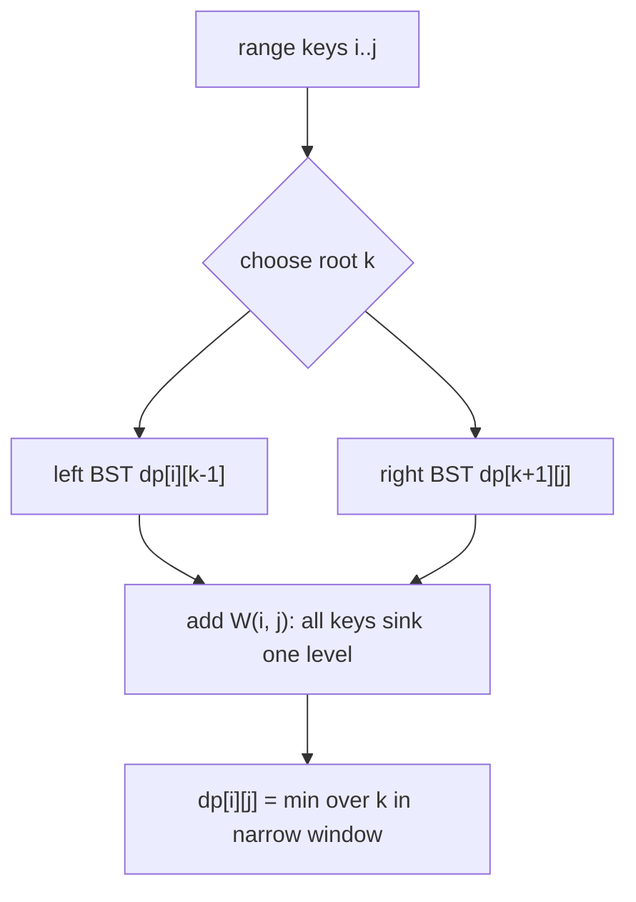
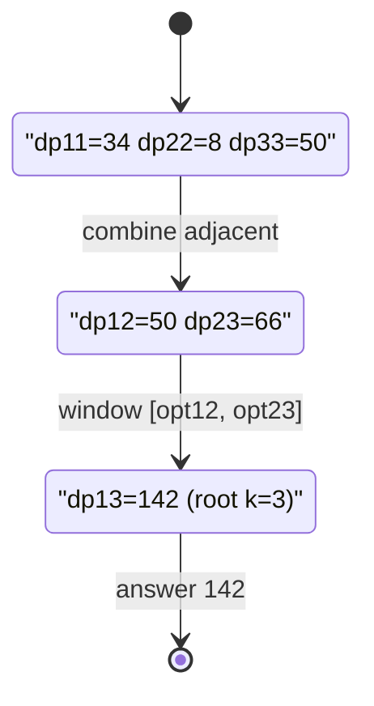

# Optimal Binary Search Tree (Knuth Optimization)

| Meta | Value |
|------|-------|
| Problem | Optimal Binary Search Tree |
| Source | Classic (Knuth 1971) |
| Difficulty | Hard |
| Topics | Interval DP, Knuth Optimization |
| Time | $O(n^2)$ |
| Space | $O(n^2)$ |

---

## Problem Statement

You are given `n` keys in **sorted order** with access frequencies `freq[0..n-1]`. Build a binary
search tree over these keys minimizing the total weighted search cost. A key placed at depth `d`
(root depth `1`) contributes `freq * d` to the cost. Equivalently, every time a key is enclosed by
a chosen root it pays its frequency one more time. Return the minimum total cost.

```text
Input:  keys with freq = [34, 8, 50]
Output: 142
Explanation:
  Choosing key index 2 (freq 50) as the root:
    left subtree holds keys {0, 1}, right subtree empty.
    best left subtree over {0,1} costs 50, plus the whole range pays
    its total frequency (34+8+50 = 92) once for the extra depth.
    total = 50 + 92 = 142, which is optimal.
```

---

## Approach (WHY)

Let `dp[i][j]` be the minimum cost of an optimal BST built from keys `i..j`. If key `k` becomes the
root of that range, its left subtree is the optimal BST of `[i, k-1]`, its right subtree the
optimal BST of `[k+1, j]`, and **every** key in `[i, j]` drops one level deeper, so the whole
range pays its summed frequency `W(i, j) = freq[i] + ... + freq[j]` once more:

$$
dp[i][j] = \min_{i \le k \le j}\Big( dp[i][k-1] + dp[k+1][j] \Big) + W(i, j).
$$

Because `W(i, j)` is a prefix-sum of non-negative frequencies, the cost satisfies the
**quadrangle inequality**, so the optimal root is monotone:

$$
opt[i][j-1] \le opt[i][j] \le opt[i+1][j].
$$

That lets us restrict the root search to a narrow window and reach $O(n^2)$.



To keep indices clean we use a 1-based `dp` of size `(n+2) x (n+1)` so `dp[i][i-1] = 0` (empty
range) is valid.

```python
def optimal_bst(freq):
    n = len(freq)
    # 1-based prefix sums: W(i, j) = pre[j] - pre[i - 1]
    pre = [0] * (n + 1)
    for i in range(1, n + 1):
        pre[i] = pre[i - 1] + freq[i - 1]

    INF = float("inf")
    # dp[i][j] for 1<=i<=j<=n; allow dp[i][i-1] = 0 (empty)
    dp = [[0] * (n + 2) for _ in range(n + 2)]
    opt = [[0] * (n + 2) for _ in range(n + 2)]

    for i in range(1, n + 1):
        dp[i][i] = freq[i - 1]   # single node at depth 1
        opt[i][i] = i

    for length in range(1, n):
        for i in range(1, n - length + 1):
            j = i + length
            lo = opt[i][j - 1]
            hi = opt[i + 1][j]
            best = INF
            arg = lo
            w = pre[j] - pre[i - 1]
            for k in range(lo, hi + 1):
                cand = dp[i][k - 1] + dp[k + 1][j] + w
                if cand < best:
                    best = cand
                    arg = k
            dp[i][j] = best
            opt[i][j] = arg

    return dp[1][n]
```

```cpp
#include <bits/stdc++.h>
using namespace std;

long long optimal_bst(const vector<long long>& freq) {
    int n = (int)freq.size();
    const long long INF = 1e18;

    // 1-based prefix sums: W(i, j) = pre[j] - pre[i - 1]
    vector<long long> pre(n + 1, 0);
    for (int i = 1; i <= n; i++) pre[i] = pre[i - 1] + freq[i - 1];

    // dp[i][j] for 1<=i<=j<=n; allow dp[i][i-1] = 0 (empty)
    vector<vector<long long>> dp(n + 2, vector<long long>(n + 2, 0));
    vector<vector<int>> opt(n + 2, vector<int>(n + 2, 0));

    for (int i = 1; i <= n; i++) {
        dp[i][i] = freq[i - 1];   // single node at depth 1
        opt[i][i] = i;
    }

    for (int length = 1; length < n; length++) {
        for (int i = 1; i + length <= n; i++) {
            int j = i + length;
            int lo = opt[i][j - 1];
            int hi = opt[i + 1][j];
            long long best = INF;
            int arg = lo;
            long long w = pre[j] - pre[i - 1];
            for (int k = lo; k <= hi; k++) {
                long long cand = dp[i][k - 1] + dp[k + 1][j] + w;
                if (cand < best) {
                    best = cand;
                    arg = k;
                }
            }
            dp[i][j] = best;
            opt[i][j] = arg;
        }
    }

    return dp[1][n];
}
```

---

## Trace

For `freq = [34, 8, 50]` (1-based keys 1, 2, 3), prefix `pre = [0, 34, 42, 92]`.

- `dp[1][1] = 34`, `dp[2][2] = 8`, `dp[3][3] = 50`, each `opt = i`.
- `dp[1][2]` (`W = 42`): roots `k in [1, 2]`. `k=1`: `0 + dp[2][2] + 42 = 50`; `k=2`:
  `dp[1][1] + 0 + 42 = 76`. Best `50`, `opt[1][2] = 1`.
- `dp[2][3]` (`W = 58`): roots `k in [2, 3]`. `k=2`: `0 + 50 + 58 = 108`; `k=3`:
  `8 + 0 + 58 = 66`. Best `66`, `opt[2][3] = 3`.
- `dp[1][3]` (`W = 92`): window `k in [opt[1][2], opt[2][3]] = [1, 3]`. `k=1`: `0 + dp[2][3] + 92 = 66 + 92 = 158`;
  `k=2`: `34 + 50 + 92 = 176`; `k=3`: `dp[1][2] + 0 + 92 = 50 + 92 = 142`. Best **142**.



---

## Complexity

- **Time:** $O(n^2)$ — the monotone root window telescopes across each diagonal.
- **Space:** $O(n^2)$ for the `dp` and `opt` tables.

Without Knuth the same recurrence is $O(n^3)$.

---

## Takeaway

Optimal BST is the textbook home of Knuth optimization: the root cost is a **range frequency sum**,
which guarantees the quadrangle inequality, so the optimal root is sandwiched between neighbours and
the cubic search collapses to a quadratic one.
