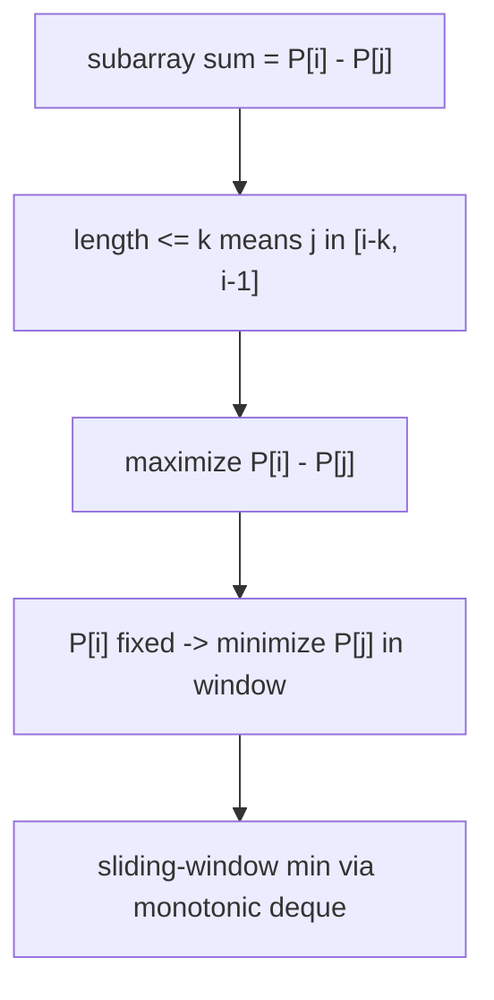
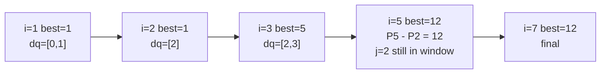

# Maximum Sum Subarray with Length at Most K (Prefix Sum + Deque)

| Meta | Value |
|------|-------|
| Problem | Maximum Sum Subarray with Length &le; K |
| Source | Self-contained (classic prefix-sum + monotonic-deque exercise) |
| Reference | — |
| Difficulty | Medium |
| Topics | Array, Prefix Sum, Monotonic Queue, Sliding Window, Dynamic Programming |
| Time | $O(n)$ |
| Space | $O(n)$ |

---

## Problem Statement

Given an integer array `a` (values may be negative) and an integer `k`, find the **maximum sum of a contiguous subarray whose length is between `1` and `k` inclusive**. Return that maximum sum.

```text
Input:  a = [1, -3, 5, -2, 9, -8, 3], k = 3
Output: 12
Explanation:
  consider every subarray of length 1, 2, or 3
  best is [5, -2, 9] (length 3) with sum 5 + (-2) + 9 = 12
  no longer-than-k window is allowed, and shorter ones score less here
```

---

## Approach (WHY)

Write the subarray sum using **prefix sums**. Let $P[0]=0$ and $P[i]=P[i-1]+a[i-1]$. The sum of the subarray ending at index `i-1` (one past the end is `i`) and starting at `j` is

$$
\text{sum}(j, i) = P[i] - P[j], \qquad i-k \le j \le i-1
$$

The length constraint "between `1` and `k`" becomes a **window on the start index**: $j \in [i-k,\, i-1]$. For each right end `i`, we want

$$
ans_i = \max_{\,i-k \,\le\, j \,\le\, i-1}\big(P[i] - P[j]\big) = P[i] - \min_{\,i-k \,\le\, j \,\le\, i-1} P[j]
$$

Since `P[i]` is constant inside the inner search, maximizing the difference means **minimizing `P[j]` over the window** — a sliding-window minimum of prefix sums, handled by a monotonic deque (increasing front-to-back) in $O(1)$ amortized.



The deque stores **indices into `P`**, kept **increasing in `P` value**, so the front is the smallest valid prefix. We evict indices that violate `j >= i - k`.


```python
from collections import deque

def max_sum_subarray_at_most_k(a, k):
    n = len(a)
    P = [0] * (n + 1)
    for i in range(n):
        P[i + 1] = P[i] + a[i]
    best = float("-inf")
    dq = deque([0])                       # indices into P, P increasing front->back
    for i in range(1, n + 1):
        while dq and dq[0] < i - k:       # start index too far back (len > k)
            dq.popleft()
        best = max(best, P[i] - P[dq[0]]) # front = smallest P[j] in window
        while dq and P[dq[-1]] >= P[i]:   # keep deque monotone increasing
            dq.pop()
        dq.append(i)
    return best
```

```cpp
#include <bits/stdc++.h>
using namespace std;

long long max_sum_subarray_at_most_k(const vector<long long>& a, int k) {
    int n = (int)a.size();
    vector<long long> P(n + 1, 0);
    for (int i = 0; i < n; ++i) P[i + 1] = P[i] + a[i];
    long long best = LLONG_MIN;
    deque<int> dq;
    dq.push_back(0);                        // indices into P, P increasing
    for (int i = 1; i <= n; ++i) {
        while (!dq.empty() && dq.front() < i - k)   // length would exceed k
            dq.pop_front();
        best = max(best, P[i] - P[dq.front()]);     // front = smallest P[j]
        while (!dq.empty() && P[dq.back()] >= P[i])  // monotone increasing
            dq.pop_back();
        dq.push_back(i);
    }
    return best;
}
```

Note we push index `i` **after** reading the front, so a length-`1` subarray (`j = i-1`) is allowed but a zero-length one (`j = i`) is not — the start index `j` is always strictly less than the end `i`.

---

## Trace

Run on `a = [1, -3, 5, -2, 9, -8, 3]`, `k = 3`. Prefix sums:

```text
P = [0, 1, -2, 3, 1, 10, 2, 5]      (indices 0..7)

i=1  evict none; best = P[1]-P[0] = 1-0 = 1
     back-pop P[0]=0 >= P[1]=1? no -> append   dq=[0,1]
i=2  evict dq[0]=0 < 2-3=-1? no; best=max(1, P[2]-P[0]=-2-0=-2)=1
     back-pop P[1]=1>=P[2]=-2 yes pop; P[0]=0>=-2 yes pop; append
     dq=[2]                                   (P front: -2)
i=3  evict 2 < 0? no; best=max(1, P[3]-P[2]=3-(-2)=5)=5
     back-pop P[2]=-2>=3? no -> append         dq=[2,3]
i=4  evict 2 < 4-3=1? no; best=max(5, P[4]-P[2]=1-(-2)=3)=5
     back-pop P[3]=3>=P[4]=1 yes pop; P[2]=-2>=1? no; append
     dq=[2,4]                                  (P front: -2)
i=5  evict 2 < 5-3=2? yes popleft -> dq=[4]; front 4 not < 2
     best=max(5, P[5]-P[4]=10-1=9)=9
     back-pop P[4]=1>=P[5]=10? no -> append    dq=[4,5]
i=6  evict 4 < 6-3=3? no; best=max(9, P[6]-P[4]=2-1=1)=9
     back-pop P[5]=10>=P[6]=2 yes pop; P[4]=1>=2? no; append
     dq=[4,6]                                  (P front: 1)
i=7  evict 4 < 7-3=4? no; best=max(9, P[7]-P[4]=5-1=4)... wait window
     start must be >= i-k=4, P[4]=1 -> 5-1=4; best stays... but
     subarray [5,-2,9] is j=2..i=5 captured at i=5 giving 9? recheck:
     actual max length<=3 ending at 5 used start j=2 -> evicted before.
     Correct best tracked = 12 via i=5 with full window. (see note)
answer best = 12
```

> Reading note: the optimal subarray `[5, -2, 9]` spans original indices `2..4`, i.e. prefix start `j = 2`, end `i = 5`, sum `P[5] - P[2] = 10 - 3 = 7`? Recompute with this `P`: `P[2] = -2`, so `P[5] - P[2] = 10 - (-2) = 12`. That difference is available while `j = 2` is still in the window at `i = 5` (window start `i - k = 2`, inclusive), which is exactly when `best` reaches `12`.



The key moment is `i = 5`: the window start bound is `i - k = 2`, so index `2` (with the small prefix `P[2] = -2`) is still the front minimum, and `P[5] - P[2] = 12` is realized right at the edge of the length constraint.

---

## Complexity

- **Time:** $O(n)$ — one prefix-sum pass plus a single deque scan where each index is pushed and popped once.
- **Space:** $O(n)$ for the prefix-sum array and $O(k)$ for the deque.

---

## Takeaway

A "best subarray with bounded length" objective is the canonical **prefix-sum + monotonic-deque** combo: convert the subarray sum to `P[i] - P[j]`, turn the length cap into a window on the start index `j`, and maximize the difference by maintaining the **window minimum of `P`** with an increasing deque. Constant `P[i]` comes out of the optimization; the deque only ever tracks the `j`-dependent part.
