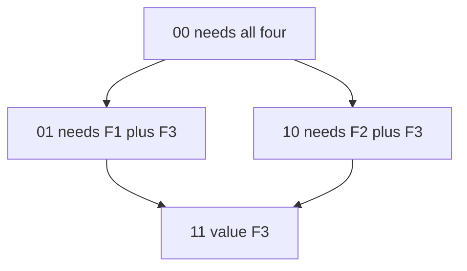
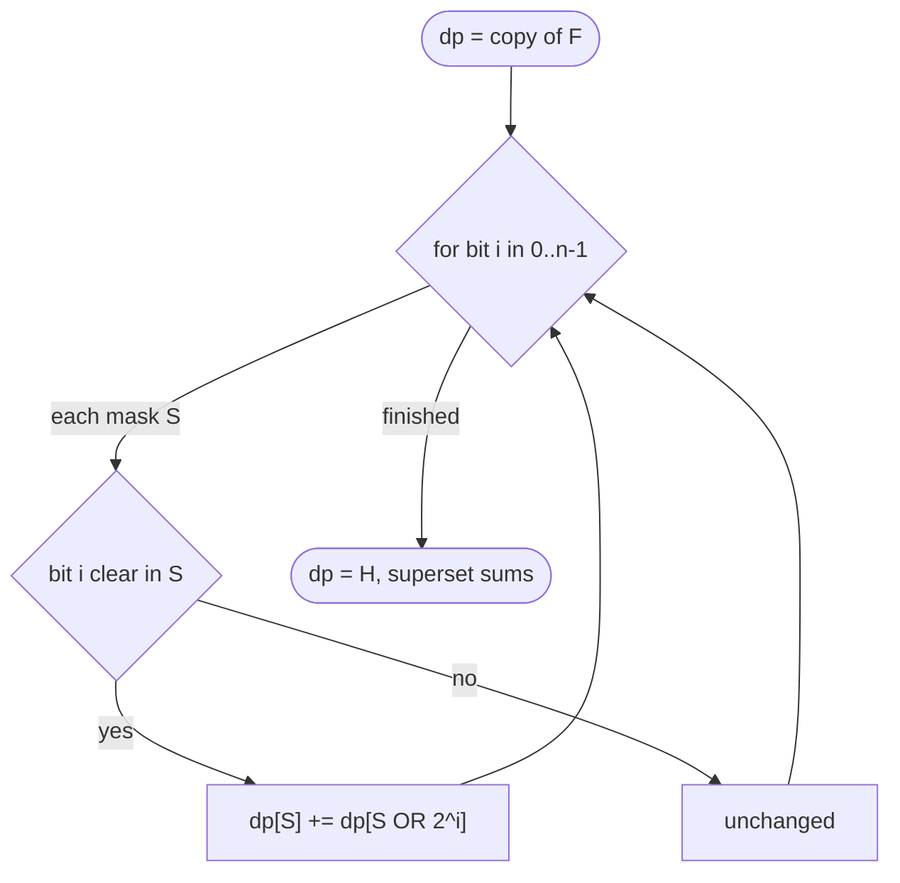
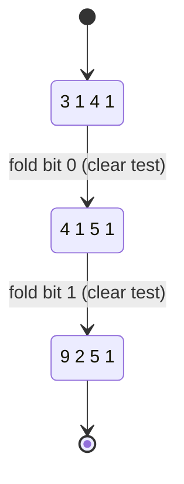

# Sum Over Supersets — Superset Aggregate

| Meta | Value |
| :--- | :--- |
| Topic | Dynamic Programming / SOS DP |
| Difficulty | Medium |
| Technique | Superset Zeta Transform |
| Time | $O(n \cdot 2^n)$ |
| Space | $O(2^n)$ |

---

## Problem Statement

You are given an array $F$ of length $2^n$. For **every** bitmask $S$, compute the aggregate of $F$ over all **supersets** of $S$:

$$
H[S] = \sum_{T \supseteq S} F[T]
$$

where $T \supseteq S$ means $S \mathbin{\&} T = S$ (every set bit of $S$ is also set in $T$). Output the array $H$.

```text
Input:
  n = 2
  F = [3, 1, 4, 1]      # indices = masks 00, 01, 10, 11

Supersets:
  H[00] = F[00]+F[01]+F[10]+F[11] = 3+1+4+1 = 9
  H[01] = F[01]+F[11]             = 1+1     = 2
  H[10] = F[10]+F[11]             = 4+1     = 5
  H[11] = F[11]                   = 1       = 1

Output:
  H = [9, 2, 5, 1]
```

---

## Approach (WHY)

This is the mirror image of subset SOS. A superset $T \supseteq S$ must contain **at least** the bits of $S$ and may add more. We fold **one bit at a time**, but now a mask absorbs the partner that has an **extra** bit turned on.

Maintain $dp[S] = F[S]$. For each bit $i$, for every mask $S$ whose bit $i$ is **clear**, add the partner with bit $i$ **set**:

$$
dp_i[S] = dp_{i-1}[S] + \big[\,\text{bit }i\text{ of }S\text{ is }0\,\big]\cdot dp_{i-1}[S \mid 2^i]
$$

Each superset $T \supseteq S$ is reached by turning on its extra bits one layer at a time along a unique monotone path, so $F[T]$ is added exactly once. Cost: $n$ layers $\times\ 2^n$ masks $= O(n 2^n)$.

The only change from subset SOS is the **direction of the bit test** (`clear` instead of `set`) and the **partner** (`S | bit` instead of `S ^ bit`).





By complement symmetry, $H[S]$ equals the subset transform evaluated at $\overline{S}$ on the reversed-index array — the same machinery, mirrored.

---

## Code

```python
def sum_over_supersets(F, n):
    dp = F[:]                       # dp[S] begins as F[S]
    for i in range(n):              # fold one bit per layer
        bit = 1 << i
        for S in range(1 << n):     # sweep every mask
            if not (S & bit):       # bit i is clear in S
                dp[S] += dp[S | bit]
    return dp                       # dp[S] = sum over supersets of S


if __name__ == "__main__":
    F = [3, 1, 4, 1]
    print(sum_over_supersets(F, 2))   # [9, 2, 5, 1]
```

```cpp
#include <bits/stdc++.h>
using namespace std;

vector<long long> sum_over_supersets(vector<long long> dp, int n) {
    for (int i = 0; i < n; ++i) {            // fold one bit per layer
        int bit = 1 << i;
        for (int S = 0; S < (1 << n); ++S) { // sweep every mask
            if (!(S & bit)) {                // bit i is clear in S
                dp[S] += dp[S | bit];
            }
        }
    }
    return dp;                               // dp[S] = sum over supersets
}

int main() {
    vector<long long> F = {3, 1, 4, 1};
    vector<long long> H = sum_over_supersets(F, 2);
    for (long long v : H) cout << v << ' ';   // 9 2 5 1
    cout << '\n';
    return 0;
}
```

---

## Trace — SOS Table After Each Bit Layer

Input $F = [3, 1, 4, 1]$, $n = 2$.

| Mask | Start (F) | After bit 0 | After bit 1 (H) |
| :--- | :--- | :--- | :--- |
| `00` | 3 | 3 + 1 = 4 | 4 + 5 = 9 |
| `01` | 1 | 1 | 1 + 1 = 2 |
| `10` | 4 | 4 + 1 = 5 | 5 |
| `11` | 1 | 1 | 1 |

- **Bit 0 layer:** masks with bit 0 **clear** (`00`, `10`) absorb partners `01`, `11`.
- **Bit 1 layer:** masks with bit 1 **clear** (`00`, `01`) absorb partners `10`, `11` (which already hold their bit-0 sums, so `00` gains the full superset total).

Final $H = [9, 2, 5, 1]$, matching the expected output.



---

## Complexity

| Resource | Cost |
| :--- | :--- |
| Time | $O(n \cdot 2^n)$ — $n$ layers over $2^n$ masks |
| Space | $O(2^n)$ — in-place dp array |
| Naive comparison | $O(3^n)$ superset enumeration |

---

## Takeaway

Superset SOS is subset SOS reflected: test the bit being **clear** and fold the partner with that bit **set** (`S | bit`). The empty mask `00` ends up holding the grand total of all $F$, while the full mask holds only itself — the exact reverse of the subset transform.
