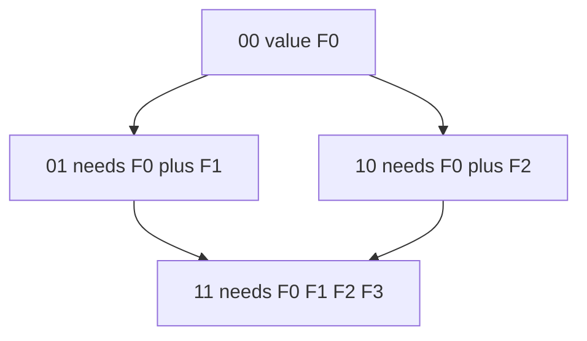
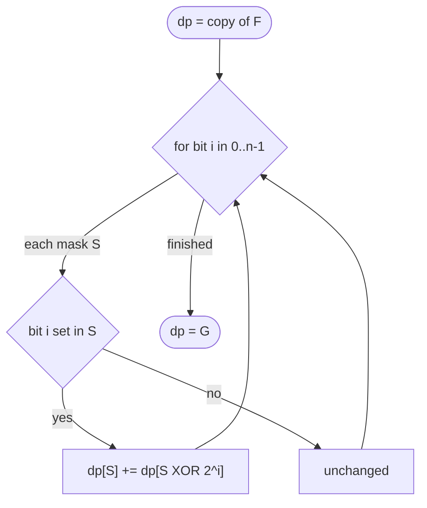
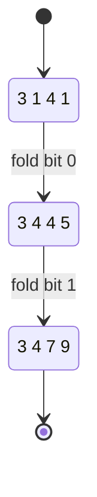

# Sum Over Subsets — Canonical SOS

| Meta | Value |
| :--- | :--- |
| Topic | Dynamic Programming / SOS DP |
| Difficulty | Medium |
| Technique | Subset Zeta Transform |
| Time | $O(n \cdot 2^n)$ |
| Space | $O(2^n)$ |

---

## Problem Statement

You are given an array $F$ of length $2^n$. For **every** bitmask $S$ in $[0, 2^n)$, compute

$$
G[S] = \sum_{T \subseteq S} F[T]
$$

where $T \subseteq S$ means $T \mathbin{\&} S = T$ (every set bit of $T$ is set in $S$). Output the array $G$.

```text
Input:
  n = 2
  F = [3, 1, 4, 1]      # indices = masks 00, 01, 10, 11

Submasks:
  G[00] = F[00]                         = 3
  G[01] = F[00] + F[01]                 = 3 + 1 = 4
  G[10] = F[00] + F[10]                 = 3 + 4 = 7
  G[11] = F[00] + F[01] + F[10] + F[11] = 3 + 1 + 4 + 1 = 9

Output:
  G = [3, 4, 7, 9]
```

---

## Approach (WHY)

The naive route enumerates every submask of every mask, costing $\sum_k \binom{n}{k} 2^k = 3^n$. Instead we fold **one bit at a time**.

Maintain $dp[S]$, initialized to $F[S]$. Process bits $i = 0 \ldots n-1$. At layer $i$, for each mask $S$ whose bit $i$ is set, add the contribution of the partner mask with bit $i$ **cleared**:

$$
dp_i[S] = dp_{i-1}[S] + [\,\text{bit }i\text{ of }S\,]\cdot dp_{i-1}[S \oplus 2^i]
$$

Each submask $T \subseteq S$ reaches $S$ along a **unique** monotone bit-flipping path (flip the differing bits in increasing order), so $F[T]$ is counted exactly once. Total work is $n$ layers $\times\ 2^n$ masks $= O(n 2^n)$.



The fold order — bit 0 then bit 1 — guarantees `11` first absorbs across bit 0, then across bit 1, gathering all four leaves.



---

## Code

```python
def sum_over_subsets(F, n):
    dp = F[:]                       # dp[S] begins as F[S]
    for i in range(n):              # fold one bit per layer
        bit = 1 << i
        for S in range(1 << n):     # sweep every mask
            if S & bit:             # bit i present in S
                dp[S] += dp[S ^ bit]
    return dp                       # dp[S] = sum over submasks of S


if __name__ == "__main__":
    F = [3, 1, 4, 1]
    print(sum_over_subsets(F, 2))   # [3, 4, 7, 9]
```

```cpp
#include <bits/stdc++.h>
using namespace std;

vector<long long> sum_over_subsets(vector<long long> dp, int n) {
    for (int i = 0; i < n; ++i) {            // fold one bit per layer
        int bit = 1 << i;
        for (int S = 0; S < (1 << n); ++S) { // sweep every mask
            if (S & bit) {                   // bit i present in S
                dp[S] += dp[S ^ bit];
            }
        }
    }
    return dp;                               // dp[S] = sum over submasks
}

int main() {
    vector<long long> F = {3, 1, 4, 1};
    vector<long long> G = sum_over_subsets(F, 2);
    for (long long v : G) cout << v << ' ';   // 3 4 7 9
    cout << '\n';
    return 0;
}
```

---

## Trace — SOS Table After Each Bit Layer

Input $F = [3, 1, 4, 1]$, $n = 2$.

| Mask | Start (F) | After bit 0 | After bit 1 (G) |
| :--- | :--- | :--- | :--- |
| `00` | 3 | 3 | 3 |
| `01` | 1 | 3 + 1 = 4 | 4 |
| `10` | 4 | 4 | 3 + 4 = 7 |
| `11` | 1 | 4 + 1 = 5 | 5 + 4 = 9 |

- **Bit 0 layer:** masks with bit 0 set (`01`, `11`) absorb partners `00`, `10`.
- **Bit 1 layer:** masks with bit 1 set (`10`, `11`) absorb partners `00`, `01` (which now already hold their bit-0 sums).



---

## Complexity

| Resource | Cost |
| :--- | :--- |
| Time | $O(n \cdot 2^n)$ — $n$ layers over $2^n$ masks |
| Space | $O(2^n)$ — in-place dp array |
| Naive comparison | $O(3^n)$ submask enumeration |

---

## Takeaway

The canonical SOS DP is six lines: copy $F$, loop bits outer, loop masks inner, and when a bit is set fold in the partner missing that bit. Master this exact shape — every SOS variant (superset, Mobius, convolution) is a one-character tweak of it.
