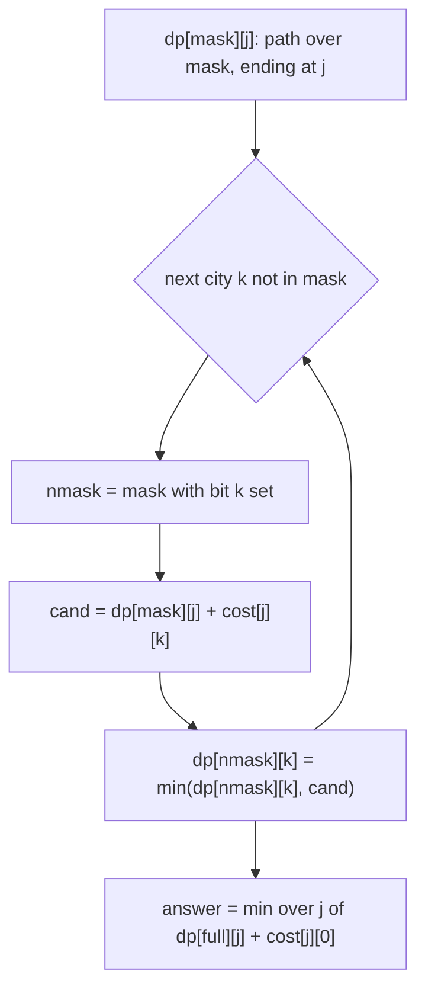
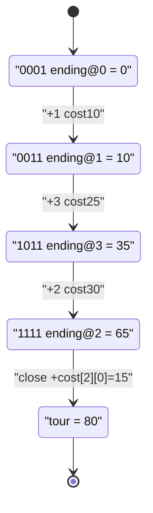

# Travelling Salesman Problem (Bitmask DP)

| Meta | Value |
|------|-------|
| Source | Classic / CSES "Hamiltonian Flights" family |
| Difficulty | Hard |
| Topics | Dynamic Programming, Bitmask, Graphs |
| Link | self-contained classic |

---

## Problem Statement

You are given an $n \times n$ matrix `cost`, where `cost[i][j]` is the price of travelling
directly from city `i` to city `j`. Starting at city `0`, visit **every** city exactly once and
return to city `0`. Output the minimum total cost of such a tour.

```text
Input:
n = 4
cost =
   0  10  15  20
  10   0  35  25
  15  35   0  30
  20  25  30   0

Output: 80
Explanation: tour 0 -> 1 -> 3 -> 2 -> 0 costs 10 + 25 + 30 + 15 = 80, the minimum.
```

Constraints: $1 \le n \le 16$ (so $2^n \le 65536$).

---

## Approach (WHY)

A tour is a permutation, so brute force is $O(n!)$ — already $16! \approx 2 \times 10^{13}$,
hopeless. The key observation: when extending a partial tour, the **only** facts that affect the
remaining cost are *which cities are already visited* and *where we currently stand*. The exact
order we visited them is irrelevant. That is a perfect setup for a bitmask state.

Let

$$
dp[\text{mask}][j] = \text{minimum cost of a path starting at } 0, \text{ visiting exactly the cities of } \text{mask}, \text{ ending at } j,
$$

requiring $0 \in \text{mask}$ and $j \in \text{mask}$. Extend by a new city `k`:

$$
dp[\text{mask} \cup \{k\}][k] = \min_{j \in \text{mask}} \big(dp[\text{mask}][j] + \text{cost}[j][k]\big),
$$

and finally close the loop back to city `0`:

$$
\text{answer} = \min_{j} \big(dp[\text{full}][j] + \text{cost}[j][0]\big), \qquad \text{full} = 2^n - 1.
$$



```python
def tsp(cost):
    n = len(cost)
    INF = float('inf')
    full = 1 << n
    dp = [[INF] * n for _ in range(full)]
    dp[1][0] = 0                                   # mask {0}, standing at city 0
    for mask in range(full):
        if not (mask & 1):                         # every tour must include city 0
            continue
        for j in range(n):
            if dp[mask][j] == INF or not (mask & (1 << j)):
                continue
            for k in range(n):
                if mask & (1 << k):                # k already visited
                    continue
                nmask = mask | (1 << k)
                cand = dp[mask][j] + cost[j][k]
                if cand < dp[nmask][k]:
                    dp[nmask][k] = cand
    best = INF
    for j in range(n):
        if dp[full - 1][j] != INF:
            best = min(best, dp[full - 1][j] + cost[j][0])
    return best
```

```cpp
#include <bits/stdc++.h>
using namespace std;

long long tsp(const vector<vector<long long>>& cost) {
    int n = (int)cost.size();
    const long long INF = LLONG_MAX / 4;
    int full = 1 << n;
    vector<vector<long long>> dp(full, vector<long long>(n, INF));
    dp[1][0] = 0;                                  // mask {0}, standing at city 0
    for (int mask = 0; mask < full; ++mask) {
        if (!(mask & 1)) continue;                 // every tour must include city 0
        for (int j = 0; j < n; ++j) {
            if (dp[mask][j] == INF || !(mask & (1 << j))) continue;
            for (int k = 0; k < n; ++k) {
                if (mask & (1 << k)) continue;     // k already visited
                int nmask = mask | (1 << k);
                long long cand = dp[mask][j] + cost[j][k];
                if (cand < dp[nmask][k]) dp[nmask][k] = cand;
            }
        }
    }
    long long best = INF;
    for (int j = 0; j < n; ++j)
        if (dp[full - 1][j] != INF)
            best = min(best, dp[full - 1][j] + cost[j][0]);
    return best;
}
```

---

## Trace Over Masks

Using the 4-city example, the start is `dp[0001][0] = 0`. We grow masks bit by bit; only a few
representative cells are shown:

| mask (binary) | cities visited | ending `j` | `dp` value | how it was reached |
|---------------|----------------|-----------|-----------|--------------------|
| `0001` | {0} | 0 | 0 | start |
| `0011` | {0,1} | 1 | 10 | 0→1 |
| `0101` | {0,2} | 2 | 15 | 0→2 |
| `1001` | {0,3} | 3 | 20 | 0→3 |
| `1011` | {0,1,3} | 3 | 35 | 0→1→3 = 10+25 |
| `1111` | all | 2 | 65 | 0→1→3→2 = 35+30 |
| close | — | — | **80** | 65 + cost[2][0]=15 |



The `dp[full][j]` row holds the best path ending at each city; adding the return edge to `0` and
taking the minimum yields `80`.

---

## Complexity

- **States:** $2^n \cdot n$ cells.
- **Transition:** each cell scans $n$ next cities $\Rightarrow$ $O(2^n \cdot n^2)$ time.
- **Space:** $O(2^n \cdot n)$ for the table.

For $n = 16$ this is about $16^2 \cdot 65536 \approx 1.7 \times 10^7$ operations — instant,
versus $16! \approx 2 \times 10^{13}$ for brute force.

---

## Takeaway

The order of visited cities never matters for the future — only *the set visited* and *the
current city*. Compressing the set into a bitmask turns an $O(n!)$ permutation search into an
$O(2^n n^2)$ DP. Anchor every tour at city `0` (`dp[1][0] = 0` and `mask & 1`) and remember the
final return edge `cost[j][0]`.
