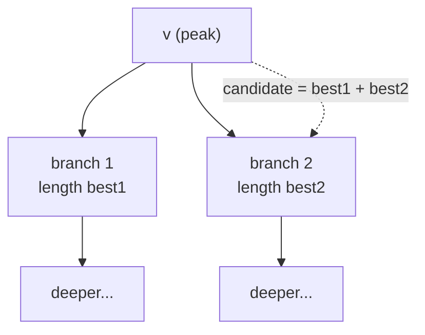
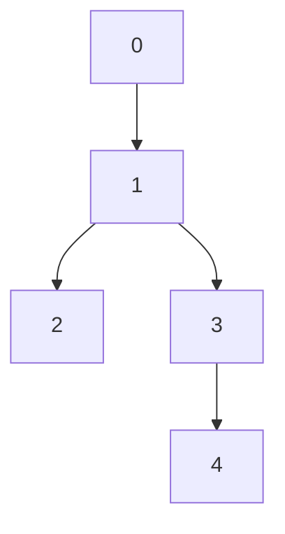
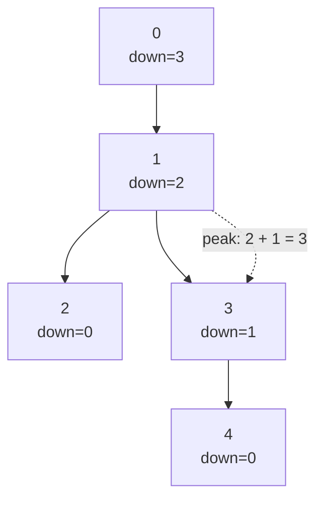

# Tree Diameter via DP

| Meta | Value |
|------|-------|
| Source | Classic (CSES Tree Diameter, LeetCode 543 variant) |
| Difficulty | Medium |
| Topics | Tree, Depth-First Search, Dynamic Programming |
| Link | https://cses.fi/problemset/task/1131 |

---

## Problem Statement

Given a tree with `n` nodes and `n-1` undirected edges, find its **diameter**: the number of
edges on the longest path between any two nodes. The path may peak at any node, not just the root.

```text
Input:  n = 5
        edges = [(0,1), (1,2), (1,3), (3,4)]

        0
        |
        1
       / \
      2   3
           \
            4

Output: 3                 // longest path is 2 - 1 - 3 - 4 (3 edges)
```

---

## Approach (WHY)

Root the tree anywhere (say node `0`). For each node `v`, define `down(v)` = the length (in
edges) of the longest **downward** path that starts at `v` and descends into its subtree. A path
that *peaks* at `v` is built by gluing `v`'s **two deepest child branches** together through `v`.

$$
\text{down}(v) = \max_{c \in \text{children}(v)} \big(1 + \text{down}(c)\big)
\quad\text{(0 if } v \text{ is a leaf)}
$$

$$
\text{diameter} = \max_v \Big( \text{best}_1(v) + \text{best}_2(v) \Big)
$$

where $\text{best}_1, \text{best}_2$ are the two largest values of $1 + \text{down}(c)$ among
`v`'s children. A single DFS returns `down(v)` upward while updating a global `best` with the
two-branch sum at every node.





```python
import sys
from collections import defaultdict

def tree_diameter(n, edges):
    sys.setrecursionlimit(1 << 25)
    g = defaultdict(list)
    for u, v in edges:
        g[u].append(v)
        g[v].append(u)

    best = 0                                  # diameter in edges

    def dfs(v, parent):
        nonlocal best
        top1 = top2 = 0                       # two deepest downward lengths
        for c in g[v]:
            if c != parent:
                d = dfs(c, v) + 1             # length through child c
                if d > top1:
                    top2, top1 = top1, d
                elif d > top2:
                    top2 = d
        best = max(best, top1 + top2)         # path peaking at v
        return top1                           # longest downward path from v

    dfs(0, -1)
    return best
```

```cpp
#include <bits/stdc++.h>
using namespace std;

vector<vector<int>> g;
long long best = 0;                           // diameter in edges

long long dfs(int v, int parent) {
    long long top1 = 0, top2 = 0;             // two deepest downward lengths
    for (int c : g[v]) {
        if (c != parent) {
            long long d = dfs(c, v) + 1;      // length through child c
            if (d > top1) { top2 = top1; top1 = d; }
            else if (d > top2) { top2 = d; }
        }
    }
    best = max(best, top1 + top2);            // path peaking at v
    return top1;                              // longest downward path from v
}

long long tree_diameter(int n, vector<pair<int,int>>& edges) {
    g.assign(n, {});
    best = 0;
    for (auto [u, v] : edges) {
        g[u].push_back(v);
        g[v].push_back(u);
    }
    dfs(0, -1);
    return best;
}
```

---

## Trace

Run on the example, rooted at `0`. DFS returns `down(v)` and updates `best`.

```text
node 2 (leaf): top1=0, top2=0 -> best=max(0, 0)=0, return 0
node 4 (leaf): top1=0, top2=0 -> best stays,        return 0
node 3: child 4 -> d = 0+1 = 1; top1=1, top2=0
        best = max(0, 1+0) = 1; return 1
node 1: child 2 -> d = 0+1 = 1; top1=1
        child 3 -> d = 1+1 = 2; top1=2, top2=1
        best = max(1, 2+1) = 3; return 2
node 0: child 1 -> d = 2+1 = 3; top1=3, top2=0
        best = max(3, 3+0) = 3; return 3
answer = 3
```



---

## Complexity

| Measure | Value |
|---------|-------|
| Time | $O(n)$ — each node and edge visited once |
| Space | $O(n)$ — adjacency list plus recursion stack |

---

## Takeaway

Tree diameter via DP: in one post-order pass, return each node's **longest downward branch** and,
at every node, test the **sum of its two deepest branches** as a candidate diameter. No two BFS
passes needed, and the method generalizes to weighted edges and to "longest path with a property".
